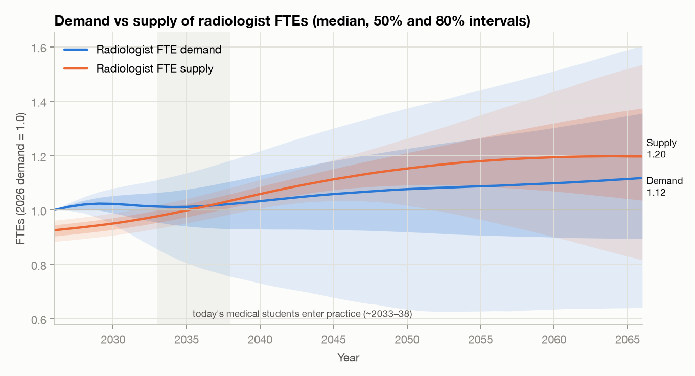

# Radiology 2066: a probabilistic forecast of the U.S. radiologist workforce

**Will AI shrink the job market for radiologists?** This repository contains a Monte Carlo model of U.S.
diagnostic-radiology demand and supply from 2026 to 2066, an interactive website, and a long technical report with
AMA-style citations. It is written for anyone considering, training in, or practicing radiology.

* **Interactive site:** <https://ethanuser.github.io/radiology/>
* **Full report:** [`REPORT.md`](REPORT.md) (also rendered at <https://ethanuser.github.io/radiology/report.html>)
* **Model code:** [`model/`](model/) · **Results:** [`outputs/`](outputs/) · **Figures:** [`figures/`](figures/)



## What the model does

Five components are modeled separately, each with explicit probability distributions, and propagated through 20,000
correlated Monte Carlo simulations (futures already contradicted by events, such as an FDA-authorized autonomous read before
October 2026, are dropped):

1. **Baseline imaging demand**: population growth and aging (Christensen et al, JACR 2025, adjusted to CBO 2026
   demographics), per-capita utilization trends, and growing work per exam.
2. **AI productivity**: a task-based model following Langlotz (2025) and Acemoglu & Restrepo. Interpretation,
   measurement/drafting, consultation, administration and procedural work each have their own AI ceiling, capability curve
   and adoption curve. AI also creates new oversight work.
3. **Jevons/rebound effects**: cheaper interpretation (price elasticity × professional-fee share), faster turnaround, scanner
   throughput and latent demand, new applications and screening, incidental follow-up and new radiologist tasks. These are
   offset by AI utilization management and scope shift, and capped by scanner/technologist capacity.
4. **Regulation and adoption**: for four tiers of exam difficulty, the chain technical capability → clinical validation → FDA
   authorization → liability/reimbursement acceptance → hospital adoption → labor substitution. A shortage speeds adoption.
5. **Radiologist supply**: a cohort model calibrated to Christensen et al's supply projection (+25.7% by 2055 with flat
   residency), with residency positions and fill rates that respond to the market with a lag.

The inputs are correlated through three latent factors (AI progress, regulatory friction, appetite for imaging) and four
AI-progress regimes (stall / trend / fast / transformative, weighted 15/55/18/12). Every parameter is graded **A**nchored
(data plus judgment) or **S**ubjective; none is purely empirical. See [`model/params.py`](model/params.py) and [`outputs/parameters.md`](outputs/parameters.md).

**Validation.** Besides calibration checks, [`model/backtest.py`](model/backtest.py) runs a simplified version of the method from
2016 and scores it against 2025 outcomes for radiologists, software developers, interpreters and translators, and medical
transcriptionists, alongside BLS projections, trend extrapolation and their average (report §6.2). It is a weak sanity check:
the BLS-plus-trend average beat the full method on average. [`model/robustness.py`](model/robustness.py) re-runs the forecast
under alternative priors and model structures (report §8.4).

## Headline results

<!-- RESULTS:START -->
| | 2030 | 2035 | 2045 | 2055 | 2066 |
|---|---|---|---|---|---|
| FTE demand, median (P10–P90), 2026 demand = 1 | 1.02 (0.95–1.08) | 1.01 (0.81–1.14) | 1.06 (0.68–1.30) | 1.09 (0.63–1.44) | 1.12 (0.64–1.60) |
| FTE supply, median, 2026 demand = 1 | 0.95 | 1.00 | 1.11 | 1.18 | 1.20 |
| Supply ÷ demand, median (2026 ≈ 0.93) | 0.93 | 0.99 | 1.06 | 1.11 | 1.09 |
| AI productivity, median | 1.06× | 1.22× | 1.37× | 1.46× | 1.54× |
| AI-first / autonomous share, median | <1% | 2% | 12% | 24% | 44% |
| P(demand < 2026) | 32% | 45% | 38% | 37% | 36% |
| P(demand < 50% of 2026) | 0% | <1% | 5% | 7% | 6% |
| **P(meaningful oversupply, S/D > 1.10)** | **3%** | **19%** | **42%** | **52%** | **47%** |
| P(true Jevons paradox) | 10% | 2% | 4% | 3% | 2% |

*Numbers from the default run (`python run_model.py`, seed 20261007), regenerated by `tools/build_docs.py`.*

**In one paragraph:** for someone entering practice in the mid-2030s, meaningful oversupply (19%) and meaningful shortage (17%) are about equally likely in 2035. Most of the oversupply risk sits in the transformative-AI branch; without it the risk is 9%. Risk grows over a career (42% by 2045, 52% by 2055) and eases a little after as residency programs adjust. Most of it comes from AI: with no further radiology AI it would be 9% and 26%; assistive AI drives the near-term risk (mostly in the transformative regime, where it bypasses regulation) and AI-first reading adds most of the rest after 2045. A true Jevons paradox, where AI-induced imaging outweighs the labor AI saves, is unlikely under the main assumptions (≈4% in 2045): induced demand offsets about 51% of the savings. A 2016→2025 backtest gave the method a 67% chance of today's shortage, driven by supply-versus-demand fundamentals rather than AI; for three other automation-exposed occupations, the simple average of BLS projections and trend extrapolation (mean log error 0.11) beat the full method (0.15), so the backtest is a weak sanity check. The direction is robust, the digits are not: under alternative priors and model structures the 2045 oversupply probability ranges from 17% to 64%, so read the numbers as model-conditioned judgment, not a calibrated forecast (report §8.4).
<!-- RESULTS:END -->

## Reproduce

```bash
python -m venv .venv && source .venv/bin/activate
pip install -r requirements.txt
python run_model.py          # simulation, sensitivity analysis and backtest -> outputs/, figures/, docs/data/  (~15 s)
python -m pytest             # calibration, accounting-identity, copula and reference tests
python tools/build_docs.py   # regenerate REPORT.md, docs/report.html and the numbers in this README
```

To view the site locally: `python -m http.server --directory docs` and open <http://localhost:8000>.

## Repository layout

```
model/
  params.py        every uncertain input: distribution, evidence grade, sources, factor loadings
  sampling.py      structured Gaussian-copula Monte Carlo sampler
  simulate.py      demand, AI task model, regulatory pipeline, Jevons channels, supply cohorts
  analysis.py      summary tables, Jevons accounting, η² and tornado sensitivity, signposts
  backtest.py      2016 → 2025 hindcast of the method vs BLS projections and trends
  plots.py         report figures (matplotlib)
  export_web.py    JSON for the website
  references.py    bibliography (AMA style) and what each source supports
  passages.json    deep links that open sources at the supporting sentence (tools/make_passages.py)
report/REPORT.src.md   report source with {{placeholders}} filled from model outputs
tools/build_docs.py    builds REPORT.md + docs/report.html, numbers citations by first appearance
docs/              GitHub Pages site (D3; data in docs/data/)
outputs/           CSV/JSON results;  figures/  PNG figures;  tests/  pytest suite
```

## Caveats

This is a forecasting exercise, not career, financial or medical advice. Long-range probabilities are coarse, and many inputs
are explicit judgment calls (graded **S**). The model, code and prose were drafted with an AI assistant (Claude, Anthropic)
from the public sources cited in [`REPORT.md`](REPORT.md#references) and should be read critically. Corrections and
alternative parameter choices are welcome: change [`model/params.py`](model/params.py) and re-run.

Code: MIT License. Text and figures: CC BY 4.0.
