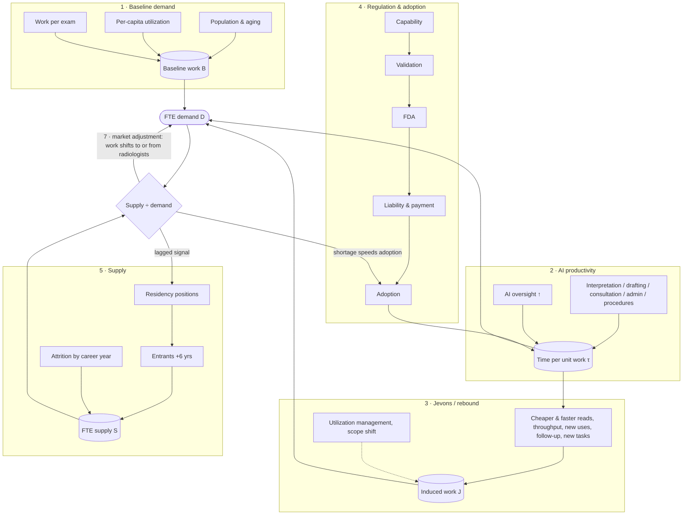
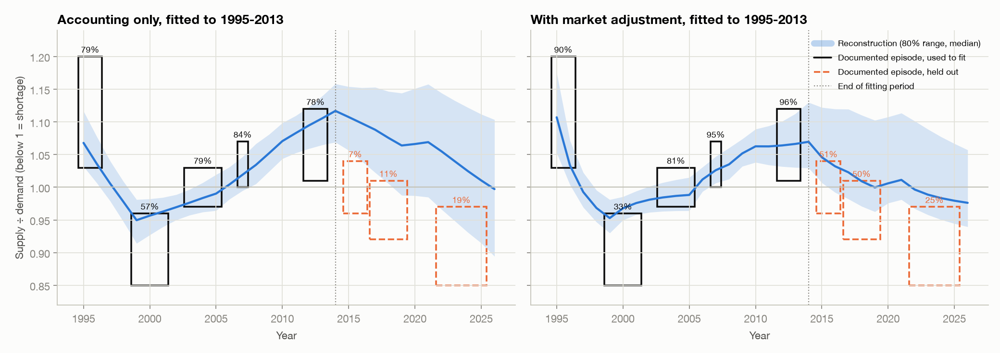
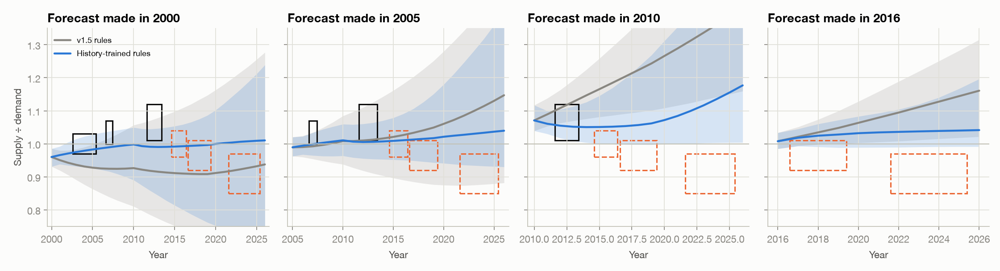
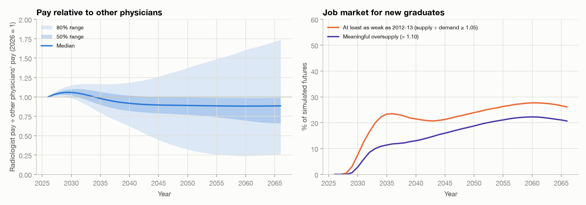

# Will AI Shrink the Radiology Job Market?
## A probabilistic forecast of the U.S. diagnostic-radiology workforce, 2026–2066

*For anyone considering, training in, or early in a career in diagnostic radiology · Version 1.6 · October 2026 ·
Interactive version: <https://ethanuser.github.io/radiology/> · Code and data: this repository*

> **How to read this document.** Every number is produced by the Monte Carlo model in [`model/`](model/) and inserted by
> [`tools/build_docs.py`](tools/build_docs.py); re-running the model regenerates the report. Superscript section marks
> (for example <sup>§4.3</sup>) link each claim to the method or evidence behind it, and numbered superscripts link to references.
> Each reference has ↩ links back to every place it is cited, and your browser's Back button returns you to where you were.
> The model and text were drafted with an AI assistant (Claude, Anthropic) from the cited sources and should be read
> critically. This is a forecast, not career, financial or medical advice. The probabilities are conditional on the model's
> assumptions: read them as structured, model-based judgment (a scenario analysis with explicit weights), not as a calibrated
> statistical forecast. §8.4 shows how much they move under alternative assumptions and model structures.

---

## Summary

**Question.** Diagnostic radiology is the specialty most often named as a likely casualty of AI. For someone choosing the
specialty now, or already training in it, what will the market for radiologists' labor look like when they enter practice
and over the following decades? How much does AI change it?

**Approach.** We built a probabilistic model with five separately specified components: baseline imaging demand, task-level
AI productivity, the regulatory and adoption pipeline for autonomous AI, Jevons/rebound effects, and a cohort model of
radiologist supply with an endogenous residency response.<sup>[§4](#sec-model "Method / evidence for this claim")</sup> Its 68 uncertain inputs are drawn
from explicit probability distributions, correlated through three latent factors (AI progress, regulatory friction, appetite
for imaging), and propagated through 20,000 simulated futures, of which the 18,697 not already contradicted by
events are kept (§10).<sup>[§4.6](#sec-uncertainty "Method / evidence for this claim")</sup> Version 1.6 adds a market adjustment fitted to radiology's own job market since
1995 and checked on held-out years (§4.7, §6.3).<sup>[§6.3](#sec-history "Method / evidence for this claim")</sup> Each input is graded
**empirical** (E), **anchored** (A: an empirical anchor plus judgment) or **subjective** (S).<sup>[§5](#sec-params "Method / evidence for this claim")</sup>

**Headline results** (median with 10th–90th percentile range; indices relative to 2026):

| Metric | 2030 | 2035 | 2045 | 2055 | 2066 |
|---|---|---|---|---|---|
| **FTE demand** (2026 demand = 1): median (P10–P90) | 0.98 (0.92–1.03) | 1.00 (0.90–1.06) | 1.12 (0.84–1.25) | 1.19 (0.79–1.44) | 1.25 (0.77–1.68) |
|   FTE demand: P25–P75 | 0.95–1.01 | 0.96–1.03 | 1.06–1.17 | 1.07–1.29 | 1.06–1.43 |
| **FTE supply** (2026 demand = 1): median (P10–P90) | 0.97 (0.93–1.00) | 1.01 (0.98–1.05) | 1.12 (1.05–1.19) | 1.19 (1.03–1.34) | 1.25 (0.94–1.53) |
|   FTE supply: P25–P75 | 0.95–0.98 | 0.99–1.03 | 1.09–1.16 | 1.12–1.27 | 1.12–1.38 |
| **Supply ÷ demand** (2026 ≈ 0.94): median (P10–P90) | 0.98 (0.94–1.04) | 1.02 (0.96–1.12) | 1.01 (0.92–1.29) | 1.01 (0.89–1.34) | 1.00 (0.86–1.24) |
|   Supply ÷ demand: P25–P75 | 0.96–1.01 | 0.99–1.05 | 0.99–1.04 | 0.99–1.06 | 0.98–1.06 |
| **AI productivity** (work per radiologist-hour, 2026 = 1) | 1.06 (1.02–1.19) | 1.21 (1.09–1.73) | 1.37 (1.21–2.68) | 1.46 (1.28–3.47) | 1.54 (1.32–3.62) |
|   AI productivity: P25–P75 | 1.03–1.10 | 1.14–1.30 | 1.28–1.49 | 1.35–1.61 | 1.41–1.72 |
| **AI-first / autonomous share** of interpretive work | <1% (<1%–2%) | 2% (<1%–9%) | 11% (3%–46%) | 24% (8%–80%) | 44% (16%–95%) |
|   AI-first share: P25–P75 | <1%–1% | <1%–4% | 6%–20% | 15%–44% | 25%–57% |
| P(demand < 2026 level) | 70% | 53% | 16% | 19% | 20% |
| P(demand < 80% of 2026) | <1% | 5% | 9% | 11% | 11% |
| P(demand < 50% of 2026) | 0% | <1% | 1% | 3% | 3% |
| P(supply > demand) | 33% | 68% | 63% | 63% | 56% |
| **P(meaningful oversupply: S/D > 1.10)** | 3% | 11% | 16% | 21% | 21% |
|   P(gap of 10%+ before the market adjustment) | 2% | 18% | 34% | 40% | 43% |
| P(severe oversupply: S/D > 1.25) | <1% | 5% | 11% | 13% | 9% |
| P(shortage worse than 10%: S/D < 0.90) | 1% | 3% | 9% | 11% | 13% |

**Key findings**

1. **Over the next decade today's shortage most likely eases into rough balance.** Radiologists who will practice in 2035
   have mostly already matched or started medical school, imaging keeps growing with an aging population, and the job market
   has historically corrected imbalances within a few years (§6.3). The median supply/demand ratio in 2035 is
   1.02 (below 1 means a shortage). Meaningful oversupply (more than 10% excess radiologist capacity) has
   probability 11% in 2035 and a meaningful shortage 3%; most of the
   oversupply risk sits in a "transformative AI" branch with a 12% prior, and outside it the risk is
   2%.<sup>[§7.2](#sec-balance "Method / evidence for this claim")</sup><sup>[§7.5](#sec-regimes "Method / evidence for this claim")</sup>
2. **Long-run risk is moderate and concentrated in very fast AI.** Median FTE demand rises +12% by 2045
   and +19% by 2055, because AI productivity absorbs much of the growth in imaging. Meaningful oversupply has
   probability 16% in 2045 and 21% in 2055; a slight surplus is common
   ($R>1$ in 63% of futures in 2045) because the market adjustment absorbs moderate
   imbalances. Those figures assume surpluses are absorbed the way the history fit suggests; if the market absorbed shortages
   but not surpluses, meaningful oversupply would be 34% in 2045 and
   38% in 2055. Before the market adjusts, a gap of 10% or more arises in
   34% of futures in 2045. Outside the transformative branch, meaningful oversupply is 6% likely in 2045 and
   12% in 2055. With no further AI it would be 1% and
   4%; with assistive AI but no AI-first reading,
   11% and 11%.<sup>[§7.1](#sec-ds "Method / evidence for this claim")</sup>
3. **A collapse is a tail, not a base case.** Demand falls below half of today's level with probability
   1% in 2045 and 3% in 2066, almost entirely in
   transformative-AI worlds.<sup>[§7.5](#sec-regimes "Method / evidence for this claim")</sup>
4. **AI productivity is real but slow to be realized.** Median time saved per unit of imaging work is
   17% in 2035 and 31% in 2055. AI-first or autonomous
   reading reaches a median 11% of interpretive work by 2045. For each tier of exam
   difficulty, the chain from technical capability to clinical validation, FDA authorization, liability and payment
   acceptance, and hospital adoption takes one to two decades by assumption (the lag priors in §4.3, anchored on past
   diffusion); it is an input, not a finding.<sup>[§7.3](#sec-aiprod "Method / evidence for this claim")</sup><sup>[§4.3](#sec-pipeline "Method / evidence for this claim")</sup>
5. **A true Jevons paradox is unlikely under the main assumptions, but this depends on the demand channels assumed.**
   AI-induced demand (cheaper and faster reads, new applications, follow-up of AI-detected findings, scanner throughput, new
   radiologist tasks) offsets a median 51% of the labor AI saves by 2045 and exceeds it in only
   4% of simulated futures. If AI creates three times as many new imaging uses (and twice the new
   radiologist tasks) as assumed, that rises to
   29%.<sup>[§7.4](#sec-jevres "Method / evidence for this claim")</sup><sup>[§8.4](#sec-robust "Method / evidence for this claim")</sup>
6. **What drives the forecast:** the AI-progress regime, then per-person imaging growth, then the market adjustment and the
   size of assistive-AI time savings. Most of the spread comes from inputs graded subjective.<sup>[§8](#sec-sensitivity "Method / evidence for this claim")</sup>
7. **A surplus would most likely be felt as lower pay relative to other physicians and a weaker market for new graduates, not
   unemployment.** In a readout calibrated on radiology's pay history (§9.2), median pay relative to other physicians is
   0.89 times its 2026 level in 2045 (80%: 0.45–1.26), as
   today's shortage premium erodes, and a job market at least as weak as 2012–13 has probability
   21% in 2045. On held-out years the pay readout got the direction of the 2022–2025 surge
   right but predicted only about a third of its size. A severe
   surplus ($R>1.25$) lasting five or more years occurs in 15% of futures
   (6% outside the transformative branch).<sup>[§9.2](#sec-margins "Method / evidence for this claim")</sup>
8. **Radiology's own history is the main validation, and it changed the model.** Fitted to the documented job market of
   1995–2013, the model's accounting alone gave the held-out 2015–2025 recovery and shortage little probability. Adding a
   market adjustment, in which work shifts between radiologists and others and labor-saving change speeds up or slows down,
   predicted them much better, mainly by pulling the market back toward balance; the history shows the adjustment is at least
   moderately fast and large but cannot bound it from above. Its surplus side rests mostly on the 2013–2018 recovery, and the
   mechanism in that direction is assumed rather than observed. Removing the adjustment while keeping v1.6's other inputs
   raises the 2045 oversupply probability to 36%. Forecasts made from past
   start years improved too, but still did not beat a naive "always balanced" forecast on the held-out years, and for three
   other occupations a simple average of official projections and trends beat the full method.<sup>[§6.3](#sec-history "Method / evidence for this claim")</sup><sup>[§6.2](#sec-backtest "Method / evidence for this claim")</sup>
9. **The direction is robust; the exact numbers are not.** Under 8 alternative prior sets (two of them
   combinations) and 12 alternative model
   structures (including weaker or no market adjustment, reads with no radiologist, automation that does not follow a difficulty
   ladder, and little or no shortage today), the 2045 oversupply probability ranges from 8% to
   36% (main model 16%); changing the AI and imaging priors together
   widens this to 4%–38%. Every variant agrees that oversupply risk is
   lower in 2035 than later. The largest single movers are the AI-progress priors and whether surpluses are absorbed.<sup>[§8.4](#sec-robust "Method / evidence for this claim")</sup>

**By career stage** (details in §9<sup>[§9](#sec-careers "Method / evidence for this claim")</sup>):

| Where you are in fall 2026 | Typical first attending year* | P(meaningful oversupply) when you start | 10 years in | 20 years in | 30 years in (or 2066) | P(demand below 2026) 10 years in | P(meaningful shortage) when you start |
|---|---|---|---|---|---|---|---|
| Pre-med (college junior) | 2038 | 12% | 18% | 22% | 21% (2066) | 17% | 5% |
| Medical student, year 1 | 2036 | 12% | 17% | 21% | 21% (2066) | 16% | 3% |
| Medical student, year 2 | 2035 | 11% | 16% | 21% | 21% (2065) | 16% | 3% |
| Medical student, year 3 | 2034 | 11% | 15% | 21% | 21% (2064) | 16% | 2% |
| Medical student, year 4 | 2033 | 10% | 15% | 20% | 22% (2063) | 16% | 2% |
| Intern (PGY-1) | 2032 | 9% | 14% | 20% | 22% (2062) | 16% | 2% |
| Radiology resident, R1 | 2031 | 6% | 14% | 19% | 22% (2061) | 18% | 1% |
| Radiology resident, R2 | 2030 | 3% | 13% | 19% | 22% (2060) | 20% | 1% |
| Radiology resident, R3 | 2029 | 1% | 13% | 18% | 22% (2059) | 23% | 1% |
| Radiology resident, R4 | 2028 | <1% | 12% | 18% | 22% (2058) | 29% | 1% |
| Fellow | 2027 | 0% | 12% | 17% | 22% (2057) | 36% | 1% |
| Practicing radiologist | 2026 | 0% | 12% | 17% | 21% (2056) | 44% | 6% |

\*Assumes a 1-year fellowship; subtract one year without it.

---

<a name="sec-question"></a>
## 1. Question, scope and definitions

**Population.** U.S. diagnostic radiologists. Supply is calibrated to the Harvey L. Neiman Health Policy Institute count of
37,482 radiologists enrolled to serve Medicare patients in 2023 <a name="c1-1"></a><sup>[1](#ref-1)</sup>, a broader definition than the AAMC's
28,618 "radiology and diagnostic radiology" physicians <a name="c2-1"></a><sup>[2](#ref-2)</sup>. All outputs are indices relative to 2026, so the
definitional difference matters mainly through the ratio of entrants to the existing stock.

**Career timelines.** The stage table above shows when people at each stage in 2026 would typically start independent
practice: a pre-med around 2038, a first-year medical student around 2035–2036, a current R1 around 2031. The forecast
reports calendar years. Read across to your own start year.

**Definitions.**

* **FTE demand $D(t)$**: radiologist full-time equivalents needed to perform the imaging work demanded of radiologists in year
  $t$, given the AI in use and after the market adjustment (§4.7), as an index with $D(2026)=1$. It includes work that is
  currently backlogged or outsourced.
* **FTE supply $S(t)$**: practicing radiologists × FTE per head, as an index with $S(2026)=1$.
* **Supply/demand ratio $R(t)$**, in absolute FTEs. Today's market is short: $R(2026)$ ≈ 0.94 (range 0.88–0.99).<sup>[§4.1](#sec-baseline "Method / evidence for this claim")</sup>
  **Meaningful oversupply** is $R>1.10$, a convention for a clearly noticeable surplus. For scale, the history reconstruction
  (§6.3) puts the 2012–13 market, when new graduates struggled to find jobs <a name="c3-1"></a><a name="c4-1"></a><sup>[3](#ref-3),[4](#ref-4)</sup>, at about
  1.05, so meaningful oversupply is about twice that surplus. We also report $P(R>1)$.
  **Severe oversupply** is $R>1.25$.
* **AI productivity $P(t)$**: imaging work completed per radiologist-hour relative to 2026. Time saved is $1-1/P$.
* **AI-first/autonomous share**: share of interpretive work where AI is the primary reader and the radiologist audits,
  signs off or handles escalations.

---

<a name="sec-approach"></a>
## 2. Forecasting approach: outside view first

We follow practices that distinguish accurate forecasters in tournaments: decompose the question, start from base rates
(the "outside view"), state explicit probabilities with wide intervals, and name the observations that should move the
forecast <a name="c5-1"></a><a name="c6-1"></a><a name="c7-1"></a><a name="c8-1"></a><sup>[5](#ref-5)-[8](#ref-8)</sup>. Four reference classes anchor the priors.

1. **Confident predictions that AI would displace radiologists have so far failed.** In 2016 Geoffrey Hinton said that
   people "should stop training radiologists now" <a name="c9-1"></a><sup>[9](#ref-9)</sup>. A decade later, diagnostic-radiology programs offered a
   record 1,241 positions with a 97.6% fill rate <a name="c10-1"></a><sup>[10](#ref-10)</sup>, and average radiology compensation rose 6.6% in the latest
   annual survey <a name="c11-1"></a><sup>[11](#ref-11)</sup>. The FDA lists more than 1,600 AI-enabled devices, about three-quarters in radiology
   <a name="c12-1"></a><sup>[12](#ref-12)</sup>, but claims data show clinical use concentrated in a handful of products <a name="c13-1"></a><sup>[13](#ref-13)</sup>. Langlotz's framing
   since 2019 has been that AI changes the work rather than replacing the worker <a name="c14-1"></a><a name="c15-1"></a><sup>[14](#ref-14),[15](#ref-15)</sup>.
2. **The radiology labor market cycles with supply and utilization shocks.** After the mid-1990s downturn, radiology trainee
   numbers fell to a nadir of 3,080 in 1997 and then rose 84% by 2011 <a name="c16-1"></a><sup>[16](#ref-16)</sup>. Positions kept expanding despite
   a softening job market, and the market was oversupplied by the mid-2010s <a name="c17-1"></a><sup>[17](#ref-17)</sup>. In the 2015 Match only 86%
   of advanced DR positions filled and U.S. graduates took 67% of matched positions <a name="c18-1"></a><sup>[18](#ref-18)</sup>. Students respond to market
   signals within a few years <a name="c19-1"></a><a name="c20-1"></a><sup>[19](#ref-19),[20](#ref-20)</sup>.
3. **Clinical technology diffuses only after payment and liability are resolved, and then it can diffuse quickly.**
   Mammography computer-aided detection (FDA 1998, Medicare payment 2002) was used for most U.S. screening mammograms within a
   few years, despite no measurable accuracy benefit <a name="c21-1"></a><sup>[21](#ref-21)</sup>. Hospital EHR adoption passed 50% about four years after
   the 2009 HITECH subsidies <a name="c22-1"></a><sup>[22](#ref-22)</sup>. Autonomous diabetic-retinopathy AI took three years from FDA
   authorization (2018) to a payable CPT code <a name="c23-1"></a><sup>[23](#ref-23)</sup>.
4. **Automation economics.** In the task framework, automation displaces labor from automated tasks, raises demand through
   productivity, and can reinstate labor through new tasks <a name="c24-1"></a><a name="c25-1"></a><sup>[24](#ref-24),[25](#ref-25)</sup>. Whether
   employment rises depends on demand elasticity, which was high early in industrialization and fell as demand saturated
   <a name="c26-1"></a><sup>[26](#ref-26)</sup>. Most of today's U.S. employment is in job specialties created after 1940 <a name="c27-1"></a><sup>[27](#ref-27)</sup>. Whether automation
   raises or lowers wages depends on whether it removes the expert or the inexpert parts of a job <a name="c28-1"></a><sup>[28](#ref-28)</sup>.
   The idea that efficiency can increase total use goes back to Jevons <a name="c29-1"></a><sup>[29](#ref-29)</sup>.

**AI-progress inputs.** METR's measured task horizons for frontier models doubled about every seven months from 2019 to 2024
<a name="c30-1"></a><sup>[30](#ref-30)</sup>, and faster after 2023 <a name="c31-1"></a><sup>[31](#ref-31)</sup>. AI 2027 sketches very rapid progress <a name="c32-1"></a><sup>[32](#ref-32)</sup>. A survey of 2,778 AI
researchers put even odds on machines outperforming humans at every task by 2047, but on full automation of occupations only
by 2116 <a name="c33-1"></a><sup>[33](#ref-33)</sup>. Expert and superforecaster panels assign far lower probabilities to near-term transformative AI than
industry leaders do <a name="c34-1"></a><a name="c35-1"></a><sup>[34](#ref-34),[35](#ref-35)</sup>. We use these sources only to weight four AI-progress regimes and to scale
when radiology capabilities arrive.<sup>[§4.6](#sec-uncertainty "Method / evidence for this claim")</sup> None of them is a forecast about medicine.

<a name="sec-approaches"></a>
### 2.1 Ways to forecast a job market, and why this one

There are several ways to answer "will there be jobs?", each with a track record.

| Approach | Strength | Weakness | Evidence on accuracy |
|---|---|---|---|
| Ask a domain expert or a famous thinker | Rich context, fast | Overconfident; experts rarely beat informed generalists on long-range questions | In 20 years of tracked political and economic forecasts, specialists did no better than generalists, and "hedgehogs" with one big idea did worst <a name="c36-1"></a><sup>[36](#ref-36)</sup>. Hinton's 2016 call on radiology <a name="c9-2"></a><sup>[9](#ref-9)</sup> |
| Aggregate many forecasters (superforecasters, prediction markets) | Best record on 1–2 year questions | Few long-horizon or niche questions; thin markets | Teams of trained forecasters beat individuals and intelligence analysts <a name="c5-2"></a><a name="c6-2"></a><sup>[5](#ref-5),[6](#ref-6)</sup>; markets aggregate dispersed information well <a name="c8-2"></a><a name="c37-1"></a><sup>[8](#ref-8),[37](#ref-37)</sup>. In a 2022 tournament, superforecasters and domain experts had nearly identical overall accuracy, and both underestimated AI benchmark progress, superforecasters more so (9.7% vs 24.6% average probability on what happened); the median of all forecasts beat individuals <a name="c38-1"></a><sup>[38](#ref-38)</sup> |
| Extend the trend / reference-class base rates | Simple, hard to beat over short horizons | Misses turning points | The "outside view" corrects planning optimism <a name="c7-2"></a><sup>[7](#ref-7)</sup>; simple statistical methods were competitive in the M4 competition <a name="c39-1"></a><sup>[39](#ref-39)</sup> |
| Official projections (BLS) | Careful, occupation-level, public | Assume slow technology change | BLS projected +14% for medical transcriptionists over 2006–16; employment fell 41% <a name="c40-1"></a><a name="c41-1"></a><sup>[40](#ref-40),[41](#ref-41)</sup> |
| Task-exposure indices | Rank which jobs are exposed | No timing, regulation or demand response | Frey & Osborne ranked transcription as highly automatable and software as not <a name="c42-1"></a><sup>[42](#ref-42)</sup>; LLM exposure estimates <a name="c43-1"></a><sup>[43](#ref-43)</sup> |
| Scenarios | Make tails concrete | No probabilities | AI 2027 <a name="c32-2"></a><sup>[32](#ref-32)</sup> |
| Structured probabilistic model (this report) | Decomposes the question into parts with evidence; keeps every assumption explicit; outputs probabilities that can be updated | Only as good as its subjective inputs; can create false precision | Combining forecasts usually beats choosing one <a name="c39-2"></a><a name="c44-1"></a><sup>[39](#ref-39),[44](#ref-44)</sup>; backtests in §6.2–6.3<sup>[§6.3](#sec-history "Method / evidence for this claim")</sup> |

We use the structured model as the main tool, but borrow from the others: base rates set the priors (§2), official
projections and trends enter the backtest baseline, radiology's own history calibrates the market adjustment (§6.3), AI
forecasts weight the regimes, and the signposts in §9.3 are designed for updating, as superforecasters do. No method has a good record at 20–40-year horizons, so the long-range probabilities
in this report should be read as structured judgment, not measurement.

---

<a name="sec-evidence"></a>
## 3. Recent evidence (2024–2026)

For a general overview of what AI can and cannot yet do compared with radiologists, see the review by Rajpurkar and
Lungren in the *New England Journal of Medicine* <a name="c45-1"></a><sup>[45](#ref-45)</sup> and Mousa's accessible essay on why AI has not replaced
radiologists <a name="c15-2"></a><sup>[15](#ref-15)</sup>. This section summarizes the empirical work most relevant to the model's least certain components. Full texts of RSNA and
open-access journals were reviewed. For some Elsevier journals (including JACR), figures come from abstracts because
full-text access was blocked for automated reading.

**3.1 How much time does AI save radiologists today?**

| Study | Setting and design | Measured effect on radiologist time |
|---|---|---|
| Huang et al, 2025 <a name="c46-1"></a><sup>[46](#ref-46)</sup> | 23,960 radiographs, live deployment, 12 hospitals | 15.5% faster documentation; no loss of accuracy |
| Hong et al, 2025 <a name="c47-1"></a><sup>[47](#ref-47)</sup> | 758 chest radiographs, 5 readers, reader study | Reading time 34.2 s → 19.8 s (−42%) |
| Li et al, 2026 <a name="c48-1"></a><sup>[48](#ref-48)</sup> | LLM impressions, 42 hospitals, blinded comparison | −0.46 min per report; impressions non-inferior in 69% |
| Liu et al, 2026 <a name="c49-1"></a><sup>[49](#ref-49)</sup> | 185,044 chest CT reports, 2 hospitals, retrospective | No sustained efficiency gain at one of two sites |
| Tanno et al, 2025 <a name="c50-1"></a><sup>[50](#ref-50)</sup> | AI chest-radiograph reports vs radiologists | AI report preferred or equivalent in 77.7% (94% of normal cases); clinically significant errors in 22.8% of AI-only vs 14.0% of human-only reports |
| Wenderott et al, 2024 <a name="c51-1"></a><sup>[51](#ref-51)</sup> | Meta-analysis of real-world AI deployments | 67% of studies reported time reductions; pooled effects not significant |
| Yu et al, 2024 <a name="c52-1"></a><sup>[52](#ref-52)</sup> | 140 radiologists, 15 chest-radiograph tasks | Effects of AI assistance highly heterogeneous; erroneous AI output hurt performance |
| Lauritzen et al, 2024 <a name="c53-1"></a><sup>[53](#ref-53)</sup> | Danish screening program before vs after AI | 33.5% fewer screening reads; higher cancer detection, lower recall |
| MASAI, 2023–2026 <a name="c54-1"></a><a name="c55-1"></a><a name="c56-1"></a><sup>[54](#ref-54)-[56](#ref-56)</sup> | 105,934 women, randomised | 44% lower screen-reading workload; 29% more cancers detected; interval cancers non-inferior (rate ratio 0.88) |

The screening savings come from replacing the second reader in European double reading, a substitution effect that does
not transfer to single-read U.S. practice; we use them only to size tier 1, not to set assistive ceilings. The evidence
supports large savings on drafting and in screening programs, modest and heterogeneous savings on
interpretation, and little measured effect at system scale so far.<sup>[§4.2](#sec-ai "Method / evidence for this claim")</sup>

**3.2 How much work could be read autonomously?** A commercial tool could autonomously report 28% of normal posteroanterior
chest radiographs (7.8% of all) with 99.1% sensitivity for abnormal films <a name="c57-1"></a><sup>[57](#ref-57)</sup>. With a tuned threshold, about 47%
of unremarkable films (roughly 17.5% of all chest radiographs) could be excluded at 99% sensitivity <a name="c58-1"></a><sup>[58](#ref-58)</sup>. An
autonomous normal-chest-radiograph product has held EU CE Class IIb marking since 2022 <a name="c59-1"></a><sup>[59](#ref-59)</sup>. In the U.S., no
autonomous radiology read is FDA-authorized as of October 2026 <a name="c12-2"></a><sup>[12](#ref-12)</sup>. Generative chest-radiograph drafting tools
received FDA Breakthrough designations in 2026, and a cleared breast-ultrasound tool generates reports under radiologist
control <a name="c60-1"></a><a name="c61-1"></a><sup>[60](#ref-60),[61](#ref-61)</sup>. FDA's AI lifecycle guidance remains a draft <a name="c62-1"></a><sup>[62](#ref-62)</sup>. Of FDA-authorized AI
devices, 43% had no published clinical validation and about 4% had randomized evidence <a name="c63-1"></a><sup>[63](#ref-63)</sup>. Liability rules
are unsettled <a name="c64-1"></a><sup>[64](#ref-64)</sup>, and mock jurors judge radiologists more harshly when they miss something AI flagged
<a name="c65-1"></a><sup>[65](#ref-65)</sup>.<sup>[§4.3](#sec-pipeline "Method / evidence for this claim")</sup>

**3.3 Adoption.** In 2020, 33.5% of surveyed U.S. radiologists used any AI <a name="c66-1"></a><sup>[66](#ref-66)</sup>. By 2025, 75% of UK radiology
departments used AI clinically, but the Royal College of Radiologists found no overall reduction in workload. The UK
consultant shortfall was 32% <a name="c67-1"></a><sup>[67](#ref-67)</sup>. In China, AI use was associated with *higher* burnout odds among radiologists with
high workloads <a name="c68-1"></a><sup>[68](#ref-68)</sup>.

**3.4 Workforce and demand.** Average exams read per radiologist-day were flat from 2018 to 2024 (+0.6%), but the busiest
quartile read 30.6% more <a name="c69-1"></a><sup>[69](#ref-69)</sup>. Practice turnover rose from 5.3% to 8.5% between 2013 and 2022 and followed a
U-shaped relationship with workload <a name="c70-1"></a><sup>[70](#ref-70)</sup>. Emergency-department CT per 100 Medicare beneficiaries nearly doubled
from 2013 to 2023 even as ED visits fell <a name="c71-1"></a><sup>[71](#ref-71)</sup>. A review of 2024 imaging research found that 49% of articles
with direct patient-care impact would increase radiologist workload and fewer than 1% would decrease it. AI studies had about 14 times higher
odds of adding work (odds ratio 14.3, 95% CI 4.2–48.2; with a baseline near 49%, roughly twice
as likely) <a name="c72-1"></a><sup>[72](#ref-72)</sup>.<sup>[§4.1](#sec-baseline "Method / evidence for this claim")</sup><sup>[§4.4](#sec-jevons "Method / evidence for this claim")</sup>

**3.5 Labor-market evidence from other occupations.** In payroll data, workers aged 22–25 in the most AI-exposed occupations
saw a 16% relative employment decline after 2022, while experienced workers did not. Firms adjusted headcount rather than
pay <a name="c73-1"></a><sup>[73](#ref-73)</sup>. Danish administrative data show near-zero effects of chatbots on earnings and hours, partly because AI
created new oversight tasks <a name="c74-1"></a><sup>[74](#ref-74)</sup>. Field experiments find meaningful productivity gains concentrated among less
experienced workers <a name="c75-1"></a><sup>[75](#ref-75)</sup>. Macro estimates of AI's productivity effect over a decade are modest
<a name="c76-1"></a><sup>[76](#ref-76)</sup>, and measured exposure is broad across occupations <a name="c43-2"></a><sup>[43](#ref-43)</sup>. These findings shape the model's
assumption that the first adjustment margin is new-graduate hiring rather than layoffs of incumbents.<sup>[§9.2](#sec-margins "Method / evidence for this claim")</sup>

---

<a name="sec-model"></a>
## 4. Model structure



<a name="sec-baseline"></a>
### 4.1 Baseline imaging demand (AI frozen at its 2026 level)

$$B(t)=\prod_{s=2027}^{t}\bigl(1+r_{\text{dem}}(s)+r_{\text{util}}(s)+r_{\text{cmplx}}(s)\bigr)\cdot\frac{1-a(t)}{1-a(2026)}$$

* **Demographics, $r_{\text{dem}}$.** Population growth and aging alone raise imaging 16.9%–26.9% from 2023 to 2055,
  depending on modality <a name="c77-1"></a><sup>[77](#ref-77)</sup>, under Census 2023 population forecasts. CBO's 2026 outlook has markedly lower
  population growth (349 million in 2026 to 364 million in 2056) <a name="c78-1"></a><sup>[78](#ref-78)</sup>, so we center demographic growth of radiologist
  work at 0.52%/yr (A), declining after 2045.
* **Per-capita utilization, $r_{\text{util}}$.** Age-specific CT use grew 3.7–5.2%/yr in 2013–2016 and MRI 1.3–2.2%/yr, while
  nuclear medicine declined <a name="c79-1"></a><sup>[79](#ref-79)</sup>. About 93 million CTs were performed in 2023 <a name="c80-1"></a><sup>[80](#ref-80)</sup>. ED CT per
  Medicare beneficiary nearly doubled from 2013 to 2023 <a name="c71-2"></a><sup>[71](#ref-71)</sup>. National 2018–22 claims data imply total utilization in
  2055 that is 16.9% to 26.9% above 2023 by modality from population growth and aging alone, and between 5.6% lower and 45.2%
  higher if each modality's recent per-person trend continues to 2030 (radiography and nuclear medicine falling, CT and MRI
  rising) <a name="c77-2"></a><sup>[77](#ref-77)</sup>. The Neiman Institute's 2026 update projects +17% (MRI) to +25% (CT) by 2055 and calls the
  shortage "fairly static" <a name="c81-1"></a><sup>[81](#ref-81)</sup>. We start the per-person trend at 1.2%/yr (σ 1.05) and let it converge to 0.2%/yr
  (σ 0.75) with an uncertain half-life. Demographics times per-person use then
  grows a median 41% from 2026 to 2055 (80%:
  5% to 88%). Each end of Christensen's
  trend range is a single modality (CT up, nuclear medicine down), so a work-weighted claims-based figure is lower than CT's;
  version 1.5 centered the trend at 0.6%/yr (σ 0.7) on that basis. The history reconstruction (§6.3) needs radiologist work per
  person to have grown about 2.2%/yr in 2022–2026 to explain
  today's shortage, about 1.8%/yr after removing complexity growth. The new center, 1.2%/yr, weights the two estimates equally by
  precision; the spreads are 1.5 times v1.5's because that width forecast best from past start years. This remains the most
  consequential non-AI judgment (§8.1); the "imaging restraint" prior set in §8.4 is close to the claims-based trends and
  "imaging growth" to the history estimate. The input is graded subjective.
* **Work per exam, $r_{\text{cmplx}}$.** Images per cross-sectional study rose about tenfold at Mayo Clinic from 1999 to 2010
  <a name="c82-1"></a><sup>[82](#ref-82)</sup>. Work per exam grows far more slowly than image counts: 0.4%/yr, decaying with a 20-year half-life.
* **Alternative diagnostics, $a(t)$.** Blood-based tests, AI-ECG and similar tools displace up to 15% of imaging (mode 4%).
* **Today's gap (subjective).** No measured national figure exists. HRSA *projects* radiology at about 90% workforce
  adequacy in 2038, and the Neiman Institute describes the shortage as "fairly static" <a name="c81-2"></a><sup>[81](#ref-81)</sup>. Pay is rising and positions
  are expanding, but per-radiologist volumes are flat on average and the strain is uneven <a name="c69-2"></a><a name="c70-2"></a><sup>[69](#ref-69),[70](#ref-70)</sup>. Two
  thirds of practices reported being understaffed in 2022 <a name="c83-1"></a><sup>[83](#ref-83)</sup>. The history reconstruction puts 2026 at
  0.95 (80%: 0.92–0.98;
  §6.3). $R(2026)$ is triangular on 0.88–0.99 (mode 0.945), combining that estimate with v1.5's judgment (0.85–0.99, mode
  0.93); graded subjective.

<a name="sec-ai"></a>
### 4.2 AI productivity: a task-based model

Following Langlotz's task-based analysis <a name="c84-1"></a><sup>[84](#ref-84)</sup> and the Acemoglu–Restrepo framework, radiologists' 2026 working time
is drawn from a Dirichlet distribution centered on interpretation 42%, measurement and drafting 18%, clinical synthesis and
consultation 13%, administration 15% and procedures 12%. Langlotz allocates 66.7% of time to performing and interpreting
studies, 5.5% to protocoling and 11.8% to communication. A time-motion study found 36.4% pure interpretation <a name="c85-1"></a><sup>[85](#ref-85)</sup>.
For each task $k$, assistive AI saves

$$\sigma_k(t)=m_k\cdot \text{cap}_k(t)\cdot \text{adopt}(t)$$

where $m_k$ is the eventual ceiling (anchored on §3.1), $\text{cap}_k$ a logistic capability curve scaled by the
AI-progress multiplier $M$, and $\text{adopt}$ the effective clinical adoption, whose clock runs faster while demand exceeds
supply (new in v1.1). For the AI-first share $\alpha(t)$, a fraction $f_{\text{sub}}$ of interpretation and drafting time is
removed. Oversight work $o(t)$ grows with AI use <a name="c74-2"></a><sup>[74](#ref-74)</sup>. Time per unit of work relative to a no-AI world is

$$\tau(t)=s_I\bigl[(1-\alpha)(1-\sigma_I)+\alpha(1-f_{\text{sub}})\bigr]+s_D\bigl[(1-\alpha)(1-\sigma_D)+\alpha(1-f_{\text{sub}})\bigr]+\sum_{k\in\{C,A,P\}}s_k(1-\sigma_k)+o(t)$$

and AI productivity is $P(t)=\tau(2026)/\tau(t)$.

<a name="sec-pipeline"></a>
### 4.3 Regulation and adoption: from capability to labor substitution

Interpretive work is split into four autonomy tiers. Tier 1 is normal or negative radiographs and screening exams, ≈7% of
interpretive work after recalibration to the Danish evidence in §3.2. Tier 2 is all radiographs, screening mammography and
standardized follow-ups (≈17%). Tier 3 is complex diagnostic CT/MR/US/NM (≈47%). Tier 4 is the hardest residual work.
These tiers are this report's own construct, not a standard classification. The closest published framework, "levels of
autonomous radiology" <a name="c86-1"></a><sup>[86](#ref-86)</sup>, grades *how much* of a read AI performs (from assistance to fully autonomous
reporting); our tiers instead group *which exams* could plausibly become autonomous first, ordered by current evidence (normal
chest radiographs and screening exams first, §3.2). The ordering is an assumption, tested by the "tiers in any order" structure
in §8.4. AI-first reading of screening mammograms also needs a change to the Mammography Quality Standards Act rules on interpreting
physicians, not just an FDA device authorization, so the archived FDA prediction (§10.1) refers to chest radiographs only. Each
tier passes, in sequence:

$$T^{\text{ready}}_j = T^{\text{cap}}_j + L^{\text{validation}}_j + L^{\text{FDA}}_j + L^{\text{liability/payment}}_j,\qquad
\alpha(t)=\sum_j w_j\,a^{\max}_j\,\text{logistic}\!\left(\tfrac{\tilde t_j(t)-h}{\text{width}}\right)$$

where $\tilde t_j$ is time since readiness on the shortage-accelerated adoption clock. Validation lags are anchored on
MASAI, which took about five years from randomization (April 2021) to its interval-cancer endpoint (January 2026)
<a name="c56-2"></a><sup>[56](#ref-56)</sup>, and on the scarcity of prospective validation <a name="c63-2"></a><sup>[63](#ref-63)</sup>. FDA lags are anchored on the absence of any
U.S. autonomous radiology authorization so far and on the IDx-DR precedent <a name="c12-3"></a><a name="c23-2"></a><sup>[12](#ref-12),[23](#ref-23)</sup>. Liability and
payment lags are anchored on CPT 92229 for autonomous retinal AI, CPT 75577 for AI coronary plaque analysis
<a name="c87-1"></a><sup>[87](#ref-87)</sup>, and liability research <a name="c64-2"></a><a name="c65-2"></a><sup>[64](#ref-64),[65](#ref-65)</sup>. Adoption half-times follow the CAD and EHR precedents
<a name="c21-2"></a><a name="c22-2"></a><sup>[21](#ref-21),[22](#ref-22)</sup>. All lags load on a common regulatory-friction factor.

<a name="sec-jevons"></a>
### 4.4 Jevons and rebound effects

| Channel | Specification | Evidence |
|---|---|---|
| Cheaper interpretation (price) | $(1-\Delta p)^{\varepsilon}-1$; professional share ≈20%, pass-through ≈40%, elasticity ≈−0.2 | <a name="c88-1"></a><a name="c89-1"></a><a name="c90-1"></a><a name="c91-1"></a><sup>[88](#ref-88)-[91](#ref-91)</sup> |
| Faster turnaround & availability | access × time saved | <a name="c92-1"></a><sup>[92](#ref-92)</sup> |
| Scanner throughput / latent demand | latent demand (2–12%) released as AI-accelerated acquisition frees capacity | <a name="c93-1"></a><a name="c94-1"></a><sup>[93](#ref-93),[94](#ref-94)</sup> |
| New applications & screening | lognormal, median 18% of baseline work by 2066 × radiologist intensity 0.4–1.0 | <a name="c72-2"></a><a name="c87-2"></a><a name="c95-1"></a><a name="c96-1"></a><sup>[72](#ref-72),[87](#ref-87),[95](#ref-95),[96](#ref-96)</sup> |
| Incidental findings & follow-up | up to 8% at full AI-detection deployment | <a name="c55-2"></a><a name="c97-1"></a><sup>[55](#ref-55),[97](#ref-97)</sup> |
| New radiologist tasks (reinstatement) | up to 12% of 2026 FTE | <a name="c25-2"></a><a name="c27-2"></a><sup>[25](#ref-25),[27](#ref-27)</sup> |
| AI utilization management (−) | up to 8% | <a name="c84-2"></a><a name="c98-1"></a><sup>[84](#ref-84),[98](#ref-98)</sup> |
| Scope shift to non-radiologists (−) | up to 10% | subjective |

Exam-generating channels pass through a smooth minimum with capacity: $G=G_{\text{pot}}(1+(G_{\text{pot}}/K)^4)^{-1/4}$. FTE
demand is

$$D(t)=B(t)\,\frac{1+J(t)}{1+J(2026)}\,\frac{\tau(t)}{\tau(2026)}+B(t)\bigl[N(t)-N(2026)\bigr]$$

Labor saved is $L=B(1-\tau/\tau_0)$, induced demand is $I=D-B\,\tau/\tau_0$, and the offset ratio is $I/L$. A *true Jevons
paradox* is $I>L$, equivalently $D>B$. The identity $D=B-L+I$ is unit-tested.

<a name="sec-supply"></a>
### 4.5 Radiologist supply

A cohort model tracks practicing radiologists by years in practice. Exit hazard rises to retirement levels after about 33
years and is scaled by a multiplier, U(0.95, 1.25). With flat positions, multipliers of 1.0 and 1.2 reproduce the published
supply projections under blended 2014–23 attrition (+25.7% by 2055) and post-COVID attrition (+20.9%); the range is centered
between them, nearer the post-COVID case. Measured attrition rose from 1.1% (2014) to 2.0% (2019) and 2.5% (2022)
<a name="c1-2"></a><a name="c81-3"></a><sup>[1](#ref-1),[81](#ref-81)</sup>; the cohort model's aggregate rate is not directly comparable, because the
entrants-per-position factor $\kappa$ absorbs definitional differences.
Practice turnover has also roughly doubled <a name="c70-3"></a><sup>[70](#ref-70)</sup>. Run backward, the cohort machinery does not reproduce 1995–2022
headcount growth or exit rates (§6.3); the forward path relies on the calibration to Christensen et al's age-based projection.
Entrants in year $t$ equal $\kappa$ × filled DR positions from
the year $t-6$ Match, where $\kappa=$1.20 is calibrated so that flat residency
positions reproduce Christensen et al's +25.7% (2023–2055) <a name="c1-3"></a><sup>[1](#ref-1)</sup>. Positions start at 1,241 <a name="c10-2"></a><sup>[10](#ref-10)</sup>,
follow a trend (1.5%/yr, σ 0.8, capped at 1.8× by GME funding; positions grew about 1.9%/yr in 2010–2025 <a name="c99-1"></a><sup>[99](#ref-99)</sup>), and
respond to a market signal $x=\ln(D/S)$ averaged over three years and observed with a 1–3-year lag, clipped to [−0.7, 0.4]:

$$\text{positions}^{*}=\text{trend}\cdot e^{\gamma' x},\quad \gamma'=\gamma \text{ if } x<0 \text{ (surplus) else } 0.3\gamma,\qquad \tilde p=\text{positions}_t(1+g),\quad \text{positions}_{t+1}=\tilde p+0.35(\text{positions}^{*}-\tilde p)$$

$$\text{fill}=0.976\,e^{\kappa_f\min(x,0)}-\text{fear}\cdot\text{visibility}_{AI}$$

Programs cut positions faster in a surplus than they add them in a shortage (GME caps). The trend accrues only while the market
is not in surplus, so programs stop expanding during a glut; each year positions grow with that trend and then close 35% of the remaining gap to the market-adjusted target.

<a name="sec-uncertainty"></a>
### 4.6 Uncertainty, correlation, regimes and the shortage feedback

Inputs are drawn through a structured Gaussian copula with three factors: AI progress, regulatory friction and appetite for
imaging. This preserves every marginal while inducing the intended correlations, which are tested: faster AI means earlier
capability *and* higher task ceilings *and* more new applications *and* more throughput. The AI factor selects a regime with
these subjective weights:

| Regime | Weight | Timeline multiplier $M$ | Interpretation |
|---|---|---|---|
| Stall | 15% | 1.6–3.0 | radiology AI arrives 1.6–3× later than trend |
| Trend | 55% | lognormal, median 1 | current pace continues |
| Fast | 18% | 0.40–0.65 | roughly 2× faster |
| Transformative | 12% | 0.25–0.45 + lifted ceilings | AI eventually does nearly all radiologist cognitive work; institutional lags for tiers 2–4 shrink 40%; robotics still lags |

**Shortage feedback (new in v1.1).** Version 1.0 assumed adoption speed was independent of the shortage. Now the model solves
in two passes. Pass 1 computes the shortage path $\ln(D/S)$. Pass 2 runs the assistive and autonomous adoption clocks faster
by $1+\kappa_a\max(0,\ln(D/S))$ with $\kappa_a\sim U(0,4)$ (subjective), so a 7% shortage speeds adoption by up to 28%. This is one
fixed-point iteration of the coupled system.

<a name="sec-market"></a>
### 4.7 Market adjustment (new in v1.6)

Radiology's job market has repeatedly corrected shortages and surpluses within a few years, faster than the training
pipeline allows (§6.3). Version 1.6 represents this with a bounded adjustment of the work that flows to radiologists. Each
year a share $\lambda$ of the remaining imbalance closes, until the cumulative adjustment reaches a limit $b$:

$$A(t)=\operatorname{clip}\bigl(A(t-1)+\lambda\ln R(t-1),\,-b,\,b\bigr),\qquad D(t)=D^{*}(t)\,e^{A(t)},\qquad A(2026)=0$$

where $D^{*}$ is demand from §4.1–4.4. In a shortage, other physicians take more of the work and labor-saving tools spread
faster, as in 1998–2005 <a name="c100-1"></a><a name="c101-1"></a><sup>[100](#ref-100),[101](#ref-101)</sup>. In a surplus the model assumes the reverse:
radiologists take back reads, take on new services, and labor-saving tools spread more slowly. In effect the adjustment pulls
supply ÷ demand back toward 1, but only so far. Both parameters are bounded by history only from below: the fit to 1995–2013
rules out slow adjustment (speed below about 0.2 per year) and weak adjustment (limits below about 0.08–0.10), but with wider
priors it allows speeds up to about 0.7 and limits up to 0.5, because past imbalances never exceeded about 10–15%. We use
$\lambda\sim U(0.2, 0.55)$ and $b\sim U(0.08, 0.28)$, the fit's 80% ranges under the original priors; their upper ends are
judgments (both graded subjective). Fitted separately, the surplus side and the shortage side get similar, weakly pinned
limits (80%: 0.06–0.28 and
0.04–0.27); on the held-out years, surplus-side adjustment alone
predicts better (Brier 0.43) than shortage-side alone
(0.65; both 0.37), mostly through the 2013–2018 recovery. The history test
cannot tell which mechanism does the work, and the reverse flows during surpluses are assumed. Because the headline depends
on them, §8.4 reports the model with shortage-side adjustment only.

**Overlaps.** The shortage side overlaps the shortage-driven adoption feedback (§4.6), whose separate effect is small
(§8.1); "taking on new services" overlaps the new-task and Jevons channels (§4.4); and "taking back reads" runs against the
AI-driven scope shift (§4.4) without being limited to the reads non-radiologists actually do. The limit $b$ caps the combined
effect but does not remove the double counting.

**What the headline now measures.** Beyond the limit, imbalances persist until residency positions and entry respond, so
supply ÷ demand after adjustment measures imbalance the market could not absorb. That changes the meaning of "meaningful
oversupply" from v1.5, which counted the raw imbalance; the headline table therefore also reports the chance of a 10%+ gap
before the adjustment, which is the work that would have to shift to radiologists, or AI uptake that would have to slow, to
avoid a surplus. The Jevons accounting (§4.4) refers to demand before adjustment
($D^{*}=B-L+I$). The "no market adjustment" structure in §8.4 restores the v1.5 dynamics.

---

<a name="sec-params"></a>
## 5. Parameters and evidence

The model has 68 sampled parameters plus the task-share Dirichlet: 0 graded E,
32 graded A and 36 graded S. The empirical backbone sits mostly in **fixed calibration
targets**: the 2023 workforce, career length, attrition, the flat-residency supply projection, 2026 positions and fill rate,
and the demographic projection. The full table is in [Appendix A](#appendix-a). What is *not* well supported by data: the
speed of general AI progress, the ceilings on AI time savings for non-interpretive tasks, the size of AI-enabled new
applications, and regulatory and liability lags for autonomous reading. These are the parameters the sensitivity analysis
flags.<sup>[§8](#sec-sensitivity "Method / evidence for this claim")</sup>

---

<a name="sec-validation"></a>
## 6. Calibration and validation

### 6.1 Calibration checks

| Check | Model | Reference |
|---|---|---|
| Supply growth 2023→2055, flat residency (calibration target, matched by construction) | +25.7% | +25.7% <a name="c1-4"></a><sup>[1](#ref-1)</sup> |
| Supply growth 2023→2055, flat residency, attrition multiplier 1.2 (calibration end-point, not independent) | +21.5% | +20.9% with post-COVID attrition <a name="c81-4"></a><sup>[81](#ref-81)</sup> |
| Matched to the Neiman update: demographics-only demand, post-COVID attrition, flat positions, no AI, no market adjustment: supply ÷ demand (consistency check) | median 0.96 (2035), 0.98 (2045), 0.97 (2055) | shortage "fairly static" if no action is taken <a name="c81-5"></a><sup>[81](#ref-81)</sup> |
| Same, but with this model's per-person and complexity growth and blended attrition (accounting only) | median 0.87 (2035), 0.84 (2045), 0.80 (2055) | shortage "fairly static" if no action is taken <a name="c81-6"></a><sup>[81](#ref-81)</sup> |
| Mean career length | 34.6 years | 34.2–35.7 years |
| Aggregate attrition, 2023 | 2.7%/yr at multiplier 1.0 (sampled median ≈3.0%; entrants per position, 1.20, inflate entries and exits alike; §6.3) | 1.1% (2014) rising to 2.5% (2022) <a name="c81-7"></a><sup>[81](#ref-81)</sup> |
| Demographic growth of imaging work, 2026→2055 | 15.7% | +16.9% to +26.9% for 2023→2055 with higher Census population <a name="c77-3"></a><sup>[77](#ref-77)</sup> |
| Realized AI time savings by 2031 | median 7.9% (P90 22%) | Langlotz: 33% (14%–49%), an "upper end" potential if all applications are adopted <a name="c84-3"></a><sup>[84](#ref-84)</sup> |
| Demographics × per-person imaging use, 2026→2055 | median 41% (80%: 5% to 88%) | 2023→2055 across modalities: +16.9% to +26.9% (demographics only), −5.6% to +45.2% (recent trends to 2030) <a name="c77-4"></a><sup>[77](#ref-77)</sup>; +17% to +25% <a name="c81-8"></a><sup>[81](#ref-81)</sup> |
| Baseline radiologist work 2026→2055, no further AI | +43% median | Exam projections above plus work per exam (complexity); no direct benchmark |

Matched to the Neiman update's assumptions, the model gives a roughly static shortage, as they do. With this model's own
per-person and complexity growth, the no-AI shortage instead deepens slowly; the gap is entirely those demand assumptions.

The starting point is reconstructed from radiology's job-market history in §6.3, which replaces the rough back-cast of v1.5.

The near-term AI effect is below Langlotz's potential because the model adds documented diffusion, validation and payment
lags. It sits within the range of measured real-world effects in §3.1. Unit tests check the calibrations, the exact Jevons
identity, copula marginals and correlation signs, regime weights, the shortage feedback, the alternative structures, and that
every reference has a link (links were checked by hand, not by the tests).

<a name="sec-backtest"></a>
### 6.2 Backtest on other occupations: forecasting 2025 from 2016

Calibration checks show that the model reproduces published projections; they do not show that the *method* forecasts well.
To test that, we set the clock back to 2016 and forecast employment in 2025 using only information available then. 2016 is a
natural start: it is the year of Hinton's "stop training radiologists" remark and of large-scale neural machine translation.

**Protocol** (fixed before computing outcomes; code in `model/backtest.py`). The three occupations share one protocol, and the
per-occupation capability dates were judged in 2026, so hindsight may enter. The backtest replays a simplified version of the
method, with the same structure and AI-regime mixture but a generic task-exposure model, rather than the full radiology model.
Radiology itself is tested from several start years in §6.3, which replaces the single 2016 radiology hindcast of earlier
versions.

* *Baseline (non-AI) growth* is an equal-weight combination of the BLS 2016–26 projection and the prior decade's trend. Their
  disagreement sets the baseline uncertainty <a name="c44-2"></a><sup>[44](#ref-44)</sup>.
* *AI layer*, with the same structure as the main model: a share of work exposed to automation (mapped from Frey & Osborne's
  2013 automation probabilities <a name="c42-2"></a><sup>[42](#ref-42)</sup>, the standard estimate in 2016), a capability S-curve timed by the
  **same AI-regime mixture** as the main model, an adoption lag, and a demand rebound set by the occupation's demand elasticity
  (high for software, middle for translation, low for transcription).
* Employment data come from the BLS *Occupational Outlook Handbook* (2008, 2018 and 2026 editions) <a name="c40-2"></a><a name="c41-2"></a><a name="c102-1"></a><a name="c103-1"></a><a name="c104-1"></a><a name="c105-1"></a><a name="c106-1"></a><a name="c107-1"></a><a name="c108-1"></a><sup>[40](#ref-40),[41](#ref-41),[102](#ref-102)-[108](#ref-108)</sup>.


| Occupation | Employment 2016 → 2025, actual | This method: median (80% interval) | BLS + trend combination, no AI layer | BLS projection (2016) | Prior trend | Inside 80% interval? | Frey & Osborne automation probability |
|---|---|---|---|---|---|---|---|
| Software developers | 1.37 | 1.32 (1.14–1.53) | 1.32 | 1.21 | 1.44 | yes | 0.09 |
| Interpreters & translators | 1.08 | 1.29 (1.00–1.65) | 1.36 | 1.16 | 1.58 | yes | 0.38 |
| Medical transcriptionists | 0.73 | 0.57 (0.37–0.86) | 0.78 | 0.97 | 0.62 | yes | 0.89 |

**Results.** All three occupations fell inside the method's 80% intervals (coverage 100%). The mean
absolute log error was 0.15 for the full method, 0.16 for BLS,
0.20 for trend extrapolation, and **0.11 for the BLS-plus-trend combination
alone**. On average forecast combination did the work. Per occupation, the AI layer helped for translators (log error
0.17 vs 0.22), tied for software developers,
and hurt badly for medical transcription, where it over-predicted the
decline in medical transcription (median 0.57 vs 0.73;
combination alone 0.78), plausibly because speech recognition moved much of the work to editing
drafts rather than eliminating it <a name="c41-3"></a><sup>[41](#ref-41)</sup>, a rebound the "low elasticity" class understated. Translation growth was
over-predicted by every method that used the strong prior trend.

**Limits.** Three cases cannot establish forecasting skill or calibration at a 40-year horizon. The 2016 inputs were selected
in 2026, and the capability timing for each occupation (for example, neural translation reaching production quality around
2022) is a judgment that may carry hindsight even though it was fixed before scoring. Wide intervals make coverage easy. What
the backtest does support is narrower: combining forecasts helps, and a generic AI-exposure layer can mislead. Forecasts
recorded before outcomes are known would make a stronger test; §10.1 begins that.

<a name="sec-history"></a>
### 6.3 Radiology's own history, 1995–2026

The occupation backtest asks whether the *method* forecasts employment; it cannot test this model's supply and demand
machinery. Radiology's own record can. Its job market went from surplus in the mid-1990s to a deep shortage around 2000, back to
balance by 2003–2005, to a surplus for new graduates in 2012–2013, and to today's shortage. Version 1.6 reconstructs that
history, uses the first half to fit what the model was missing, and checks the fit on the second half. Code:
`model/history.py`. The driver ranges and episode bands were set in 2026, after the outcomes were known; only the time split
guards against fitting to the held-out years.

**Design.**

* *Drivers.* Supply ÷ demand follows the main model's accounting. It rises with growth in practicing radiologists and in the
  work each can do (capacity per radiologist, which rose with PACS, voice recognition and teleradiology), and falls with
  demographics and with radiologist work per person (imaging volume × complexity). Each era's growth rate is a range set from
  published series, with one draw per era in each simulated history:

| Driver | Years | Range used (%/yr) | Reconstructed, all episodes: median (80%) | Sources |
|---|---|---|---|---|
| Population and aging | 1995–1999 | 1.3 to 1.7 | 1.5 (1.3 to 1.7) | <a name="c77-5"></a><a name="c109-1"></a><sup>[77](#ref-77),[109](#ref-109)</sup> |
| Population and aging | 2000–2010 | 1.1 to 1.5 | 1.3 (1.1 to 1.5) | <a name="c77-6"></a><a name="c109-2"></a><sup>[77](#ref-77),[109](#ref-109)</sup> |
| Population and aging | 2011–2019 | 0.9 to 1.3 | 1.1 (0.9 to 1.3) | <a name="c77-7"></a><a name="c109-3"></a><sup>[77](#ref-77),[109](#ref-109)</sup> |
| Population and aging | 2020–2026 | 0.7 to 1.1 | 0.9 (0.7 to 1.1) | <a name="c77-8"></a><a name="c109-4"></a><sup>[77](#ref-77),[109](#ref-109)</sup> |
| Radiologist work per person | 1995–1999 | 2.5 to 6 | 5.3 (4.0 to 5.9) | <a name="c69-3"></a><a name="c77-9"></a><a name="c100-2"></a><a name="c101-2"></a><a name="c110-1"></a><a name="c111-1"></a><sup>[69](#ref-69),[77](#ref-77),[100](#ref-100),[101](#ref-101),[110](#ref-110),[111](#ref-111)</sup> |
| Radiologist work per person | 2000–2005 | 2.5 to 6.5 | 4.7 (3.2 to 6.1) | <a name="c69-4"></a><a name="c77-10"></a><a name="c100-3"></a><a name="c101-3"></a><a name="c110-2"></a><a name="c111-2"></a><sup>[69](#ref-69),[77](#ref-77),[100](#ref-100),[101](#ref-101),[110](#ref-110),[111](#ref-111)</sup> |
| Radiologist work per person | 2006–2008 | -0.5 to 2 | 0.7 (-0.2 to 1.7) | <a name="c69-5"></a><a name="c77-11"></a><a name="c100-4"></a><a name="c101-4"></a><a name="c110-3"></a><a name="c111-3"></a><sup>[69](#ref-69),[77](#ref-77),[100](#ref-100),[101](#ref-101),[110](#ref-110),[111](#ref-111)</sup> |
| Radiologist work per person | 2009–2014 | -3 to 0 | -1.0 (-2.3 to -0.2) | <a name="c69-6"></a><a name="c77-12"></a><a name="c100-5"></a><a name="c101-5"></a><a name="c110-4"></a><a name="c111-4"></a><sup>[69](#ref-69),[77](#ref-77),[100](#ref-100),[101](#ref-101),[110](#ref-110),[111](#ref-111)</sup> |
| Radiologist work per person | 2015–2019 | 0 to 2.5 | 1.7 (0.6 to 2.4) | <a name="c69-7"></a><a name="c77-13"></a><a name="c100-6"></a><a name="c101-6"></a><a name="c110-5"></a><a name="c111-5"></a><sup>[69](#ref-69),[77](#ref-77),[100](#ref-100),[101](#ref-101),[110](#ref-110),[111](#ref-111)</sup> |
| Radiologist work per person | 2020–2021 | -1 to 1 | 0.1 (-0.8 to 0.8) | <a name="c69-8"></a><a name="c77-14"></a><a name="c100-7"></a><a name="c101-7"></a><a name="c110-6"></a><a name="c111-6"></a><sup>[69](#ref-69),[77](#ref-77),[100](#ref-100),[101](#ref-101),[110](#ref-110),[111](#ref-111)</sup> |
| Radiologist work per person | 2022–2026 | 0.5 to 3 | 2.2 (1.1 to 2.9) | <a name="c69-9"></a><a name="c77-15"></a><a name="c100-8"></a><a name="c101-8"></a><a name="c110-7"></a><a name="c111-7"></a><sup>[69](#ref-69),[77](#ref-77),[100](#ref-100),[101](#ref-101),[110](#ref-110),[111](#ref-111)</sup> |
| Work capacity per radiologist | 1995–1999 | 1 to 3.5 | 1.7 (1.1 to 2.8) | <a name="c69-10"></a><a name="c101-9"></a><sup>[69](#ref-69),[101](#ref-101)</sup> |
| Work capacity per radiologist | 2000–2005 | 2 to 5.5 | 3.6 (2.4 to 5.0) | <a name="c69-11"></a><a name="c101-10"></a><sup>[69](#ref-69),[101](#ref-101)</sup> |
| Work capacity per radiologist | 2006–2008 | 1 to 3 | 2.0 (1.2 to 2.8) | <a name="c69-12"></a><a name="c101-11"></a><sup>[69](#ref-69),[101](#ref-101)</sup> |
| Work capacity per radiologist | 2009–2017 | 0 to 2 | 0.6 (0.1 to 1.5) | <a name="c69-13"></a><a name="c101-12"></a><sup>[69](#ref-69),[101](#ref-101)</sup> |
| Work capacity per radiologist | 2018–2026 | -0.5 to 1 | -0.0 (-0.4 to 0.7) | <a name="c69-14"></a><a name="c101-13"></a><sup>[69](#ref-69),[101](#ref-101)</sup> |
| Practicing radiologists (FTE) | 1995–2010 | 1.5 to 2.4 | 1.8 (1.6 to 2.3) | <a name="c1-5"></a><a name="c16-2"></a><a name="c99-2"></a><sup>[1](#ref-1),[16](#ref-16),[99](#ref-99)</sup> |
| Practicing radiologists (FTE) | 2011–2022 | 0.5 to 1.5 | 0.8 (0.6 to 1.3) | <a name="c1-6"></a><a name="c16-3"></a><a name="c99-3"></a><sup>[1](#ref-1),[16](#ref-16),[99](#ref-99)</sup> |
| Practicing radiologists (FTE) | 2023–2026 | 0.6 to 1.5 | 1.0 (0.7 to 1.4) | <a name="c1-7"></a><a name="c16-4"></a><a name="c99-4"></a><sup>[1](#ref-1),[16](#ref-16),[99](#ref-99)</sup> |

* *Outcomes.* Eight documented episodes, coded from contemporaneous indicators (job advertisements, job listings per job
  seeker, surveys of desired workload and of hiring, pay). Each gets a band for its average supply ÷ demand. The direction of
  each episode is well documented; the bands are judgments about size. Episodes through 2013 are used to fit; the 2015–2025
  episodes are held out.
* *Fit.* 300,000 simulated histories, starting from an unknown 1995 balance (0.95–1.20), are
  weighted by agreement with the fitting episodes (effective sample size 27,034 with the
  market adjustment and 1,707 without; with all eight episodes,
  7,910 and only 121). There are two versions: accounting only, and accounting plus the **market
  adjustment** of §4.7, whose speed λ (0–0.6 per year) and limit b (0–0.3) are unknown and fitted.

**Results.** The last two columns give the probability the fitted reconstruction assigns to each episode's band.

| Years | Documented state | Evidence | Band for supply ÷ demand | Used to | Accounting only | With market adjustment |
|---|---|---|---|---|---|---|
| 1995–1996 | Surplus | job ads fell to one-eighth of their 1991 peak; as few as 0.25 job listings per job seeker; residency positions cut <a name="c112-1"></a><a name="c113-1"></a><sup>[112](#ref-112),[113](#ref-113)</sup> | 1.03–1.20 | fit | 79% | 90% |
| 1999–2001 | Shortage | ads up 75% in 1999; up to 3.8 listings per job seeker; 51% of radiologists wanted less work in 2000 <a name="c113-2"></a><a name="c114-1"></a><a name="c115-1"></a><sup>[113](#ref-113)-[115](#ref-115)</sup> | 0.85–0.96 | fit | 57% | 33% |
| 2003–2005 | Balanced | net desired workload change ≈0% (2003); about 1.1 listings per job seeker <a name="c113-3"></a><a name="c116-1"></a><sup>[113](#ref-113),[116](#ref-116)</sup> | 0.97–1.03 | fit | 79% | 81% |
| 2007 | Mild surplus | 0.72 listings per job seeker; desirable jobs harder to find <a name="c113-4"></a><sup>[113](#ref-113)</sup> | 1.00–1.07 | fit | 84% | 95% |
| 2012–2013 | Surplus | hiring flat and roughly equal to the ≈1,200 graduates; job deficits for new graduates <a name="c3-2"></a><a name="c4-2"></a><a name="c117-1"></a><sup>[3](#ref-3),[4](#ref-4),[117](#ref-117)</sup> | 1.01–1.12 | fit | 78% | 96% |
| 2015–2016 | Recovering | job opportunities rising since 2013; 2016 hiring projected 16% above 2015 <a name="c118-1"></a><a name="c119-1"></a><sup>[118](#ref-118),[119](#ref-119)</sup> | 0.96–1.04 | **check (held out)** | 7% | 51% |
| 2017–2019 | Tightening | 1,434-1,861 hires in 2017 against ≈1,200 graduates; a 'positive picture' for job seekers <a name="c120-1"></a><sup>[120](#ref-120)</sup> | 0.92–1.01 | **check (held out)** | 11% | 50% |
| 2022–2025 | Shortage | 67% of radiologists said their practices were understaffed (2022 survey); practice turnover up to 8.5% (2022); record residency positions (coded without pay data, which test the pay readout) <a name="c10-3"></a><a name="c70-4"></a><a name="c83-2"></a><sup>[10](#ref-10),[70](#ref-70),[83](#ref-83)</sup> | 0.85–0.97 | **check (held out)** | 19% | 25% |



* **Accounting alone reproduces the fitting period but not what came next.** Fitted to 1995–2013, it predicts a surplus that
  lasts through the late 2010s and gives the held-out recovery and shortage little probability (Brier score
  0.77 on the held-out episodes, where 0 is perfect and 1 is certain and wrong).
  The market turned faster than the published growth rates allow.
* **A market adjustment fitted to 1995–2013 predicts the held-out years much better** (Brier
  0.35), mostly for the near-balance episodes of 2015–2019; for the 2022–2025
  shortage the gain is small (19% to 25%).
  The gain survives wider driver ranges: with every range 1.5 times wider, the held-out Brier scores are
  0.31 with the adjustment and 0.52 without. The fit puts the speed at λ ≈ 0.39
  per year (80%: 0.19–0.55) and the limit at
  b ≈ 0.19 (0.08–0.28).
  Histories with almost no adjustment (b < 0.05) get only 4% of the weight.
  This matches contemporaneous accounts that the market corrects itself within a few years <a name="c113-5"></a><sup>[113](#ref-113)</sup> and documented
  mechanisms: non-radiologists' imaging grew about twice as fast as radiologists' in 1998–2005, the shortage years <a name="c100-9"></a><sup>[100](#ref-100)</sup>,
  and radiologists' output per FTE rose 70% from 1991–92 to 2006–07 as PACS, voice recognition and teleradiology spread
  <a name="c101-14"></a><sup>[101](#ref-101)</sup>. The data cannot separate these mechanisms, or show the reverse flows during surpluses directly.
* **It fits the depth of the 2000 shortage worse** (33%, against
  57% without it), because fast adjustment pulls toward balance. The same compression
  applies to deep surpluses, which is what the headline measures, so both tails may be underweighted in the main forecast.
* **Today's balance.** With all eight episodes, the reconstruction puts 2026 at 0.95
  (80%: 0.92–0.98) and needs radiologist
  work per person to have grown about 2.2%/yr in 2022–2026.

**Forecasts from past start years.** A mechanical version of the method's demand rule forecast supply ÷ demand from 2000,
2005, 2010 and 2016, starting from the reconstruction as it stood at each start year. Per-person work growth starts at its recent
trend and decays toward a third of it; capacity per radiologist continues its recent trend. The score is the mean log
probability given to each later episode's band (higher is better; certainty of the right band scores 0; probabilities below 2%
count as 2%):

| Forecasting rule | Fitting episodes (≤2013; in-sample for the trained rules) | Held-out episodes (2015–2025) |
|---|---|---|
| Version 1.5 rules (no market adjustment, v1.5 spreads) | -1.35 | -2.63 |
| History-trained rules (market adjustment fitted to 1995–2013; spreads × 1.5) | -0.78 | -1.65 |
| Persistence: today's balance drifts at random (2%/yr) | -1.08 | -1.31 |
| Always balanced (supply ÷ demand ≈ 1 ± 6%) | -0.95 | -0.84 |



Extrapolating recent per-person trends was the main failure: from 2010 and 2016 the rule projected the post-2008 decline in
imaging forward and missed the recovery. Adding the market adjustment and making the spreads 1.5 times wider improved both the
fitting and the held-out scores. Three caveats. The fitting-episode scores are in-sample for the trained rules, whose
adjustment was fitted on those episodes. The 1.5 width barely beat 1.0 on the fitting episodes
(-0.78 vs -0.78), while the held-out episodes
favored even wider spreads (-1.46 at 2.0), which we did not adopt because that would
choose on held-out years. And the rules had some foresight: they used realized ranges for headcount and demographics, and the
"recent trend" at a start year averages era ranges that were set with later data. Even so, on the held-out episodes the trained
rules lost to simply assuming a balanced market; for the 2022–2025 shortage they gave
2% (from 2010) and 4% (from 2016). Probabilities for each start year and episode are in
`outputs/history.json`.

**Supply check.** The model's cohort machinery, run backward, does not reproduce history:

| Check | Measured | Model's cohort machinery | Refitted to the fitting rows | Used to |
|---|---|---|---|---|
| Practicing radiologists, 1995→2011 | +39% <a name="c16-5"></a><sup>[16](#ref-16)</sup> | +0% | +42% | fit |
| Practicing radiologists, 2010→2022 | +12% <a name="c99-5"></a><sup>[99](#ref-99)</sup> | +8% | +26% | check |
| Share of radiologists leaving practice, 2014 | 1.1% <a name="c81-9"></a><sup>[81](#ref-81)</sup> | 2.8% | 1.6% | fit |
| Share of radiologists leaving practice, 2019 | 2.0% <a name="c81-10"></a><sup>[81](#ref-81)</sup> | 2.8% | 1.9% | fit |
| Share of radiologists leaving practice, 2022 | 2.5% <a name="c81-11"></a><sup>[81](#ref-81)</sup> | 2.7% | 2.0% | check |

Its entry history assumes a steady workforce before 1995, whereas radiology grew rapidly from the 1960s to the 1990s, and its exit
rate is higher than measured because the entrants-per-position factor absorbs differences between data sources. Refitting the
pre-1995 entry history and the exit hazard to the fitting rows (keeping mean career length within 34.2–35.7 years) fixes the
1995–2011 growth but makes both held-out checks worse, so the supply model is unchanged. Its forward path rests on the
calibration to Christensen et al's age-based projection (§4.5), not on this history.

**What changed in the model, and what did not** (version 1.6):

1. **Market adjustment** (§4.7), with λ ~ U(0.2, 0.55), the 80% range of the 1995–2013 fit, and b ~ U(0.08, 0.28). The fit
   bounds b only from below. Refitted with wider priors (λ up to 0.8, b up to 0.5), limits below 0.05 keep only
   2% of the weight against a prior share of 10%, but every range from
   0.2 to 0.5 keeps about its prior share (23%, 24% and
   24% against 20% each). So the upper end, 0.28 (the fit's 80% point under the
   original 0–0.3 prior), is a judgment, and a larger limit would lower the oversupply probabilities further.
2. **Per-person imaging growth now** is centered at 1.2%/yr (σ 1.05) instead of 0.6%/yr (σ 0.7), and its long-run spread is
   also 1.5 times wider (§4.1). The center is a judgment halfway between the claims-based view and the reconstruction's
   ≈1.8%/yr, not a formal combination: the reconstruction's estimate is barely narrower than the range it started from, shares
   sources with the claims-based view, and is about half a point lower without the market adjustment.
3. **Today's balance** is Triangular(0.88, 0.945, 0.99) instead of (0.85, 0.93, 0.99) (§4.1): one judgment informed by the
   reconstruction (0.95 with the adjustment, 0.88 without), whose 2022–2025 episode was coded from some of the same signals.
   Items 2 and 3 are drawn independently, although in the reconstruction faster recent growth goes with a deeper shortage today.
4. **Pay readout** (§9.2), calibrated on the reconstructed market and 2001–2025 pay.
5. **Unchanged:** the supply model, the AI and regulatory components, and the regime weights.

After validation, items 2–4 use all eight episodes; item 1 uses only the fitting episodes.

**Limits.** Eight episodes and four start years are few. The bands are coded judgments, and the driver ranges are wide. The
adjustment's limit was learned from imbalances of about ±10%, so applying it to AI-driven shifts several times larger is an
extrapolation; §8.4 therefore keeps the v1.5 dynamics as an alternative structure. The reconstruction was built after the
outcomes were known, and only the time split guards against fitting to them.


---

<a name="sec-results"></a>
## 7. Results

<a name="sec-ds"></a>
### 7.1 Demand and supply


Median FTE demand rises −0% by 2035, +12% by 2045 and
+25% by 2066. Baseline workload rises +31% by 2045 without further
AI.<sup>[§7.7](#sec-baseres "Method / evidence for this claim")</sup> Supply is predictable for a decade: relative to 2026 supply, the median index is 1.08 in 2035
(≈41,510 radiologists) and 1.20 in 2045.<sup>[§4.5](#sec-supply "Method / evidence for this claim")</sup>

<a name="sec-balance"></a>
### 7.2 The supply/demand balance


In the median world the shortage eases by 2030 and the market stays close to balance afterward (median ratio
1.02 in 2035 and 1.01 in 2045), because the market adjustment absorbs moderate
imbalances. The tails remain: the probability of meaningful oversupply rises from 3% (2030) to
11% (2035), 16% (2045) and 21% (2055), and a
shortage worse than 10% has probability 9% in 2045. The market adjustment uses most of its limit in
those tails: its median is -1% in 2045 (80%: -17% to 18%
of demand).

<a name="sec-aiprod"></a>
### 7.3 AI productivity and autonomy


| Tier | Capable | Validated | FDA-authorized | Paid & liability-accepted | 50% of eventual adoption |
|---|---|---|---|---|---|
| Tier 1 — normal radiographs & negative screens | 2025 (2024–2026) | 2028 (2026–2030) | 2029 (2028–2032) | 2033 (2030–2038) | 2038 (2034–2045) |
| Tier 2 — other radiographs, screening mammography, standardized follow-up | 2030 (2027–2038) | 2033 (2029–2042) | 2036 (2031–2044) | 2040 (2033–2052) | 2046 (2037–2059) |
| Tier 3 — most CT, MRI, US & NM | 2038 (2031–2056) | 2042 (2033–2061) | 2046 (2036–2065) | 2052 (2039–2075) | 2058 (2043–2082) |
| Tier 4 — hardest remaining work | 2049 (2035–2081) | 2054 (2039–2086) | 2058 (2041–2092) | 2067 (2046–2105) | 2073 (2050–2111) |

Tier 1 is typically payable in the early 2030s, but tier 3 (complex cross-sectional work, where most radiologist time goes)
only in the 2050s. The upper tail of productivity (P90 2.68× in 2045) comes from the
transformative branch.<sup>[§7.5](#sec-regimes "Method / evidence for this claim")</sup>

<a name="sec-jevres"></a>
### 7.4 Jevons accounting: does AI-induced demand offset AI productivity?


| | 2030 | 2035 | 2045 | 2055 | 2066 |
|---|---|---|---|---|---|
| Labor saved by AI productivity (mean, share of 2026 FTE) | 0.081 | 0.237 | 0.411 | 0.524 | 0.635 |
| ↳ induced: Cheaper interpretation (price) | +0.004 | +0.008 | +0.012 | +0.013 | +0.015 |
| ↳ induced: Faster turnaround & availability | +0.008 | +0.019 | +0.028 | +0.034 | +0.040 |
| ↳ induced: Scanner throughput / latent demand | +0.014 | +0.028 | +0.041 | +0.045 | +0.050 |
| ↳ induced: New applications & screening | +0.021 | +0.044 | +0.077 | +0.097 | +0.113 |
| ↳ induced: Incidental findings & follow-up | +0.005 | +0.015 | +0.023 | +0.026 | +0.029 |
| ↳ induced: New radiologist tasks | +0.004 | +0.018 | +0.056 | +0.073 | +0.083 |
| ↳ induced: Utilization management (AI) | −0.011 | −0.021 | −0.024 | −0.024 | −0.026 |
| ↳ induced: Scope shift to non-radiologists | −0.003 | −0.009 | −0.024 | −0.035 | −0.042 |
| **Net AI-induced demand (mean)** | 0.042 | 0.102 | 0.190 | 0.229 | 0.262 |
| Offset ratio, induced ÷ saved: median (P10–P90) | 0.50 (0.10–1.06) | 0.44 (0.18–0.77) | 0.51 (0.21–0.83) | 0.48 (0.20–0.79) | 0.44 (0.20–0.72) |
| Ratio of means | 0.52 | 0.43 | 0.46 | 0.44 | 0.41 |
| **P(true Jevons paradox: induced > saved)** | 11.8% | 2.9% | 3.8% | 2.7% | 1.6% |

* Induced demand offsets a median 44% (2035), 51% (2045) and 44% (2066) of the
  labor AI saves. A true Jevons paradox occurs in 2.9% of worlds in 2035 and
  2.7% in 2055. Early on (2030) it is more common (12%) because throughput
  gains can arrive before reading-time savings.
* Cheaper interpretation is the weakest channel. The professional fee is about 10%–30% of an exam's all-in price
  <a name="c88-2"></a><sup>[88](#ref-88)</sup>, and demand is price-inelastic (≈−0.2) <a name="c89-2"></a><a name="c90-2"></a><sup>[89](#ref-89),[90](#ref-90)</sup>, so halving interpretation cost adds
  roughly 1%–2% more exams.
* The large channels are new applications, new radiologist tasks, throughput/latent demand and faster turnaround: the
  "reinstatement" and "new work" mechanisms <a name="c25-3"></a><a name="c27-3"></a><sup>[25](#ref-25),[27](#ref-27)</sup>. Recent literature suggests AI tends to
  *add* radiologist work <a name="c72-3"></a><sup>[72](#ref-72)</sup>. Capacity limits remove on average 11% of potential
  induced exams in 2045.
* In Bessen's terms <a name="c26-2"></a><sup>[26](#ref-26)</sup>, radiologist demand behaves like a mature, fairly inelastic market.

<a name="sec-regimes"></a>
### 7.5 AI-progress regimes


| AI regime | Weight | Timeline multiplier M | Median demand 2035 / 2045 / 2055 | AI productivity 2045 | AI-first share 2045 | P(oversupply) 2035 / 2045 / 2055 |
|---|---|---|---|---|---|---|
| Stall | 16% | 1.6–3.0 | 1.01 / 1.14 / 1.24 | 1.21× | 5% | <1% / 4% / 9% |
| Trend | 56% | ≈0.65–1.6 (median 1) | 1.00 / 1.13 / 1.21 | 1.36× | 10% | 1% / 6% / 12% |
| Fast | 17% | 0.40–0.65 | 1.00 / 1.11 / 1.17 | 1.47× | 19% | 4% / 9% / 17% |
| Transformative | 11% | 0.25–0.45 + ceilings lifted | 0.82 / 0.64 / 0.60 | 3.45× | 69% | 90% / 95% / 94% |

Excluding the transformative branch, the 2045 oversupply probability is 6%, and the
probability that 2045 demand is below 80% of today's is <1%.

<a name="sec-tasks"></a>
### 7.6 How the job changes


| Task | 2026 | 2035 | 2045 | 2055 | 2066 |
|---|---|---|---|---|---|
| Interpretation / reporting | 42% | 41% | 36% | 32% | 30% |
| Measurement & report drafting | 18% | 12% | 10% | 9% | 9% |
| Clinical synthesis & consultation | 13% | 13% | 14% | 14% | 15% |
| Administrative (protocoling, QA) | 15% | 13% | 13% | 13% | 14% |
| Physical / procedural | 12% | 15% | 16% | 17% | 17% |
| AI oversight (new task) | <1% | 4% | 6% | 7% | 8% |
| Other new radiologist tasks | 0% | 2% | 6% | 7% | 7% |

<a name="sec-baseres"></a>
### 7.7 Baseline demand without further AI


Without further AI, workload would grow a median +17% by 2035 and
+43% by 2055 (P10–P90: +5% to
+97%). That growth is one reason the median market stays near balance: AI in the median world
mostly absorbs growth that would otherwise deepen the shortage. It is also the most consequential non-AI input (§8.1).

---

<a name="sec-sensitivity"></a>
## 8. Sensitivity analysis

<a name="sec-tornado"></a>
### 8.1 Which assumptions move the forecast?

Each assumption group is pinned at its 10th and then its 90th percentile while all other inputs keep their distributions
(8,000 simulations per run, common random numbers). All members of a group are pinned at the same percentile together, which is
more extreme than the group's combined 10th/90th percentile unless the members are perfectly correlated, and more so the
weaker their correlation. For future imaging utilization, this sets three inputs at their tails at once; the milder prior sets
in §8.4 are a better guide to its plausible effect. Bold rows are six commonly debated
assumptions.


| Assumption group (10th → 90th percentile) | Median demand 2035 | Median demand 2045 | Median demand 2055 | P(oversupply) 2035 | P(oversupply) 2045 | P(oversupply) 2055 |
|---|---|---|---|---|---|---|
| AI capability speed | 1.01 → 0.82 | 1.13 → 0.65 | 1.23 → 0.58 | 1% → 93% | 5% → 95% | 10% → 95% |
| **Future imaging utilization** | 0.96 → 1.05 | 1.02 → 1.26 | 0.97 → 1.48 | 16% → 7% | 39% → 8% | 69% → 6% |
| Today's shortage (2026 S/D) | 0.97 → 1.03 | 1.08 → 1.15 | 1.16 → 1.22 | 11% → 12% | 13% → 17% | 18% → 22% |
| Assistive-AI time savings | 1.01 → 0.98 | 1.14 → 1.09 | 1.23 → 1.15 | 10% → 13% | 12% → 21% | 17% → 27% |
| Residency slot growth | 1.00 → 1.00 | 1.10 → 1.14 | 1.15 → 1.24 | 11% → 11% | 14% → 16% | 18% → 23% |
| **New imaging applications** | 0.99 → 1.01 | 1.11 → 1.13 | 1.17 → 1.22 | 12% → 10% | 18% → 13% | 23% → 18% |
| **AI-first / autonomous adoption** | 1.00 → 0.99 | 1.13 → 1.11 | 1.21 → 1.16 | 10% → 12% | 14% → 18% | 17% → 26% |
| **Regulatory delay** | 0.99 → 1.00 | 1.11 → 1.12 | 1.18 → 1.20 | 13% → 10% | 18% → 13% | 23% → 18% |
| Attrition | 1.00 → 0.99 | 1.13 → 1.11 | 1.20 → 1.18 | 11% → 11% | 16% → 15% | 21% → 20% |
| **Scanner throughput & capacity** | 0.99 → 1.00 | 1.11 → 1.12 | 1.17 → 1.20 | 13% → 11% | 18% → 14% | 24% → 19% |
| Demographics | 0.99 → 1.00 | 1.11 → 1.12 | 1.18 → 1.21 | 12% → 11% | 17% → 14% | 23% → 18% |
| Price elasticity & pass-through | 0.99 → 1.00 | 1.11 → 1.12 | 1.18 → 1.20 | 12% → 10% | 16% → 14% | 22% → 19% |
| **Residency adjustment** | 1.00 → 1.00 | 1.12 → 1.11 | 1.20 → 1.18 | 11% → 11% | 16% → 14% | 23% → 18% |
| Market adjustment | 1.00 → 1.00 | 1.12 → 1.12 | 1.19 → 1.19 | 13% → 8% | 21% → 11% | 27% → 15% |
| Shortage-driven AI adoption | 1.00 → 1.00 | 1.12 → 1.12 | 1.19 → 1.19 | 11% → 11% | 15% → 15% | 21% → 20% |
| *All assumptions at their sampled distributions (reference)* | 1.00 | 1.12 | 1.19 | 11% | 15% | 20% |

* **Future imaging utilization** is the most important named assumption. It moves the 2045 oversupply probability from
  39% to 8%.
* **AI capability speed** is the largest single driver, mostly through whether a world falls in the transformative branch.
* **AI-first adoption** and **regulatory delay** matter mainly after 2040.
* **New applications** and **scanner throughput** shift median demand by roughly ±5%–8%.
* **Market adjustment** (new in v1.6) moves the 2045 oversupply probability from 21%
  (slow adjustment, low limit) to 11% (fast, high limit) but barely changes median
  demand: it trims the tails.
* **Residency adjustment** barely matters before 2045. New entrants are about 3.7% of the
  workforce a year and training takes six years, so the pipeline corrects slowly.

<a name="sec-eta"></a>
### 8.2 Variance-based sensitivity

The correlation ratio $\eta^2=\operatorname{Var}(E[Y\mid X])/\operatorname{Var}(Y)$ estimates first-order variance shares.
With correlated inputs it includes effects carried by correlated parameters.


| Rank | Parameter | Evidence | η² demand 2035 | η² demand 2045 | η² demand 2055 | η² S/D 2045 | Spearman ρ (demand 2045) |
|---|---|---|---|---|---|---|---|
| 1 | AI progress speed (timeline multiplier M, incl. regime) (`ai_u`) | S | 0.46 | 0.55 | 0.48 | 0.54 | +0.37 |
| 2 | Per-capita (age/sex-adjusted) utilization growth, 2026 (`util_g0`) | S | 0.15 | 0.14 | 0.21 | 0.13 | +0.55 |
| 3 | Long-run per-capita utilization growth (asymptote) (`util_ginf`) | S | 0.08 | 0.10 | 0.18 | 0.09 | +0.47 |
| 4 | Max time saved on interpretation by assistive AI (radiologist still reads) (`m_interp`) | A | 0.08 | 0.07 | 0.07 | 0.06 | -0.24 |
| 5 | Max time saved on administrative work (protocoling, QA, scheduling) (`m_admin`) | A | 0.06 | 0.06 | 0.06 | 0.06 | -0.20 |
| 6 | Max time saved on clinical synthesis/consultation/communication (`m_consult`) | A | 0.05 | 0.06 | 0.06 | 0.06 | -0.19 |
| 7 | Max time saved on physical/procedural work (`m_proc`) | S | 0.04 | 0.05 | 0.05 | 0.05 | -0.16 |
| 8 | AI-driven acquisition throughput gain at maturity (faster scans, auto-positioning) (`thru_H`) | A | 0.04 | 0.05 | 0.05 | 0.05 | -0.15 |
| 9 | Max time saved on measurement & report drafting (`m_draft`) | A | 0.05 | 0.05 | 0.05 | 0.04 | -0.19 |
| 10 | Liability + reimbursement + scope-of-practice acceptance lag; tier-2 median (`lpay`) | A | 0.04 | 0.04 | 0.04 | 0.04 | +0.18 |

Excluding the transformative branch, per-capita utilization dominates:

| Rank | Parameter | Evidence | η² demand 2035 | η² demand 2045 | η² demand 2055 | η² S/D 2045 | Spearman ρ (demand 2045) |
|---|---|---|---|---|---|---|---|
| 1 | Per-capita (age/sex-adjusted) utilization growth, 2026 (`util_g0`) | S | 0.42 | 0.49 | 0.53 | 0.46 | +0.66 |
| 2 | Long-run per-capita utilization growth (asymptote) (`util_ginf`) | S | 0.22 | 0.35 | 0.46 | 0.35 | +0.58 |
| 3 | Growth in radiologist work per exam (complexity, images/study), 2026 (`cmplx_g0`) | A | 0.10 | 0.12 | 0.13 | 0.11 | +0.33 |
| 4 | AI-enabled utilization management (order decision support, payer AI prior auth) (`um_max`) | A | 0.08 | 0.08 | 0.09 | 0.07 | -0.27 |
| 5 | New AI-enabled imaging applications by 2066 (share of baseline work, before capacity limits) (`new_max`) | S | 0.04 | 0.05 | 0.05 | 0.05 | +0.21 |
| 6 | Max time saved on interpretation by assistive AI (radiologist still reads) (`m_interp`) | A | 0.04 | 0.03 | 0.02 | 0.02 | -0.14 |
| 7 | Supply ÷ demand for radiologist FTEs in 2026 (current shortage) (`ratio0`) | S | 0.14 | 0.02 | 0.01 | 0.01 | +0.25 |
| 8 | Drift in FTE per radiologist (part-time, generational preferences) (`fte_drift`) | S | 0.02 | 0.02 | 0.01 | 0.02 | +0.25 |

<a name="sec-evshare"></a>
### 8.3 How much of the uncertainty is subjective?


Pinning all 36 subjective parameters at their medians narrows the 80% interval for 2045 demand by
86% and for the 2045 supply/demand ratio by 94%.
Pinning the anchored parameters widens it by 7%. No sampled input is graded purely empirical
(the empirical anchors enter as fixed calibration targets without propagated uncertainty), so most of the spread (pinning the subjective
inputs narrows the demand interval by 74%–86%) comes from purely subjective inputs and nearly all of it
involves judgment. The attribution is not additive.
Pinning the anchored inputs barely sharpens the demand range (and widens the 2045 supply ÷ demand interval by
13%, a sign the attribution is not additive), although two measurable quantities,
today's per-person imaging growth and today's shortage, are large drivers of the oversupply probability and worth measuring
better. Note that this attribution measures the width of the demand interval, not the oversupply probability. What would
also sharpen it is information about AI, regulation and
future imaging use, which is why §9.3 is framed around signposts.

<a name="sec-robust"></a>
### 8.4 Beyond parameter uncertainty: alternative priors and model structures

A Monte Carlo simulation propagates uncertainty *within* a model. More simulations reduce numerical noise, but they cannot
correct errors shared by every simulated future, and possibilities the equations exclude contribute nothing. We therefore
separate three kinds of uncertainty:

1. **Numerical (Monte Carlo) error.** With 18,697 futures, the standard error of a probability near 30% is about
   0.3%. Negligible.
2. **Parameter uncertainty.** The distributions in Appendix A; everything in §7 reflects it.
3. **Choice of priors and of model structure.** Tested here.

**Alternative prior sets.** The same simulated futures are importance-reweighted so that the most consequential subjective
inputs follow different, separately motivated priors (effective sample sizes stay above 5,676). *AI-skeptical:* regime
weights 30/55/12/3, in the spirit of forecasting panels that put far lower odds on rapid transformative AI than AI-lab
leaders <a name="c34-2"></a><a name="c35-2"></a><sup>[34](#ref-34),[35](#ref-35)</sup>. *AI-bullish:* 5/35/30/30, closer to AI-lab leaders and the AI 2027 scenario <a name="c31-2"></a><a name="c32-3"></a><sup>[31](#ref-31),[32](#ref-32)</sup>. *Imaging restraint:* per-capita imaging growth centered on 0.4%/yr, close to claims-based trends, plus Medicare cost
pressure and appropriateness rules <a name="c98-2"></a><sup>[98](#ref-98)</sup> (v1.5 used 0.6%/yr). *Imaging growth:* centered on 1.8%/yr, what the history
reconstruction implies for 2022–2026 and near recent CT growth <a name="c71-3"></a><a name="c80-2"></a><sup>[71](#ref-71),[80](#ref-80)</sup>.
*Residency growth slows:* positions grow only about 0.5%/yr as GME caps bind. *Residency growth continues:* positions grow
1.9%/yr, the 2010–2025 pace <a name="c99-6"></a><sup>[99](#ref-99)</sup> (both exact reweights, since that
input has no factor loadings). Two *corner* sets change both AI and imaging priors at once (AI-skeptical with imaging growth; AI-bullish with imaging restraint), because
single changes understate how far the answer can move when assumptions err in the same direction.

**Alternative model structures.** The main model fixes several things by construction, so 12 alternatives are
re-simulated from the same draws:

* *No radiologist on AI-first reads:* in every tier, AI-first reads need no radiologist time at all (no audit or sign-off),
  rather than about a fifth of the usual time (2% in the transformative branch).
* *Tiers automated in any order:* capability dates are assigned to tiers at random in each future and regulatory lags are
  equal across tiers, so AI may master some complex CT tasks before simpler radiographs.
* *3× unforeseen new demand:* three times the new AI-enabled applications and twice the new radiologist tasks, standing in
  for channels such as image-derived biomarkers that are hard to forecast from current utilization.
* *Stronger payer pushback:* twice the AI-enabled utilization management and scope shift to other clinicians.
* *New uses not capped by scanners:* new AI-enabled uses (such as opportunistic screening of existing CTs) bypass the scanner and
  technologist capacity cap.
* *Normal-X-ray AI capable since 2022:* tier-1 capability centered on 2022, matching the EU approval, instead of 2025. Only
  38% of these futures survive the condition that no autonomous read is FDA-authorized
  yet, and because regulatory lags load on the AI-speed factor (−0.3), the non-event also counts as evidence against fast AI.
* *No shortage today:* supply ÷ demand in 2026 drawn from 0.95–1.03 instead of 0.88–0.99, since the main prior rules out a
  balanced market today.
* *No market adjustment:* shortages and surpluses persist until residency positions and entry respond, as in version 1.5, but
  with version 1.6's other inputs, which were calibrated with the adjustment on (so this is not a coherent v1.5 model; its 2045
  shortage probability, 28%, is inflated by them). The
  history test disfavors this structure (§6.3), but it shows how much the adjustment matters: the 2045 oversupply probability is
  36% instead of 16%, and a meaningful shortage
  28% instead of 9%.
* *Surpluses not absorbed:* the market closes shortages as fitted but work does not flow back to radiologists in a surplus.
  2045 oversupply 34%, 2055 38%.
* *Adjustment limit at most 15%,* the largest gap seen in 1995–2026: 18% in 2045.
* *Larger adjustment:* speed and limit drawn from the wider fit (limit up to 50%): 13%
  in 2045.
* *Transformative boost waits for regulation:* in the main model, the transformative regime raises assistive time-saving
  ceilings (interpretation up to 70%, drafting up to 90%) without passing the validation, FDA and payment pipeline that gates
  AI-first reading. That boost drives much of the transformative branch's near-certain oversupply in 2035. In this variant the
  extra savings count as de facto autonomy and phase in only as the tier-3 pipeline clears and hospitals adopt; the 2035
  headline falls from
  11% to 5%.

**Counterfactuals: how much of the risk comes from AI?** Two further runs are not alternatives but decompositions: *no further
AI in radiology* (radiology AI frozen at its 2026 level; alternative diagnostics such as AI-ECG still displace some imaging, so
this is not a world without AI anywhere) and *assistive AI only* (no AI-first reading). Without further AI, meaningful oversupply has
probability 0% in 2035, 1% in
2045 and 4% in 2055. In this world today's shortage mostly deepens (a meaningful
shortage in 21% of futures in 2045, despite the market adjustment); oversupply arises
only where per-person imaging grows slowly. With assistive AI only it is 10%,
11% and 11%.
So nearly all of the oversupply risk comes from AI: assistive AI drives it before 2045 (mostly in the transformative regime),
and AI-first reading adds the rest after 2045; without further AI only
17% of the 2055 risk would remain.


| Prior set or structure | P(oversupply) 2035 | P(oversupply) 2045 | P(oversupply) 2055 | P(Jevons) 2045 | Median demand 2045 |
|---|---|---|---|---|---|
| Prior: This site's assumptions | 11% | 16% | 21% | 4% | 1.12 |
| Prior: AI-skeptical | 4% | 8% | 14% | 4% | 1.13 |
| Prior: AI-bullish | 27% | 32% | 36% | 3% | 1.09 |
| Prior: Imaging restraint | 14% | 22% | 32% | 3% | 1.08 |
| Prior: Imaging growth | 10% | 11% | 13% | 4% | 1.14 |
| Prior: Residency growth slows | 11% | 14% | 18% | 4% | 1.10 |
| Prior: Residency growth continues | 11% | 17% | 22% | 4% | 1.12 |
| Prior: Lowest-risk combination: AI-skeptical + imaging growth | 2% | 4% | 6% | 5% | 1.15 |
| Prior: Highest-risk combination: AI-bullish + imaging restraint | 31% | 38% | 47% | 2% | 1.05 |
| Structure: No radiologist on AI-first reads | 12% | 18% | 26% | 3% | 1.11 |
| Structure: Tiers automated in any order | 11% | 16% | 22% | 4% | 1.11 |
| Structure: Much more new imaging | 10% | 12% | 15% | 29% | 1.14 |
| Structure: Stronger payer pushback | 13% | 19% | 25% | 2% | 1.10 |
| Structure: New uses not capped by scanners | 10% | 15% | 20% | 8% | 1.12 |
| Structure: Transformative boost waits for regulation | 5% | 16% | 21% | 4% | 1.12 |
| Structure: No market adjustment (other v1.6 inputs kept) | 19% | 36% | 45% | 4% | 1.12 |
| Structure: Surpluses not absorbed | 18% | 34% | 38% | 4% | 1.09 |
| Structure: Adjustment limit at most 15% | 12% | 18% | 24% | 4% | 1.12 |
| Structure: Larger adjustment (limit up to 50%) | 9% | 13% | 16% | 4% | 1.11 |
| Structure: Normal-X-ray AI capable since 2022 | 7% | 11% | 16% | 5% | 1.13 |
| Structure: Little or no shortage today | 12% | 18% | 23% | 4% | 1.16 |
| **Range across rows** | **2%–31%** | **4%–38%** | **6%–47%** | **2%–29%** | |
| Counterfactual: Assistive AI only | 10% | 11% | 11% | 8% | 1.13 |
| Counterfactual: No further radiology AI | 0% | 1% | 4% | 0% | 1.17 |

The qualitative conclusions survive every variant: oversupply risk is lower in 2035 than in 2045–2055,
and regulation and adoption lags matter. The quantitative ones do not: the 2045 oversupply probability spans
8%–36% across single changes and
4%–38% including the corners. The largest single movers are the AI-progress
priors and the market adjustment: removing it, or letting it absorb shortages but not surpluses, roughly doubles the 2045 figure,
more than any other structural change. The Jevons result is also fragile: with three times the new demand, a true Jevons paradox occurs in
29% of futures in 2045. These bands are sensitivity ranges, not
confidence intervals. They cover a chosen set of alternatives, not the full space of plausible structures (for example, a
transformative-AI future that also creates large imaging-derived services needing little scanner time). Only the market
adjustment was fitted to data (§6.3); others, such as a full wage-and-hours labor market or regional markets, remain untested.

**Method check on the reweighting.** Importance reweighting changes one input's marginal, but because inputs share latent
factors it also shifts the correlated inputs. As a cross-check, the two imaging-growth sets were re-simulated with only that
input's marginal changed and the copula unchanged: 2045 oversupply is 20%
(restraint) and 12% (growth), against
22% and 11% reweighted. The
reweighted values are somewhat more extreme, as expected, but tell the same story. One structural feature deserves note: in the transformative branch, extra exams are capped by scanner and
technologist capacity while radiologist time per study falls by about 70% by 2045, so oversupply there is near-certain
and a Jevons outcome impossible by construction. The 2035 headline is therefore close to the transformative weight plus the
non-transformative risk (2%); the market adjustment absorbs only part of the transformative surplus. Similarly, the collapse tail (demand below half of
today's) comes almost entirely from that 12% prior weight: outside the transformative branch, task ceilings keep 2045 demand
above 80% of today's in nearly every future. Finally, the capacity cap also limits new uses that need no extra scanner time
(such as opportunistic screening of existing CTs); exempting that channel raises P(Jevons, 2045) to
8% and lowers P(oversupply, 2045) to
15%.

---

<a name="sec-careers"></a>
## 9. What this means at different career stages

### 9.1 When you enter practice, and after

| Where you are in fall 2026 | Typical first attending year* | P(meaningful oversupply) when you start | 10 years in | 20 years in | 30 years in (or 2066) | P(demand below 2026) 10 years in | P(meaningful shortage) when you start |
|---|---|---|---|---|---|---|---|
| Pre-med (college junior) | 2038 | 12% | 18% | 22% | 21% (2066) | 17% | 5% |
| Medical student, year 1 | 2036 | 12% | 17% | 21% | 21% (2066) | 16% | 3% |
| Medical student, year 2 | 2035 | 11% | 16% | 21% | 21% (2065) | 16% | 3% |
| Medical student, year 3 | 2034 | 11% | 15% | 21% | 21% (2064) | 16% | 2% |
| Medical student, year 4 | 2033 | 10% | 15% | 20% | 22% (2063) | 16% | 2% |
| Intern (PGY-1) | 2032 | 9% | 14% | 20% | 22% (2062) | 16% | 2% |
| Radiology resident, R1 | 2031 | 6% | 14% | 19% | 22% (2061) | 18% | 1% |
| Radiology resident, R2 | 2030 | 3% | 13% | 19% | 22% (2060) | 20% | 1% |
| Radiology resident, R3 | 2029 | 1% | 13% | 18% | 22% (2059) | 23% | 1% |
| Radiology resident, R4 | 2028 | <1% | 12% | 18% | 22% (2058) | 29% | 1% |
| Fellow | 2027 | 0% | 12% | 17% | 22% (2057) | 36% | 1% |
| Practicing radiologist | 2026 | 0% | 12% | 17% | 21% (2056) | 44% | 6% |

\*Assumes a 1-year fellowship. "Oversupply" means more than 10% excess radiologist capacity nationally (a convention; §1).

* **Trainees finishing in the next five years** (current residents and fellows) enter a market that is most likely still
  slightly short. The probability of meaningful oversupply is 3% in 2030.<sup>[§7.2](#sec-balance "Method / evidence for this claim")</sup>
* **Medical students and pre-meds** enter in the mid-to-late 2030s, most likely into a roughly balanced market. Meaningful
  oversupply over a career comes mostly from very fast AI; the extreme outcomes (demand halving, layoffs) are almost entirely
  transformative.<sup>[§7.5](#sec-regimes "Method / evidence for this claim")</sup>
* **Everyone** should expect the job to change more than headcounts do: drafting, measurement and protocoling shrink, while
  consultation, procedures and AI oversight grow.<sup>[§7.6](#sec-tasks "Method / evidence for this claim")</sup>

<a name="sec-margins"></a>
### 9.2 How a shortage or surplus would be felt: pay and hiring

The model forecasts supply ÷ demand after the market adjustment. A separate readout (`model/labor.py`) translates it into two
things radiologists would notice. It is calibrated on radiology's own history, but it is not a labor-market model: pay does not
feed back into supply or demand.

* **Pay relative to other physicians.** Radiologists' pay rose faster than other physicians' while they were scarce (about 5%
  a year in 2001–2006 against about 2–4% for specialists) and fell behind while they were plentiful (+5.5% in total over
  2006–2010; +1.6% in 2014 against +5.9% for medical specialties) <a name="c121-1"></a><a name="c122-1"></a><a name="c123-1"></a><a name="c124-1"></a><sup>[121](#ref-121)-[124](#ref-124)</sup>. In the 1990s,
  job ads had tracked radiologists' income relative to all physicians <a name="c112-2"></a><sup>[112](#ref-112)</sup>. A rate model,
  $d\ln(\text{relative pay})/dt=-\beta\ln R$, fitted to 2001–2014 with the reconstructed market (§6.3) puts β at
  0.42 (80%: 0.29–0.67).
  For the held-out years 2022–2025 it predicts relative pay growth of
  +1.2%/yr (80%: +0.5 to
  +2.4), against about +4%/yr observed in the years with a comparator
  <a name="c11-2"></a><a name="c125-1"></a><a name="c126-1"></a><sup>[11](#ref-11),[125](#ref-125),[126](#ref-126)</sup>: the right direction, but only about a third of the size. (The 2022–2025
  job-market episode used to reconstruct supply ÷ demand is coded without pay data, so this check is not circular.) The forward
  readout uses β refitted on all years (80%: 0.41–0.88), fitted on imbalances of about ±10% and
  extrapolated beyond them. It lets relative pay drift by 5%–20% a year toward a normal level, between today's and about 15%
  below it (before the 2022–2025 premium); fees, hours and entry respond to pay, and without this drift a long surplus would cut
  pay without limit. Both are judgments.
* **The job market for new graduates**, compared with 2012–13. That was the last surplus: hiring was flat at about the number of
  graduates, with deficits for new graduates <a name="c3-3"></a><a name="c4-3"></a><sup>[3](#ref-3),[4](#ref-4)</sup>. The reconstruction puts it at supply ÷ demand
  ≈1.05, so "meaningful oversupply" (1.10) is about twice that surplus.

| | 2030 | 2035 | 2045 | 2055 |
|---|---|---|---|---|
| Radiologist pay ÷ other physicians' pay, 2026 = 1: median (80%) | 1.06 (0.99–1.15) | 0.98 (0.80–1.17) | 0.89 (0.45–1.26) | 0.88 (0.26–1.49) |
| P(relative pay at least 10% below 2026) | 1% | 25% | 51% | 55% |
| P(relative pay at least 10% above 2026) | 26% | 18% | 16% | 17% |
| P(job market at least as weak as 2012–13, supply ÷ demand ≥ 1.05) | 8% | 23% | 21% | 26% |
| P(meaningful oversupply, > 1.10) | 3% | 11% | 16% | 21% |



Median relative pay rises while today's shortage lasts and then eases below its 2026 level as the shortage premium erodes,
and the range widens: by 2045 the 80% range runs from 0.45 to 1.26 times the
2026 level, with the deep falls in the transformative branch. In order of likelihood, AI risk would show up as:

1. **Task composition** (near-certain). See §7.6.
2. **Workload intensity** while short. In shortage worlds, productivity gains become more studies per hour rather than shorter
   days, consistent with rising volumes for the busiest radiologists <a name="c69-15"></a><sup>[69](#ref-69)</sup>.
3. **Slower pay growth relative to other physicians** once supply exceeds demand, as in 2007–2014.
4. **Fewer openings for new graduates**, as in the mid-1990s and 2012–2015 <a name="c4-4"></a><a name="c16-6"></a><sup>[4](#ref-4),[16](#ref-16)</sup>. In other
   AI-exposed occupations, early-career employment fell first while experienced workers were unaffected <a name="c73-2"></a><sup>[73](#ref-73)</sup>.
5. **Pressure on practicing radiologists.** Demand falls faster than attrition in some five-year window after 2035 in
   8% of worlds, nearly all of them transformative. Because new
   graduates keep entering, a severe surplus ($R>1.25$) lasts five or more years in
   15% of worlds (6%
   outside the transformative branch). As illustrative arithmetic, a 15% surplus could be absorbed entirely by about
   13% fewer hours each, or by halving new-graduate entry for about
   7 years (entrants are about 3.7% of the
   workforce a year), or by lower pay, most likely in some uneven mix.

**Who keeps AI's time savings?** This is a question of fee policy that the readout does not model. If fees per exam stay fixed, a
radiologist whose time per exam falls by 27% (the 2045 median) can read
37% more per hour, which raises earnings per hour by the same amount if the work is
there. If fees fall in proportion, as when Medicare revalues codes whose work has shrunk, earnings per hour do not rise, and the
gain goes to payers. Competition among radiologists in a surplus pushes the same way. If AI automates mostly the routine parts of
the job, the remaining work becomes more expert, which tends to support pay but reduce headcount <a name="c28-2"></a><sup>[28](#ref-28)</sup>.

<a name="sec-signposts"></a>
### 9.3 What would make the forecast more optimistic or pessimistic

| If we observe… | Share of simulated worlds | P(oversupply) 2035 | P(oversupply) 2045 | P(oversupply) 2055 | Median demand 2045 |
|---|---|---|---|---|---|
| All simulated futures | 100% | 11% | 16% | 21% | 1.12 |
| AI saves >15% of radiologist time by 2031 | 17% | 61% | 65% | 68% | 0.77 |
| AI saves <5% of radiologist time by 2031 | 26% | <1% | 4% | 9% | 1.14 |
| AI-first reading exceeds 5% of interpretive work by 2033 | 11% | 62% | 67% | 68% | 0.74 |
| AI-first reads paid for through tier 2 (all radiographs & screening) before 2035 | 18% | 49% | 54% | 57% | 0.93 |
| AI-first reads not paid for through tier 2 until after 2045 | 27% | 1% | 4% | 8% | 1.14 |
| Per-person imaging growth in the top third (≥1.6%/yr in 2026) | 33% | 9% | 9% | 9% | 1.18 |
| Per-person imaging growth in the bottom third (≤0.7%/yr in 2026) | 33% | 15% | 27% | 39% | 1.07 |
| Many new AI-enabled imaging uses (top third)† | 33% | 20% | 24% | 26% | 1.12 |
| Few new AI-enabled imaging uses (bottom third)† | 33% | 5% | 12% | 19% | 1.11 |
| Transformative-AI regime | 11% | 90% | 95% | 94% | 0.64 |
| Any regime except transformative AI | 89% | 2% | 6% | 12% | 1.13 |

†Futures with many new AI uses are mostly fast-AI futures, where AI also saves more time, so they show *more* oversupply despite the extra imaging; these are signals, not levers.

* **Pessimistic signals:** prospective multi-site evidence of ≥15% real-world time savings from generative reporting by about
  2030; FDA authorization of autonomous reads for any U.S. exam class <a name="c12-4"></a><sup>[12](#ref-12)</sup>; payment for AI-only reads or liability
  safe harbors <a name="c64-3"></a><sup>[64](#ref-64)</sup>; per-capita imaging flattening as Medicare's trust fund nears depletion in 2033
  <a name="c98-3"></a><sup>[98](#ref-98)</sup>; DR positions passing about 1,400 a year; frontier AI reliably completing multi-day clinical reasoning
  tasks <a name="c31-3"></a><sup>[31](#ref-31)</sup>.
* **Optimistic signals:** real-world AI time savings staying in single digits <a name="c49-2"></a><a name="c51-2"></a><sup>[49](#ref-49),[51](#ref-51)</sup>; autonomous
  products stalling at FDA, liability or payment; continued strong CT growth <a name="c71-4"></a><sup>[71](#ref-71)</sup>; screening and opportunistic
  imaging scaling with radiologists in the loop <a name="c95-2"></a><a name="c96-2"></a><sup>[95](#ref-95),[96](#ref-96)</sup>; AI creating paid radiologist-led services.

---

<a name="sec-limits"></a>
## 10. Limitations

* **National aggregate.** The model has no geography, subspecialty mix, practice type or teleradiology. The shortage is local
  and uneven <a name="c69-16"></a><a name="c81-12"></a><sup>[69](#ref-69),[81](#ref-81)</sup>.
* **Pay is a readout, not an equilibrium.** $R$ drives a pay index calibrated on history (§9.2), but pay does not feed back into
  supply or demand, hours are not modeled separately, and fee policy (who keeps AI's time savings) is not modeled.
* **The headline depends on surpluses being absorbed.** The market adjustment's speed and limit are bounded by history only from
  below (§4.7, §6.3); its surplus side rests mostly on one transition (2013–2018), and the mechanism in that direction is
  assumed. If surpluses are not absorbed, the 2045 oversupply probability is
  34% instead of 16% (§8.4). Applying limits learned from
  imbalances of about ±10% to AI-driven shifts several times larger is an extrapolation.
* **Pay is underpredicted.** The pay readout predicted only about a third of the 2022–2025 relative pay surge on held-out years.
* **The starting point is reconstructed, not measured.** The 2026 ratio (median 0.94) combines indirect market signals with a
  reconstruction from coded job-market episodes (§6.3). A milder starting shortage (0.97) raises the 2045 oversupply probability
  from about 16% to 17%.
* **Tier-1 timing and conditioning.** Tier-1 capability is centered on 2025, later than the European evidence (CE marking 2022)
  implies; with capability in 2022, the model's own lags would have produced FDA authorization before late 2026 in most futures
  (only 38% survive),
  which has not happened, suggesting the validation and FDA lags may be short and thin-tailed: the model cannot represent an
  authorization pathway that stays closed for many years, so the archived FDA and payment predictions (§10.1) partly test those
  tails. All results drop the 6.5% of futures already contradicted by events (an FDA-authorized
  autonomous radiology read before October 2026), which lowers the effective transformative-AI weight to
  11%.
* **Structure is only partly tested.** §8.4 tests 12 alternative structures; others are untested.
* **The shortage feedback is a one-step approximation** of a coupled system, with a subjective strength.
* **The regimes are coarse.** The transformative branch is a stylization of a world far stranger than any parameter change
  can capture.
* **Subjective parameters dominate the spread** (§8.3).
* **Data definitions differ** (Medicare-enrolled radiologists vs AAMC counts; exams vs RVUs).
* **Limited validation.** The history test (§6.3) rests on eight coded episodes and four start years; the occupation backtest
  (§6.2) on three cases over nine years. Even the history-trained rules lost to a naive "always balanced" forecast on the
  held-out years. The forecast runs 40 years; prospectively recorded forecasts (§10.1) would be stronger evidence.
* **Deep shortages may be underweighted.** The adjusted reconstruction gives the deep 2000 shortage only
  33% probability, and the main forecast puts a shortage worse than 10% at
  3% in 2035.
* **Recent sources.** Several key sources are preprints, conference results or trade-press summaries. Some JACR figures come
  from abstracts.

**Priorities for further work**, in order: (1) replace the coded job-market episodes with measured national series (work RVUs,
hours, vacancies, hiring and pay by year), which would sharpen the market adjustment and today's balance; (2) elicit the AI and
imaging-growth priors from outside forecasters with a prespecified procedure; (3) score the archived predictions below as they
resolve; (4) model subspecialty and regional markets, where on-site work cannot move.

<a name="sec-tracking"></a>
### 10.1 Prospective tracking

Each release archives near-term, checkable predictions in `outputs/predictions/` so the forecast can be scored later. The
tables below are rendered from the archive file for release 2026-10-v1.6, and a unit test fails if the
model changes without a new release. Earlier releases' files are kept unchanged for scoring; drafts labelled v1.4 were revised
before publication and are kept for transparency.
Like every result in this report, they are conditioned on what is already known
(no FDA-authorized autonomous radiology read before October 2026), state how they will be resolved, and will be scored by Brier score for yes/no events; for positions, whether the outcome falls in the 80% interval and its percentile rank. This release's are:

| Check | Event | Resolution | Model's forecast |
|---|---|---|---|
| By 31 Dec 2029 | FDA authorizes a device that finalizes some normal chest radiographs without radiologist review | FDA device database (510(k)/De Novo/PMA) decision summary states autonomous reporting without radiologist review | 64% chance |
| By 31 Dec 2032 | Medicare pays separately for such autonomous reads | A national Medicare payment rate (physician fee schedule or OPPS) for autonomous AI interpretation, not contractor pricing | 55% chance |
| 2030 Match | Diagnostic-radiology first-year residency positions offered (2026: 1,241) | NRMP Main Residency Match results: diagnostic radiology positions offered, the same series that reported 1,241 in 2026 | 1,333 (80% range 1,279–1,388) |

<a name="sec-repro"></a>
## 11. Reproducibility

```bash
python -m venv .venv && source .venv/bin/activate
pip install -r requirements.txt
python run_model.py          # 20,000 simulations + sensitivity; writes outputs/, figures/, docs/data/
python -m pytest             # calibration, accounting, copula, feedback and reference tests
python tools/build_docs.py   # regenerates REPORT.md and docs/report.html
```

**Version history.** v1.0 (October 2026): initial model. v1.1 (October 2026): 2024–2026 evidence review (§3); tier-1/2
autonomy shares recalibrated to autonomous chest-radiograph and mammography evidence; per-capita utilization raised to
1.2%/yr; shortage-driven adoption feedback; AMA-standardized references with links and back-links; neutral career-stage
framing. v1.2 (October 2026): 2016→2025 backtest against BLS projections and trends for radiology, software developers,
translators and medical transcriptionists (§6.2); comparison of forecasting approaches (§2.1); supply shown in units of 2026
demand; axis titles on all figures; citation pop-overs with source passages on the website. v1.3 (October 2026): per-person
imaging growth recentered from 1.2% to 0.6%/yr after benchmarking against national claims-based projections (§4.1, §6.1);
alternative prior sets, corner combinations and alternative model structures (§8.4); three kinds of uncertainty separated;
backtest compared with forecast combination alone (§6.2); sustained-surplus metric; today's shortage regraded subjective;
oversupply threshold described as a convention. v1.4 (October 2026): counterfactuals without further radiology AI and with assistive AI only; no-shortage-today and
uncapped-new-uses structures; re-simulation check of the reweighting; attrition range centered nearer post-COVID levels;
imaging-growth center 0.6%/yr; tiers described as this report's construct; illustrative surplus arithmetic; archived
checkable predictions (§10.1). Also in v1.4: residency growth recentered to 1.5%/yr (2010–2025 pace ≈1.9%/yr); a variant that gates the
transformative assistive boost through the regulatory pipeline; predictions conditioned on known events with resolution
criteria; like-for-like shortage and oversupply comparisons; rough back-cast of the starting point. v1.5 (October 2026): all
results conditioned on events so far; residency trend paused during a surplus; predictions archived once per release. v1.6
(October 2026): radiology history test, 1995–2026, with a time split between fitting and held-out episodes (§6.3), replacing
the single 2016 radiology hindcast; market adjustment fitted to that history (§4.7); per-person imaging growth recentered to
1.2%/yr with 1.5-times wider spreads; today's balance reconstructed (0.88–0.99); pay and hiring readout (§9.2); corrected the
source cited for the 6.6% pay rise.


<a name="references"></a>

## References

*AMA Manual of Style, 11th edition. ↩ links return to each place a source is cited.*

1. <a name="ref-1"></a>Christensen EW, Parikh JR, Drake AR, Rubin EM, Rula EY. Projected US radiologist supply, 2025 to 2055. *J Am Coll Radiol*. 2025;22(2):161-169. doi:[10.1016/j.jacr.2024.10.019](https://doi.org/10.1016/j.jacr.2024.10.019) [↩a](#c1-1) [↩b](#c1-2) [↩c](#c1-3) [↩d](#c1-4) [↩e](#c1-5) [↩f](#c1-6) [↩g](#c1-7) [↩h](#c1-8) [↩i](#c1-9)
2. <a name="ref-2"></a>Association of American Medical Colleges. Active physicians in the largest specialties, 2024. *AAMC Physician Specialty Data Report*. Accessed October 7, 2026. [https://www.aamc.org/data-reports/workforce/data/active-physicians-largest-specialties-2024](https://www.aamc.org/data-reports/workforce/data/active-physicians-largest-specialties-2024) [↩](#c2-1)
3. <a name="ref-3"></a>Bluth EI, Truong H, Bansal S. The 2014 ACR Commission on Human Resources workforce survey. *J Am Coll Radiol*. 2014;11(10):948-952. doi:[10.1016/j.jacr.2014.06.003](https://doi.org/10.1016/j.jacr.2014.06.003) [↩a](#c3-1) [↩b](#c3-2) [↩c](#c3-3)
4. <a name="ref-4"></a>Pfeifer CM. Radiology resident supply and demand: a regional perspective. *J Am Coll Radiol*. 2017;14(9):1161-1168. doi:[10.1016/j.jacr.2017.05.016](https://doi.org/10.1016/j.jacr.2017.05.016) [↩a](#c4-1) [↩b](#c4-2) [↩c](#c4-3) [↩d](#c4-4)
5. <a name="ref-5"></a>Tetlock PE, Gardner D. *Superforecasting: The Art and Science of Prediction*. Crown; 2015. Accessed October 7, 2026. [https://www.penguinrandomhouse.com/books/227815/superforecasting-by-philip-e-tetlock-and-dan-gardner/](https://www.penguinrandomhouse.com/books/227815/superforecasting-by-philip-e-tetlock-and-dan-gardner/) [↩a](#c5-1) [↩b](#c5-2)
6. <a name="ref-6"></a>Mellers B, Ungar L, Baron J, et al. Psychological strategies for winning a geopolitical forecasting tournament. *Psychol Sci*. 2014;25(5):1106-1115. doi:[10.1177/0956797614524255](https://doi.org/10.1177/0956797614524255) [↩a](#c6-1) [↩b](#c6-2)
7. <a name="ref-7"></a>Kahneman D, Lovallo D. Timid choices and bold forecasts: a cognitive perspective on risk taking. *Manage Sci*. 1993;39(1):17-31. doi:[10.1287/mnsc.39.1.17](https://doi.org/10.1287/mnsc.39.1.17) [↩a](#c7-1) [↩b](#c7-2)
8. <a name="ref-8"></a>Metaculus. Track record. *Metaculus*. Accessed October 7, 2026. [https://www.metaculus.com/questions/track-record/](https://www.metaculus.com/questions/track-record/) [↩a](#c8-1) [↩b](#c8-2)
9. <a name="ref-9"></a>Hinton G. Geoff Hinton: on radiology. Presented at: Machine Learning and the Market for Intelligence; 2016; Toronto, Ontario, Canada. *Creative Destruction Lab YouTube channel*. Published November 24, 2016. Accessed October 7, 2026. [https://www.youtube.com/watch?v=2HMPRXstSvQ](https://www.youtube.com/watch?v=2HMPRXstSvQ) [↩a](#c9-1) [↩b](#c9-2)
10. <a name="ref-10"></a>Match Day 2026: radiology programs offer more positions than ever, but applicant pool declines. *Radiology Business*. Published March 20, 2026. Accessed October 7, 2026. [https://radiologybusiness.com/topics/healthcare-management/healthcare-staffing/match-day-2026-radiology-programs-offer-more-positions-ever-applicant-pool-declines](https://radiologybusiness.com/topics/healthcare-management/healthcare-staffing/match-day-2026-radiology-programs-offer-more-positions-ever-applicant-pool-declines) [↩a](#c10-1) [↩b](#c10-2) [↩c](#c10-3) [↩d](#c10-4) [↩e](#c10-5) [↩f](#c10-6)
11. <a name="ref-11"></a>Interventional radiology tops compensation growth in 2025. *AuntMinnie*. Published August 25, 2026. Accessed October 7, 2026. [https://www.auntminnie.com/home/news/15833258/interventional-radiology-tops-compensation-growth-in-2025](https://www.auntminnie.com/home/news/15833258/interventional-radiology-tops-compensation-growth-in-2025) [↩a](#c11-1) [↩b](#c11-2) [↩c](#c11-3)
12. <a name="ref-12"></a>US Food and Drug Administration. Artificial intelligence-enabled medical devices. *FDA*. Updated September 2026. Accessed October 7, 2026. [https://www.fda.gov/medical-devices/digital-health-center-excellence/artificial-intelligence-enabled-medical-devices](https://www.fda.gov/medical-devices/digital-health-center-excellence/artificial-intelligence-enabled-medical-devices) [↩a](#c12-1) [↩b](#c12-2) [↩c](#c12-3) [↩d](#c12-4) [↩e](#c12-5) [↩f](#c12-6)
13. <a name="ref-13"></a>Wu K, Wu E, Theodorou B, et al. Characterizing the clinical adoption of medical AI devices through U.S. insurance claims. *NEJM AI*. 2024;1(1). doi:[10.1056/AIoa2300030](https://doi.org/10.1056/AIoa2300030) [↩a](#c13-1) [↩b](#c13-2) [↩c](#c13-3)
14. <a name="ref-14"></a>Langlotz CP. Will artificial intelligence replace radiologists? *Radiol Artif Intell*. 2019;1(3):e190058. doi:[10.1148/ryai.2019190058](https://doi.org/10.1148/ryai.2019190058) [↩](#c14-1)
15. <a name="ref-15"></a>Mousa D. AI isn't replacing radiologists. *Works in Progress*. Published September 2025. Accessed October 7, 2026. [https://www.worksinprogress.news/p/why-ai-isnt-replacing-radiologists](https://www.worksinprogress.news/p/why-ai-isnt-replacing-radiologists) [↩a](#c15-1) [↩b](#c15-2)
16. <a name="ref-16"></a>Rosenkrantz AB, Hughes DR, Duszak R Jr. The U.S. radiologist workforce: an analysis of temporal and geographic variation by using large national datasets. *Radiology*. 2016;279(1):175-184. doi:[10.1148/radiol.2015150921](https://doi.org/10.1148/radiol.2015150921) [↩a](#c16-1) [↩b](#c16-2) [↩c](#c16-3) [↩d](#c16-4) [↩e](#c16-5) [↩f](#c16-6) [↩g](#c16-7)
17. <a name="ref-17"></a>Sharafinski ME Jr, Nussbaum D, Jha S. Supply/demand in radiology: a historical perspective and comparison to other labor markets. *Acad Radiol*. 2016;23(2):245-251. doi:[10.1016/j.acra.2015.10.009](https://doi.org/10.1016/j.acra.2015.10.009) [↩a](#c17-1) [↩b](#c17-2) [↩c](#c17-3) [↩d](#c17-4)
18. <a name="ref-18"></a>Shi J. May the Match be ever in your favor. *Diagnostic Imaging*. Published May 7, 2015. Accessed October 7, 2026. [https://www.diagnosticimaging.com/view/may-match-be-ever-your-favor](https://www.diagnosticimaging.com/view/may-match-be-ever-your-favor) [↩a](#c18-1) [↩b](#c18-2)
19. <a name="ref-19"></a>Nicholson S. Physician specialty choice under uncertainty. *J Labor Econ*. 2002;20(4):816-847. doi:[10.1086/342039](https://doi.org/10.1086/342039) [↩a](#c19-1) [↩b](#c19-2)
20. <a name="ref-20"></a>Reeder K, Lee H. Impact of artificial intelligence on US medical students' choice of radiology. *Clin Imaging*. 2022;81:67-71. doi:[10.1016/j.clinimag.2021.09.018](https://doi.org/10.1016/j.clinimag.2021.09.018) [↩a](#c20-1) [↩b](#c20-2)
21. <a name="ref-21"></a>Lehman CD, Wellman RD, Buist DSM, Kerlikowske K, Tosteson ANA, Miglioretti DL; Breast Cancer Surveillance Consortium. Diagnostic accuracy of digital screening mammography with and without computer-aided detection. *JAMA Intern Med*. 2015;175(11):1828-1837. doi:[10.1001/jamainternmed.2015.5231](https://doi.org/10.1001/jamainternmed.2015.5231) [↩a](#c21-1) [↩b](#c21-2) [↩c](#c21-3) [↩d](#c21-4)
22. <a name="ref-22"></a>Adler-Milstein J, Jha AK. HITECH Act drove large gains in hospital electronic health record adoption. *Health Aff (Millwood)*. 2017;36(8):1416-1422. doi:[10.1377/hlthaff.2016.1651](https://doi.org/10.1377/hlthaff.2016.1651) [↩a](#c22-1) [↩b](#c22-2) [↩c](#c22-3)
23. <a name="ref-23"></a>Abràmoff MD, Lavin PT, Birch M, Shah N, Folk JC. Pivotal trial of an autonomous AI-based diagnostic system for detection of diabetic retinopathy in primary care offices. *NPJ Digit Med*. 2018;1:39. doi:[10.1038/s41746-018-0040-6](https://doi.org/10.1038/s41746-018-0040-6) [↩a](#c23-1) [↩b](#c23-2) [↩c](#c23-3) [↩d](#c23-4)
24. <a name="ref-24"></a>Acemoglu D, Restrepo P. The race between man and machine: implications of technology for growth, factor shares, and employment. *Am Econ Rev*. 2018;108(6):1488-1542. doi:[10.1257/aer.20160696](https://doi.org/10.1257/aer.20160696) [↩](#c24-1)
25. <a name="ref-25"></a>Acemoglu D, Restrepo P. Automation and new tasks: how technology displaces and reinstates labor. *J Econ Perspect*. 2019;33(2):3-30. doi:[10.1257/jep.33.2.3](https://doi.org/10.1257/jep.33.2.3) [↩a](#c25-1) [↩b](#c25-2) [↩c](#c25-3) [↩d](#c25-4) [↩e](#c25-5)
26. <a name="ref-26"></a>Bessen J. Automation and jobs: when technology boosts employment. *Econ Policy*. 2019;34(100):589-626. doi:[10.1093/epolic/eiaa001](https://doi.org/10.1093/epolic/eiaa001) [↩a](#c26-1) [↩b](#c26-2)
27. <a name="ref-27"></a>Autor D, Chin C, Salomons A, Seegmiller B. New frontiers: the origins and content of new work, 1940-2018. *Q J Econ*. 2024;139(3):1399-1465. doi:[10.1093/qje/qjae008](https://doi.org/10.1093/qje/qjae008) [↩a](#c27-1) [↩b](#c27-2) [↩c](#c27-3) [↩d](#c27-4)
28. <a name="ref-28"></a>Autor D, Thompson N. Expertise. *J Eur Econ Assoc*. 2025;23(4):1203-1271. doi:[10.1093/jeea/jvaf023](https://doi.org/10.1093/jeea/jvaf023) [↩a](#c28-1) [↩b](#c28-2)
29. <a name="ref-29"></a>Jevons WS. *The Coal Question: An Inquiry Concerning the Progress of the Nation, and the Probable Exhaustion of Our Coal-Mines*. Macmillan and Co; 1865. Accessed October 7, 2026. [https://archive.org/details/coalquestionani00jevogoog](https://archive.org/details/coalquestionani00jevogoog) [↩](#c29-1)
30. <a name="ref-30"></a>Kwa T, West B, Becker J, et al. Measuring AI ability to complete long tasks. *arXiv*. Preprint posted online March 18, 2025. doi:[10.48550/arXiv.2503.14499](https://doi.org/10.48550/arXiv.2503.14499) [↩a](#c30-1) [↩b](#c30-2)
31. <a name="ref-31"></a>METR. Time horizon 1.1 and the limitations of time-horizon measurements. *METR Notes*. Published January 22, 2026. Accessed October 7, 2026. [https://metr.org/notes/2026-01-22-time-horizon-limitations/](https://metr.org/notes/2026-01-22-time-horizon-limitations/) [↩a](#c31-1) [↩b](#c31-2) [↩c](#c31-3) [↩d](#c31-4)
32. <a name="ref-32"></a>Kokotajlo D, Alexander S, Larsen T, Lifland E, Dean R. AI 2027. *AI Futures Project*. Published April 3, 2025. Accessed October 7, 2026. [https://ai-2027.com](https://ai-2027.com) [↩a](#c32-1) [↩b](#c32-2) [↩c](#c32-3) [↩d](#c32-4)
33. <a name="ref-33"></a>Grace K, Sandkühler JF, Stewart H, et al. Thousands of AI authors on the future of AI. *J Artif Intell Res*. 2025;84. doi:[10.1613/jair.1.19087](https://doi.org/10.1613/jair.1.19087) [↩a](#c33-1) [↩b](#c33-2)
34. <a name="ref-34"></a>Forecasting Research Institute. Introducing LEAP: the Longitudinal Expert AI Panel. *Forecasting Research Institute Substack*. Published November 2025. Accessed October 7, 2026. [https://forecastingresearch.substack.com/p/introducing-leap](https://forecastingresearch.substack.com/p/introducing-leap) [↩a](#c34-1) [↩b](#c34-2) [↩c](#c34-3)
35. <a name="ref-35"></a>Karger E, Rosenberg J, Jacobs Z, et al. Forecasting existential risk: evidence from a long-run forecasting tournament. Forecasting Research Institute Working Paper 1. Forecasting Research Institute; 2023. Accessed October 7, 2026. [https://forecastingresearch.org/xpt](https://forecastingresearch.org/xpt) [↩a](#c35-1) [↩b](#c35-2) [↩c](#c35-3)
36. <a name="ref-36"></a>Tetlock PE. *Expert Political Judgment: How Good Is It? How Can We Know?*. Princeton University Press; 2005. doi:[10.1515/9781400830312](https://doi.org/10.1515/9781400830312) [↩](#c36-1)
37. <a name="ref-37"></a>Arrow KJ, Forsythe R, Gorham M, et al. The promise of prediction markets. *Science*. 2008;320(5878):877-878. doi:[10.1126/science.1157679](https://doi.org/10.1126/science.1157679) [↩](#c37-1)
38. <a name="ref-38"></a>Forecasting Research Institute. What did forecasters get right and wrong in the largest existential risk forecasting tournament? *Forecasting Research Institute Substack*. Published 2025. Accessed October 7, 2026. [https://forecastingresearch.substack.com/p/what-did-forecasters-get-right-and](https://forecastingresearch.substack.com/p/what-did-forecasters-get-right-and) [↩](#c38-1)
39. <a name="ref-39"></a>Makridakis S, Spiliotis E, Assimakopoulos V. The M4 Competition: 100,000 time series and 61 forecasting methods. *Int J Forecast*. 2020;36(1):54-74. doi:[10.1016/j.ijforecast.2019.04.014](https://doi.org/10.1016/j.ijforecast.2019.04.014) [↩a](#c39-1) [↩b](#c39-2)
40. <a name="ref-40"></a>US Bureau of Labor Statistics. Medical transcriptionists. *Occupational Outlook Handbook, 2008-09 Edition (archived May 11, 2008)*. Accessed October 7, 2026. [http://web.archive.org/web/20080511153519/http://www.bls.gov/oco/ocos271.htm](http://web.archive.org/web/20080511153519/http://www.bls.gov/oco/ocos271.htm) [↩a](#c40-1) [↩b](#c40-2)
41. <a name="ref-41"></a>US Bureau of Labor Statistics. Medical transcriptionists (2016-26 projections). *Occupational Outlook Handbook, 2018-19 Edition (archived June 2018)*. Accessed October 7, 2026. [http://web.archive.org/web/20180615000000/https://www.bls.gov/ooh/healthcare/medical-transcriptionists.htm](http://web.archive.org/web/20180615000000/https://www.bls.gov/ooh/healthcare/medical-transcriptionists.htm) [↩a](#c41-1) [↩b](#c41-2) [↩c](#c41-3)
42. <a name="ref-42"></a>Frey CB, Osborne MA. The future of employment: how susceptible are jobs to computerisation? Working paper. Oxford Martin School, University of Oxford; September 17, 2013. Accessed October 7, 2026. [https://www.oxfordmartin.ox.ac.uk/downloads/academic/The_Future_of_Employment.pdf](https://www.oxfordmartin.ox.ac.uk/downloads/academic/The_Future_of_Employment.pdf) [↩a](#c42-1) [↩b](#c42-2)
43. <a name="ref-43"></a>Eloundou T, Manning S, Mishkin P, Rock D. GPTs are GPTs: labor market impact potential of LLMs. *Science*. 2024;384(6702):1306-1308. doi:[10.1126/science.adj0998](https://doi.org/10.1126/science.adj0998) [↩a](#c43-1) [↩b](#c43-2)
44. <a name="ref-44"></a>Clemen RT. Combining forecasts: a review and annotated bibliography. *Int J Forecast*. 1989;5(4):559-583. doi:[10.1016/0169-2070(89)90012-5](https://doi.org/10.1016/0169-2070(89)90012-5) [↩a](#c44-1) [↩b](#c44-2)
45. <a name="ref-45"></a>Rajpurkar P, Lungren MP. The current and future state of AI interpretation of medical images. *N Engl J Med*. 2023;388(21):1981-1990. doi:[10.1056/NEJMra2301725](https://doi.org/10.1056/NEJMra2301725) [↩a](#c45-1) [↩b](#c45-2)
46. <a name="ref-46"></a>Huang J, Wittbrodt MT, Teague CN, et al. Efficiency and quality of generative AI-assisted radiograph reporting. *JAMA Netw Open*. 2025;8(6):e2513921. doi:[10.1001/jamanetworkopen.2025.13921](https://doi.org/10.1001/jamanetworkopen.2025.13921) [↩a](#c46-1) [↩b](#c46-2) [↩c](#c46-3)
47. <a name="ref-47"></a>Hong EK, Roh B, Park B, et al. Value of using a generative AI model in chest radiography reporting: a reader study. *Radiology*. 2025;314(3):e241646. doi:[10.1148/radiol.241646](https://doi.org/10.1148/radiol.241646) [↩a](#c47-1) [↩b](#c47-2) [↩c](#c47-3) [↩d](#c47-4)
48. <a name="ref-48"></a>Li M, Wang Y, Miao Z, et al. Fine-tuned large language model for automated radiology impression generation: a multicenter evaluation. *Radiol Artif Intell*. 2026;8(3):e250714. doi:[10.1148/ryai.250714](https://doi.org/10.1148/ryai.250714) [↩a](#c48-1) [↩b](#c48-2)
49. <a name="ref-49"></a>Liu W, Wu Y, Yu W, Bittle MJ, Zheng Z, Kharrazi H. Measuring the impact of AI on report-drafting efficiency in chest computed tomography interpretation: retrospective analysis. *J Med Internet Res*. 2026;28:e77967. doi:[10.2196/77967](https://doi.org/10.2196/77967) [↩a](#c49-1) [↩b](#c49-2) [↩c](#c49-3)
50. <a name="ref-50"></a>Tanno R, Barrett DGT, Sellergren A, et al. Collaboration between clinicians and vision-language models in radiology report generation. *Nat Med*. 2025;31(2):599-608. doi:[10.1038/s41591-024-03302-1](https://doi.org/10.1038/s41591-024-03302-1) [↩a](#c50-1) [↩b](#c50-2) [↩c](#c50-3)
51. <a name="ref-51"></a>Wenderott K, Krups J, Zaruchas F, Weigl M. Effects of artificial intelligence implementation on efficiency in medical imaging-a systematic literature review and meta-analysis. *NPJ Digit Med*. 2024;7(1):265. doi:[10.1038/s41746-024-01248-9](https://doi.org/10.1038/s41746-024-01248-9) [↩a](#c51-1) [↩b](#c51-2) [↩c](#c51-3)
52. <a name="ref-52"></a>Yu F, Moehring A, Banerjee O, Salz T, Agarwal N, Rajpurkar P. Heterogeneity and predictors of the effects of AI assistance on radiologists. *Nat Med*. 2024;30(3):837-849. doi:[10.1038/s41591-024-02850-w](https://doi.org/10.1038/s41591-024-02850-w) [↩a](#c52-1) [↩b](#c52-2) [↩c](#c52-3)
53. <a name="ref-53"></a>Lauritzen AD, Lillholm M, Lynge E, Nielsen M, Karssemeijer N, Vejborg I. Early indicators of the impact of using AI in mammography screening for breast cancer. *Radiology*. 2024;311(3):e232479. doi:[10.1148/radiol.232479](https://doi.org/10.1148/radiol.232479) [↩a](#c53-1) [↩b](#c53-2)
54. <a name="ref-54"></a>Lång K, Josefsson V, Larsson AM, et al. Artificial intelligence-supported screen reading versus standard double reading in the Mammography Screening with Artificial Intelligence trial (MASAI): a clinical safety analysis of a randomised, controlled, non-inferiority, single-blinded, screening accuracy study. *Lancet Oncol*. 2023;24(8):936-944. doi:[10.1016/S1470-2045(23)00298-X](https://doi.org/10.1016/S1470-2045(23)00298-X) [↩a](#c54-1) [↩b](#c54-2)
55. <a name="ref-55"></a>Hernström V, Josefsson V, Sartor H, et al. Screening performance and characteristics of breast cancer detected in the Mammography Screening with Artificial Intelligence trial (MASAI): a randomised, controlled, parallel-group, non-inferiority, single-blinded, screening accuracy study. *Lancet Digit Health*. 2025;7(3):e175-e183. doi:[10.1016/S2589-7500(24)00267-X](https://doi.org/10.1016/S2589-7500(24)00267-X) [↩a](#c55-1) [↩b](#c55-2) [↩c](#c55-3) [↩d](#c55-4)
56. <a name="ref-56"></a>Gommers J, Hernström V, Josefsson V, et al. Interval cancer, sensitivity, and specificity comparing AI-supported mammography screening with standard double reading without AI in the MASAI study: a randomised, controlled, non-inferiority, single-blinded, population-based, screening-accuracy trial. *Lancet*. 2026;407(10527):505-514. doi:[10.1016/S0140-6736(25)02464-X](https://doi.org/10.1016/S0140-6736(25)02464-X) [↩a](#c56-1) [↩b](#c56-2) [↩c](#c56-3) [↩d](#c56-4)
57. <a name="ref-57"></a>Plesner LL, Müller FC, Nybing JD, et al. Autonomous chest radiograph reporting using AI: estimation of clinical impact. *Radiology*. 2023;307(3):e222268. doi:[10.1148/radiol.222268](https://doi.org/10.1148/radiol.222268) [↩a](#c57-1) [↩b](#c57-2)
58. <a name="ref-58"></a>Plesner LL, Müller FC, Brejnebøl MW, et al. Using AI to identify unremarkable chest radiographs for automatic reporting. *Radiology*. 2024;312(2):e240272. doi:[10.1148/radiol.240272](https://doi.org/10.1148/radiol.240272) [↩a](#c58-1) [↩b](#c58-2)
59. <a name="ref-59"></a>Oxipit. CE mark for first autonomous AI medical imaging application. *Oxipit News*. Published 2022. Accessed October 7, 2026. [https://oxipit.ai/news/first-autonomous-ai-medical-imaging-application/](https://oxipit.ai/news/first-autonomous-ai-medical-imaging-application/) [↩a](#c59-1) [↩b](#c59-2) [↩c](#c59-3)
60. <a name="ref-60"></a>Aidoc's chest X-ray reporting tool earns FDA Breakthrough Device designation. *Radiology Business*. Published June 2026. Accessed October 7, 2026. [https://radiologybusiness.com/topics/healthcare-management/healthcare-policy/aidocs-chest-x-ray-reporting-tool-earns-fda-breakthrough-device-designation](https://radiologybusiness.com/topics/healthcare-management/healthcare-policy/aidocs-chest-x-ray-reporting-tool-earns-fda-breakthrough-device-designation) [↩a](#c60-1) [↩b](#c60-2) [↩c](#c60-3)
61. <a name="ref-61"></a>DeepHealth gets FDA nod for AI tool that reads ultrasounds, creates reports. *Healthcare Dive*. Published July 2026. Accessed October 7, 2026. [https://www.healthcaredive.com/news/deephealth-gets-fda-nod-for-ai-tool-that-reads-ultrasounds-creates-reports/827093/](https://www.healthcaredive.com/news/deephealth-gets-fda-nod-for-ai-tool-that-reads-ultrasounds-creates-reports/827093/) [↩a](#c61-1) [↩b](#c61-2)
62. <a name="ref-62"></a>US Food and Drug Administration. *Artificial Intelligence-Enabled Device Software Functions: Lifecycle Management and Marketing Submission Recommendations. Draft Guidance for Industry and Food and Drug Administration Staff*. US Food and Drug Administration; January 7, 2025. Accessed October 7, 2026. [https://www.fda.gov/regulatory-information/search-fda-guidance-documents/artificial-intelligence-enabled-device-software-functions-lifecycle-management-and-marketing](https://www.fda.gov/regulatory-information/search-fda-guidance-documents/artificial-intelligence-enabled-device-software-functions-lifecycle-management-and-marketing) [↩a](#c62-1) [↩b](#c62-2)
63. <a name="ref-63"></a>Chouffani El Fassi S, Abdullah A, Fang Y, et al. Not all AI health tools with regulatory authorization are clinically validated. *Nat Med*. 2024;30(10):2718-2720. doi:[10.1038/s41591-024-03203-3](https://doi.org/10.1038/s41591-024-03203-3) [↩a](#c63-1) [↩b](#c63-2) [↩c](#c63-3)
64. <a name="ref-64"></a>Mello MM, Guha N. Understanding liability risk from using health care artificial intelligence tools. *N Engl J Med*. 2024;390(3):271-278. doi:[10.1056/NEJMhle2308901](https://doi.org/10.1056/NEJMhle2308901) [↩a](#c64-1) [↩b](#c64-2) [↩c](#c64-3) [↩d](#c64-4)
65. <a name="ref-65"></a>Bernstein MH, Sheppard B, Bruno MA, Lay PS, Baird GL. Randomized study of the impact of AI on perceived legal liability for radiologists. *NEJM AI*. 2025;2(6). doi:[10.1056/AIoa2400785](https://doi.org/10.1056/AIoa2400785) [↩a](#c65-1) [↩b](#c65-2) [↩c](#c65-3)
66. <a name="ref-66"></a>Allen B, Agarwal S, Coombs L, Wald C, Dreyer K. 2020 ACR Data Science Institute artificial intelligence survey. *J Am Coll Radiol*. 2021;18(8):1153-1159. doi:[10.1016/j.jacr.2021.04.002](https://doi.org/10.1016/j.jacr.2021.04.002) [↩a](#c66-1) [↩b](#c66-2)
67. <a name="ref-67"></a>Royal College of Radiologists. *Clinical Radiology Workforce Census 2025*. Royal College of Radiologists; 2026. Accessed October 7, 2026. [https://www.rcr.ac.uk/media/n1fjvrv4/rcr-2025-clinical-radiology-workforce-census-report.pdf](https://www.rcr.ac.uk/media/n1fjvrv4/rcr-2025-clinical-radiology-workforce-census-report.pdf) [↩a](#c67-1) [↩b](#c67-2) [↩c](#c67-3)
68. <a name="ref-68"></a>Liu H, Ding N, Li X, et al. Artificial intelligence and radiologist burnout. *JAMA Netw Open*. 2024;7(11):e2448714. doi:[10.1001/jamanetworkopen.2024.48714](https://doi.org/10.1001/jamanetworkopen.2024.48714) [↩](#c68-1)
69. <a name="ref-69"></a>Zamani H, Fruscello T, Burleson J, Bhargavan-Chatfield M, Davenport MS. US radiology imaging and workforce volumes 2017-2024: an analysis of 46.4 million imaging examinations from 167 radiology facilities. *J Am Coll Radiol*. 2026;23(6):1041-1048. doi:[10.1016/j.jacr.2025.12.026](https://doi.org/10.1016/j.jacr.2025.12.026) [↩a](#c69-1) [↩b](#c69-2) [↩c](#c69-3) [↩d](#c69-4) [↩e](#c69-5) [↩f](#c69-6) [↩g](#c69-7) [↩h](#c69-8) [↩i](#c69-9) [↩j](#c69-10) [↩k](#c69-11) [↩l](#c69-12) [↩m](#c69-13) [↩n](#c69-14) [↩o](#c69-15) [↩p](#c69-16) [↩q](#c69-17) [↩r](#c69-18)
70. <a name="ref-70"></a>Parikh JR, Drake AR, Rula EY, Golding E, Christensen EW. Radiologist turnover in the United States. *J Am Coll Radiol*. 2026;23(6):1058-1066. doi:[10.1016/j.jacr.2026.01.009](https://doi.org/10.1016/j.jacr.2026.01.009) [↩a](#c70-1) [↩b](#c70-2) [↩c](#c70-3) [↩d](#c70-4) [↩e](#c70-5) [↩f](#c70-6)
71. <a name="ref-71"></a>Rosenkrantz AB, Cummings RW. Utilization of emergency department imaging from 2013 to 2023: a national Medicare analysis. *Radiology*. 2025;316(3):e251395. doi:[10.1148/radiol.251395](https://doi.org/10.1148/radiol.251395) [↩a](#c71-1) [↩b](#c71-2) [↩c](#c71-3) [↩d](#c71-4) [↩e](#c71-5)
72. <a name="ref-72"></a>Kwee TC, Kwee RM. Workload of diagnostic radiologists in the foreseeable future based on recent (2024) scientific advances: updated growth expectations. *Eur J Radiol*. 2025;187:112103. doi:[10.1016/j.ejrad.2025.112103](https://doi.org/10.1016/j.ejrad.2025.112103) [↩a](#c72-1) [↩b](#c72-2) [↩c](#c72-3) [↩d](#c72-4) [↩e](#c72-5)
73. <a name="ref-73"></a>Brynjolfsson E, Chandar B, Chen R. Canaries in the coal mine? Six facts about the recent employment effects of artificial intelligence. Working paper. Stanford Digital Economy Lab; November 2025. Accessed October 7, 2026. [https://digitaleconomy.stanford.edu/app/uploads/2025/11/CanariesintheCoalMine_Nov25.pdf](https://digitaleconomy.stanford.edu/app/uploads/2025/11/CanariesintheCoalMine_Nov25.pdf) [↩a](#c73-1) [↩b](#c73-2)
74. <a name="ref-74"></a>Humlum A, Vestergaard E. Large language models, small labor market effects. NBER Working Paper 33777. National Bureau of Economic Research; 2025. doi:[10.3386/w33777](https://doi.org/10.3386/w33777) [↩a](#c74-1) [↩b](#c74-2) [↩c](#c74-3)
75. <a name="ref-75"></a>Brynjolfsson E, Li D, Raymond L. Generative AI at work. *Q J Econ*. 2025;140(2):889-942. doi:[10.1093/qje/qjae044](https://doi.org/10.1093/qje/qjae044) [↩](#c75-1)
76. <a name="ref-76"></a>Acemoglu D. The simple macroeconomics of AI. *Econ Policy*. 2025;40(121):13-58. doi:[10.1093/epolic/eiae042](https://doi.org/10.1093/epolic/eiae042) [↩](#c76-1)
77. <a name="ref-77"></a>Christensen EW, Drake AR, Parikh JR, Rubin EM, Rula EY. Projected US imaging utilization, 2025 to 2055. *J Am Coll Radiol*. 2025;22(2):151-158. doi:[10.1016/j.jacr.2024.10.017](https://doi.org/10.1016/j.jacr.2024.10.017) [↩a](#c77-1) [↩b](#c77-2) [↩c](#c77-3) [↩d](#c77-4) [↩e](#c77-5) [↩f](#c77-6) [↩g](#c77-7) [↩h](#c77-8) [↩i](#c77-9) [↩j](#c77-10) [↩k](#c77-11) [↩l](#c77-12) [↩m](#c77-13) [↩n](#c77-14) [↩o](#c77-15) [↩p](#c77-16) [↩q](#c77-17) [↩r](#c77-18)
78. <a name="ref-78"></a>Congressional Budget Office. *The Demographic Outlook: 2026 to 2056*. Publication 61879. Congressional Budget Office; January 2026. Accessed October 7, 2026. [https://www.cbo.gov/publication/61879](https://www.cbo.gov/publication/61879) [↩a](#c78-1) [↩b](#c78-2) [↩c](#c78-3)
79. <a name="ref-79"></a>Smith-Bindman R, Kwan ML, Marlow EC, et al. Trends in use of medical imaging in US health care systems and in Ontario, Canada, 2000-2016. *JAMA*. 2019;322(9):843-856. doi:[10.1001/jama.2019.11456](https://doi.org/10.1001/jama.2019.11456) [↩a](#c79-1) [↩b](#c79-2) [↩c](#c79-3)
80. <a name="ref-80"></a>Smith-Bindman R, Chu PW, Azman Firdaus H, et al. Projected lifetime cancer risks from current computed tomography imaging. *JAMA Intern Med*. 2025;185(6):710-719. doi:[10.1001/jamainternmed.2025.0505](https://doi.org/10.1001/jamainternmed.2025.0505) [↩a](#c80-1) [↩b](#c80-2) [↩c](#c80-3)
81. <a name="ref-81"></a>Rula EY. The radiologist shortage: a workforce update from HPI. *ACR Bulletin*. Published February 5, 2026. Accessed October 7, 2026. [https://www.acr.org/Clinical-Resources/Publications-and-Research/ACR-Bulletin/2026/radiologist-shortage-work-force-update](https://www.acr.org/Clinical-Resources/Publications-and-Research/ACR-Bulletin/2026/radiologist-shortage-work-force-update) [↩a](#c81-1) [↩b](#c81-2) [↩c](#c81-3) [↩d](#c81-4) [↩e](#c81-5) [↩f](#c81-6) [↩g](#c81-7) [↩h](#c81-8) [↩i](#c81-9) [↩j](#c81-10) [↩k](#c81-11) [↩l](#c81-12) [↩m](#c81-13) [↩n](#c81-14) [↩o](#c81-15) [↩p](#c81-16)
82. <a name="ref-82"></a>McDonald RJ, Schwartz KM, Eckel LJ, et al. The effects of changes in utilization and technological advancements of cross-sectional imaging on radiologist workload. *Acad Radiol*. 2015;22(9):1191-1198. doi:[10.1016/j.acra.2015.05.007](https://doi.org/10.1016/j.acra.2015.05.007) [↩a](#c82-1) [↩b](#c82-2)
83. <a name="ref-83"></a>Dibble EH, Rubin E, Parikh JR. Workforce shortage and strategies for mitigation: results from the 2022 ACR/Radiology Business Management Association workforce survey. *J Am Coll Radiol*. 2025;22(5):573-576. doi:[10.1016/j.jacr.2025.01.012](https://doi.org/10.1016/j.jacr.2025.01.012) [↩a](#c83-1) [↩b](#c83-2) [↩c](#c83-3)
84. <a name="ref-84"></a>Langlotz CP. The effect of AI on the radiologist workforce: a task-based analysis. *medRxiv*. Preprint posted online December 22, 2025. doi:[10.64898/2025.12.20.25342714](https://doi.org/10.64898/2025.12.20.25342714) [↩a](#c84-1) [↩b](#c84-2) [↩c](#c84-3) [↩d](#c84-4) [↩e](#c84-5) [↩f](#c84-6) [↩g](#c84-7) [↩h](#c84-8) [↩i](#c84-9) [↩j](#c84-10) [↩k](#c84-11) [↩l](#c84-12) [↩m](#c84-13) [↩n](#c84-14)
85. <a name="ref-85"></a>Dhanoa D, Dhesi TS, Burton KR, Nicolaou S, Liang T. The evolving role of the radiologist: the Vancouver workload utilization evaluation study. *J Am Coll Radiol*. 2013;10(10):764-769. doi:[10.1016/j.jacr.2013.04.001](https://doi.org/10.1016/j.jacr.2013.04.001) [↩a](#c85-1) [↩b](#c85-2)
86. <a name="ref-86"></a>Ghuwalewala S, Kulkarni V, Pant R, Kharat A. Levels of autonomous radiology. *Interact J Med Res*. 2022;11(2):e38655. doi:[10.2196/38655](https://doi.org/10.2196/38655) [↩](#c86-1)
87. <a name="ref-87"></a>Centers for Medicare & Medicaid Services. Medicare and Medicaid programs; CY 2026 payment policies under the physician fee schedule and other changes to Part B payment and coverage policies; Medicare Shared Savings Program requirements; and Medicare prescription drug inflation rebate program. Final rule. *Fed Regist*. 2025;90(212):49266-50481. Accessed October 7, 2026. [https://www.govinfo.gov/content/pkg/FR-2025-11-05/html/2025-19787.htm](https://www.govinfo.gov/content/pkg/FR-2025-11-05/html/2025-19787.htm) [↩a](#c87-1) [↩b](#c87-2) [↩c](#c87-3) [↩d](#c87-4)
88. <a name="ref-88"></a>Radiology alignment: common structures and the value of radiologists' services. *Radiology Business*. Accessed October 7, 2026. [https://radiologybusiness.com/sponsored/1067/vmg/topics/healthcare-management/business-intelligence/radiology-alignment-common-structures-and-value-radiologists-services](https://radiologybusiness.com/sponsored/1067/vmg/topics/healthcare-management/business-intelligence/radiology-alignment-common-structures-and-value-radiologists-services) [↩a](#c88-1) [↩b](#c88-2) [↩c](#c88-3)
89. <a name="ref-89"></a>Manning WG, Newhouse JP, Duan N, Keeler EB, Leibowitz A, Marquis MS. Health insurance and the demand for medical care: evidence from a randomized experiment. *Am Econ Rev*. 1987;77(3):251-277. Accessed October 7, 2026. [https://www.jstor.org/stable/1804094](https://www.jstor.org/stable/1804094) [↩a](#c89-1) [↩b](#c89-2) [↩c](#c89-3)
90. <a name="ref-90"></a>Aron-Dine A, Einav L, Finkelstein A. The RAND Health Insurance Experiment, three decades later. *J Econ Perspect*. 2013;27(1):197-222. doi:[10.1257/jep.27.1.197](https://doi.org/10.1257/jep.27.1.197) [↩a](#c90-1) [↩b](#c90-2) [↩c](#c90-3)
91. <a name="ref-91"></a>Brot-Goldberg ZC, Chandra A, Handel BR, Kolstad JT. What does a deductible do? The impact of cost-sharing on health care prices, quantities, and spending dynamics. *Q J Econ*. 2017;132(3):1261-1318. doi:[10.1093/qje/qjx013](https://doi.org/10.1093/qje/qjx013) [↩a](#c91-1) [↩b](#c91-2)
92. <a name="ref-92"></a>Larson DB, Johnson LW, Schnell BM, Salisbury SR, Forman HP. National trends in CT use in the emergency department: 1995-2007. *Radiology*. 2011;258(1):164-173. doi:[10.1148/radiol.10100640](https://doi.org/10.1148/radiol.10100640) [↩a](#c92-1) [↩b](#c92-2)
93. <a name="ref-93"></a>Johnson PM, Lin DJ, Zbontar J, et al. Deep learning reconstruction enables prospectively accelerated clinical knee MRI. *Radiology*. 2023;307(2):e220425. doi:[10.1148/radiol.220425](https://doi.org/10.1148/radiol.220425) [↩a](#c93-1) [↩b](#c93-2) [↩c](#c93-3)
94. <a name="ref-94"></a>American Society of Radiologic Technologists. ASRT staffing and workplace survey shows vacancy rate increases near record highs aligning with overall health care profession trends. *ASRT News*. Published July 24, 2025. Accessed October 7, 2026. [https://www.asrt.org/main/news-publications/news/article/2025/07/24/asrt-staffing-and-workplace-survey-shows-vacancy-rate-increases-near-record-highs-aligning-with-overall-health-care-profession-trends](https://www.asrt.org/main/news-publications/news/article/2025/07/24/asrt-staffing-and-workplace-survey-shows-vacancy-rate-increases-near-record-highs-aligning-with-overall-health-care-profession-trends) [↩a](#c94-1) [↩b](#c94-2)
95. <a name="ref-95"></a>Bandi P, Star J, Ashad-Bishop K, Kratzer T, Smith R, Jemal A. Lung cancer screening in the US, 2022. *JAMA Intern Med*. 2024;184(8):882-891. doi:[10.1001/jamainternmed.2024.1655](https://doi.org/10.1001/jamainternmed.2024.1655) [↩a](#c95-1) [↩b](#c95-2) [↩c](#c95-3)
96. <a name="ref-96"></a>Lee MH, Garrett JW, Warner JD, Pickhardt PJ. Opportunistic screening with imaging: actionable insights from unused data. *Radiol Clin North Am*. 2026;64(3):605-621. doi:[10.1016/j.rcl.2026.01.013](https://doi.org/10.1016/j.rcl.2026.01.013) [↩a](#c96-1) [↩b](#c96-2) [↩c](#c96-3)
97. <a name="ref-97"></a>Eisemann N, Bunk S, Mukama T, et al. Nationwide real-world implementation of AI for cancer detection in population-based mammography screening. *Nat Med*. 2025;31(3):917-924. doi:[10.1038/s41591-024-03408-6](https://doi.org/10.1038/s41591-024-03408-6) [↩a](#c97-1) [↩b](#c97-2)
98. <a name="ref-98"></a>Boards of Trustees of the Federal Hospital Insurance and Federal Supplementary Medical Insurance Trust Funds. *2026 Annual Report of the Boards of Trustees of the Federal Hospital Insurance and Federal Supplementary Medical Insurance Trust Funds*. Centers for Medicare & Medicaid Services; June 9, 2026. Accessed October 7, 2026. [https://www.cms.gov/oact/tr](https://www.cms.gov/oact/tr) [↩a](#c98-1) [↩b](#c98-2) [↩c](#c98-3) [↩d](#c98-4)
99. <a name="ref-99"></a>Malhotra A, Kandala K, Futela D, et al. The evolving US radiologist pipeline: trends in residency positions, resident workforce, and practicing radiologists per unit population. *J Am Coll Radiol*. 2026;23(8):1587-1592. doi:[10.1016/j.jacr.2026.04.005](https://doi.org/10.1016/j.jacr.2026.04.005) [↩a](#c99-1) [↩b](#c99-2) [↩c](#c99-3) [↩d](#c99-4) [↩e](#c99-5) [↩f](#c99-6) [↩g](#c99-7)
100. <a name="ref-100"></a>Levin DC, Rao VM, Parker L, Frangos AJ, Sunshine JH. Bending the curve: the recent marked slowdown in growth of noninvasive diagnostic imaging. *AJR Am J Roentgenol*. 2011;196(1):W25-W29. doi:[10.2214/AJR.10.4835](https://doi.org/10.2214/AJR.10.4835) [↩a](#c100-1) [↩b](#c100-2) [↩c](#c100-3) [↩d](#c100-4) [↩e](#c100-5) [↩f](#c100-6) [↩g](#c100-7) [↩h](#c100-8) [↩i](#c100-9) [↩j](#c100-10) [↩k](#c100-11)
101. <a name="ref-101"></a>Bhargavan M, Kaye AH, Forman HP, Sunshine JH. Workload of radiologists in United States in 2006-2007 and trends since 1991-1992. *Radiology*. 2009;252(2):458-467. doi:[10.1148/radiol.2522081895](https://doi.org/10.1148/radiol.2522081895) [↩a](#c101-1) [↩b](#c101-2) [↩c](#c101-3) [↩d](#c101-4) [↩e](#c101-5) [↩f](#c101-6) [↩g](#c101-7) [↩h](#c101-8) [↩i](#c101-9) [↩j](#c101-10) [↩k](#c101-11) [↩l](#c101-12) [↩m](#c101-13) [↩n](#c101-14) [↩o](#c101-15)
102. <a name="ref-102"></a>US Bureau of Labor Statistics. Computer software engineers and computer programmers. *Occupational Outlook Handbook, 2010-11 Edition (archived)*. Accessed October 7, 2026. [http://web.archive.org/web/2008/http://www.bls.gov/oco/ocos303.htm](http://web.archive.org/web/2008/http://www.bls.gov/oco/ocos303.htm) [↩](#c102-1)
103. <a name="ref-103"></a>US Bureau of Labor Statistics. Software developers (2016-26 projections). *Occupational Outlook Handbook, 2018-19 Edition (archived June 2018)*. Accessed October 7, 2026. [http://web.archive.org/web/20180615000000/https://www.bls.gov/ooh/computer-and-information-technology/software-developers.htm](http://web.archive.org/web/20180615000000/https://www.bls.gov/ooh/computer-and-information-technology/software-developers.htm) [↩](#c103-1)
104. <a name="ref-104"></a>US Bureau of Labor Statistics. Software developers, quality assurance analysts, and testers. *Occupational Outlook Handbook*. Accessed October 7, 2026. [https://www.bls.gov/ooh/computer-and-information-technology/software-developers.htm](https://www.bls.gov/ooh/computer-and-information-technology/software-developers.htm) [↩](#c104-1)
105. <a name="ref-105"></a>US Bureau of Labor Statistics. Interpreters and translators. *Occupational Outlook Handbook, 2008-09 Edition (archived May 13, 2008)*. Accessed October 7, 2026. [http://web.archive.org/web/20080513155327/http://www.bls.gov/oco/ocos175.htm](http://web.archive.org/web/20080513155327/http://www.bls.gov/oco/ocos175.htm) [↩](#c105-1)
106. <a name="ref-106"></a>US Bureau of Labor Statistics. Interpreters and translators (2016-26 projections). *Occupational Outlook Handbook, 2018-19 Edition (archived June 2018)*. Accessed October 7, 2026. [http://web.archive.org/web/20180615000000/https://www.bls.gov/ooh/media-and-communication/interpreters-and-translators.htm](http://web.archive.org/web/20180615000000/https://www.bls.gov/ooh/media-and-communication/interpreters-and-translators.htm) [↩](#c106-1)
107. <a name="ref-107"></a>US Bureau of Labor Statistics. Interpreters and translators. *Occupational Outlook Handbook*. Accessed October 7, 2026. [https://www.bls.gov/ooh/media-and-communication/interpreters-and-translators.htm](https://www.bls.gov/ooh/media-and-communication/interpreters-and-translators.htm) [↩](#c107-1)
108. <a name="ref-108"></a>US Bureau of Labor Statistics. Medical transcriptionists. *Occupational Outlook Handbook*. Accessed October 7, 2026. [https://www.bls.gov/ooh/healthcare/medical-transcriptionists.htm](https://www.bls.gov/ooh/healthcare/medical-transcriptionists.htm) [↩](#c108-1)
109. <a name="ref-109"></a>US Census Bureau. Historical population change data (1910-2020). *US Census Bureau*. Published April 26, 2021. Accessed October 7, 2026. [https://www.census.gov/data/tables/time-series/dec/popchange-data-text.html](https://www.census.gov/data/tables/time-series/dec/popchange-data-text.html) [↩a](#c109-1) [↩b](#c109-2) [↩c](#c109-3) [↩d](#c109-4)
110. <a name="ref-110"></a>Levin DC, Parker L, Palit CD, Rao VM. After nearly a decade of rapid growth, use and complexity of imaging declined, 2008-14. *Health Aff (Millwood)*. 2017;36(4):663-670. doi:[10.1377/hlthaff.2016.0836](https://doi.org/10.1377/hlthaff.2016.0836) [↩a](#c110-1) [↩b](#c110-2) [↩c](#c110-3) [↩d](#c110-4) [↩e](#c110-5) [↩f](#c110-6) [↩g](#c110-7)
111. <a name="ref-111"></a>Hong AS, Levin D, Parker L, Rao VM, Ross-Degnan D, Wharam JF. Trends in diagnostic imaging utilization among Medicare and commercially insured adults from 2003 through 2016. *Radiology*. 2020;294(2):342-350. doi:[10.1148/radiol.2019191116](https://doi.org/10.1148/radiol.2019191116) [↩a](#c111-1) [↩b](#c111-2) [↩c](#c111-3) [↩d](#c111-4) [↩e](#c111-5) [↩f](#c111-6) [↩g](#c111-7)
112. <a name="ref-112"></a>Forman HP, Kamin DS, Covey AM, Sunshine JH. Changes in the market for diagnostic radiologists as measured through a help wanted index. *AJR Am J Roentgenol*. 2000;174(4):933-938. doi:[10.2214/ajr.174.4.1740933](https://doi.org/10.2214/ajr.174.4.1740933) [↩a](#c112-1) [↩b](#c112-2)
113. <a name="ref-113"></a>Sunshine JH, Maynard CD. Update on the diagnostic radiology employment market: findings through 2006-2007. *J Am Coll Radiol*. 2007;4(10):686-690. doi:[10.1016/j.jacr.2007.06.015](https://doi.org/10.1016/j.jacr.2007.06.015) [↩a](#c113-1) [↩b](#c113-2) [↩c](#c113-3) [↩d](#c113-4) [↩e](#c113-5) [↩f](#c113-6)
114. <a name="ref-114"></a>Covey AM, Sunshine J, Forman HP. The job market in diagnostic radiology 1999: updated findings from a help wanted index of job advertisements. *AJR Am J Roentgenol*. 2000;175(4):957-961. doi:[10.2214/ajr.175.4.1750957](https://doi.org/10.2214/ajr.175.4.1750957) [↩](#c114-1)
115. <a name="ref-115"></a>Sunshine JH, Maynard CD, Paros J, Forman HP. Update on the diagnostic radiologist shortage. *AJR Am J Roentgenol*. 2004;182(2):301-305. doi:[10.2214/ajr.182.2.1820301](https://doi.org/10.2214/ajr.182.2.1820301) [↩](#c115-1)
116. <a name="ref-116"></a>Meghea CI, Sunshine JH. Who's overworked and who's underworked among radiologists? An update on the radiologist shortage. *Radiology*. 2005;236(3):932-938. doi:[10.1148/radiol.2363041885](https://doi.org/10.1148/radiol.2363041885) [↩](#c116-1)
117. <a name="ref-117"></a>Bluth EI, Short BW, Willis-Walton S. 2012 ACR Commission on Human Resources workforce survey. *J Am Coll Radiol*. 2012;9(9):625-629. doi:[10.1016/j.jacr.2012.06.001](https://doi.org/10.1016/j.jacr.2012.06.001) [↩](#c117-1)
118. <a name="ref-118"></a>Bluth EI, Cox J, Bansal S, Green D. The 2015 ACR Commission on Human Resources workforce survey. *J Am Coll Radiol*. 2015;12(11):1137-1141. doi:[10.1016/j.jacr.2015.06.009](https://doi.org/10.1016/j.jacr.2015.06.009) [↩](#c118-1)
119. <a name="ref-119"></a>Bluth EI, Bansal S. The 2016 ACR Commission on Human Resources workforce survey. *J Am Coll Radiol*. 2016;13(10):1227-1232. doi:[10.1016/j.jacr.2016.06.006](https://doi.org/10.1016/j.jacr.2016.06.006) [↩](#c119-1)
120. <a name="ref-120"></a>Bender CE, Bansal S, Wolfman D, Parikh JR. 2018 ACR Commission on Human Resources workforce survey. *J Am Coll Radiol*. 2019;16(4 pt A):508-512. doi:[10.1016/j.jacr.2018.12.034](https://doi.org/10.1016/j.jacr.2018.12.034) [↩](#c120-1)
121. <a name="ref-121"></a>Inflation swamps specialty salaries, but radiologists stay afloat. *AuntMinnie*. Published August 31, 2007. Accessed October 7, 2026. [https://www.auntminnie.com/practice-management/careers/article/15583656/inflation-swamps-specialty-salaries-but-radiologists-stay-afloat](https://www.auntminnie.com/practice-management/careers/article/15583656/inflation-swamps-specialty-salaries-but-radiologists-stay-afloat) [↩](#c121-1)
122. <a name="ref-122"></a>Rad salaries don't keep pace with inflation. *AuntMinnie*. Published June 25, 2009. Accessed October 7, 2026. [https://www.auntminnie.com/practice-management/careers/article/15591508/rad-salaries-dont-keep-pace-with-inflation](https://www.auntminnie.com/practice-management/careers/article/15591508/rad-salaries-dont-keep-pace-with-inflation) [↩](#c122-1)
123. <a name="ref-123"></a>MGMA: radiologist salaries dip 1.6% in 2010. *AuntMinnie*. Published June 16, 2011. Accessed October 7, 2026. [https://www.auntminnie.com/practice-management/careers/article/15599556/mgma-radiologist-salaries-dip-16-in-2010](https://www.auntminnie.com/practice-management/careers/article/15599556/mgma-radiologist-salaries-dip-16-in-2010) [↩](#c123-1)
124. <a name="ref-124"></a>RSNA News. Radiologists see increased pay for second year. *RSNA*. Published December 1, 2015. Accessed October 7, 2026. [https://www.rsna.org/news/2015/december/radiologists-see-increased-pay-for-second-year](https://www.rsna.org/news/2015/december/radiologists-see-increased-pay-for-second-year) [↩](#c124-1)
125. <a name="ref-125"></a>Radiologists among top 10 highest paid medical specialists in 2022. *AuntMinnie*. Published March 30, 2023. Accessed October 7, 2026. [https://www.auntminnie.com/practice-management/article/15633149/radiologists-among-top-10-highest-paid-medical-specialists-in-2022](https://www.auntminnie.com/practice-management/article/15633149/radiologists-among-top-10-highest-paid-medical-specialists-in-2022) [↩](#c125-1)
126. <a name="ref-126"></a>Doximity: radiology makes top 5 specialties for compensation growth. *AuntMinnie*. Published July 31, 2025. Accessed October 7, 2026. [https://www.auntminnie.com/industry-news/market-analysis/article/15751929/doximity-radiology-makes-top-5-specialties-for-compensation-growth](https://www.auntminnie.com/industry-news/market-analysis/article/15751929/doximity-radiology-makes-top-5-specialties-for-compensation-growth) [↩](#c126-1)
127. <a name="ref-127"></a>Agarwal N, Moehring A, Rajpurkar P, Salz T. Combining human expertise with artificial intelligence: experimental evidence from radiology. NBER Working Paper 31422. National Bureau of Economic Research; 2023. doi:[10.3386/w31422](https://doi.org/10.3386/w31422) [↩a](#c127-1) [↩b](#c127-2)
128. <a name="ref-128"></a>Baker LC. Acquisition of MRI equipment by doctors drives up imaging use and spending. *Health Aff (Millwood)*. 2010;29(12):2252-2259. doi:[10.1377/hlthaff.2009.1099](https://doi.org/10.1377/hlthaff.2009.1099) [↩](#c128-1)

---

<a name="appendix-a"></a>
## Appendix A. Full parameter table

E = empirical, A = anchored, S = subjective. Loadings are on $z_{AI}$ (AI progress), $z_{reg}$ (regulatory friction) and
$z_{dem}$ (appetite for imaging).

| Group | Parameter | Distribution | P10 / P50 / P90 | Unit | Evidence | Sources & notes |
|---|---|---|---|---|---|---|
| demand | Demographic (population + aging) growth of radiologist work, 2026-2045 (`dem_rate`) | Normal(μ=0.52, σ=0.1), truncated [0.15, 0.9] | 0.392 / 0.52 / 0.648 | %/yr | **A** | <a name="c77-16"></a><sup>[77](#ref-77)</sup>, <a name="c78-2"></a><sup>[78](#ref-78)</sup> Christensen et al project +16.9% to +26.9% exams by modality 2023-2055 from population growth and aging alone (≈0.49-0.75%/yr) using Census 2023 projections. CBO's 2026 outlook has slower population growth (349M→364M, 2026-2056), so the centre is shaded down ≈0.1 pt. |
| demand | Demographic growth in 2066 relative to 2026-2045 rate (`dem_late`) | Uniform(0.4, 0.9) | 0.45 / 0.65 / 0.85 | ratio | **A** | <a name="c78-3"></a><sup>[78](#ref-78)</sup> CBO projects population growth slowing to zero by 2056; aging continues to add imaging per capita. |
| demand | Per-capita (age/sex-adjusted) utilization growth, 2026 (`util_g0`) | Normal(μ=1.2, σ=1.05), truncated [-2.0, 4.5] | -0.14 / 1.2 / 2.54 | %/yr | **S** | <a name="c77-17"></a><sup>[77](#ref-77)</sup>, <a name="c81-13"></a><sup>[81](#ref-81)</sup>, <a name="c79-2"></a><sup>[79](#ref-79)</sup>, <a name="c71-5"></a><sup>[71](#ref-71)</sup>, <a name="c80-3"></a><sup>[80](#ref-80)</sup>, <a name="c69-17"></a><sup>[69](#ref-69)</sup> National 2018-22 claims (Christensen et al): projected total utilization in 2055 vs 2023 is +16.9% to +26.9% by modality from population growth and aging alone, and -5.6% to +45.2% if each modality's recent per-person trend continues to 2030 (radiography and nuclear medicine falling, CT and MRI rising). The Neiman Institute's 2026 update projects +17% (MRI) to +25% (CT) by 2055. Older health-system data show faster CT growth (3.7-5.2%/yr, 2013-16) and ED CT per Medicare beneficiary nearly doubled 2013-2023. Each end of the trend range is a single modality (CT up, nuclear medicine down), so a work-weighted claims-based figure is lower than CT's. Version 1.5 centred per-person growth at 0.6%/yr (σ 0.7). The history test (model/history.py) needs radiologist work per person to have grown about 2.2%/yr in 2022-2026 (80%: 1.1-2.9; about 1.8%/yr after removing complexity growth) to explain today's shortage, but that estimate is barely narrower than the range it started from, shares sources with the claims-based view, and is about 0.5 points lower without the market adjustment. The centre, 1.2%/yr, halfway between, is therefore a judgment informed by both. The spread is 1.5 times v1.5's, a width that tied with 1.0 on the fitting episodes and did better on the held-out ones (wider still did better there, but choosing on held-out years would leak). Growth decays toward ~0.2%/yr. The 'imaging restraint' prior set (near claims-based trends) and 'imaging growth' (the history estimate) bracket it. *Factor loadings: z_dem: +0.7.* |
| demand | Long-run per-capita utilization growth (asymptote) (`util_ginf`) | Normal(μ=0.2, σ=0.75), truncated [-2.0, 3.0] | -0.755 / 0.201 / 1.16 | %/yr | **S** | <a name="c79-3"></a><sup>[79](#ref-79)</sup>, <a name="c77-18"></a><sup>[77](#ref-77)</sup> Growth in CT/MRI per capita has decelerated each decade since 2000; we assume further deceleration but allow either sign. Spread 1.5 times v1.5's, as for the current rate. *Factor loadings: z_dem: +0.7.* |
| demand | Half-life of convergence from current to long-run utilization growth (`util_half`) | Uniform(6, 20) | 7.4 / 13 / 18.6 | years | **S** |   |
| demand | Growth in radiologist work per exam (complexity, images/study), 2026 (`cmplx_g0`) | Normal(μ=0.4, σ=0.3), truncated [-0.2, 1.2] | 0.0476 / 0.407 / 0.782 | %/yr | **A** | <a name="c82-2"></a><sup>[82](#ref-82)</sup> Images per cross-sectional study rose ~10x at Mayo 1999-2010 while exams doubled. Work per exam (RVU-weighted) grows far more slowly than image counts; we decay this term with a 20-year half-life. *Factor loadings: z_dem: +0.3.* |
| demand | Imaging displaced by alternative diagnostics by 2066 (blood tests, AI-ECG, genomics) (`alt_max`) | Triangular(0, mode 0.04, 0.15) | 0.0245 / 0.0592 / 0.109 | share | **S** |   |
| demand | Midpoint year of alternative-diagnostic substitution (`alt_mid`) | Uniform(2035, 2055) | 2037 / 2045 / 2053 | year | **S** |   |
| demand | Supply ÷ demand for radiologist FTEs in 2026 (current shortage) (`ratio0`) | Triangular(0.88, mode 0.945, 0.99) | 0.907 / 0.94 / 0.968 | ratio | **S** | <a name="c81-14"></a><sup>[81](#ref-81)</sup>, <a name="c69-18"></a><sup>[69](#ref-69)</sup>, <a name="c70-5"></a><sup>[70](#ref-70)</sup>, <a name="c11-3"></a><sup>[11](#ref-11)</sup>, <a name="c10-4"></a><sup>[10](#ref-10)</sup>, <a name="c83-3"></a><sup>[83](#ref-83)</sup> No measured national figure exists; this is a judgment from indirect signals. HRSA projects radiology at ≈90% adequacy in 2038 (a projection, not today's gap), and the Neiman Institute calls the shortage 'fairly static'. Compensation rose 6.6% in a year and DR positions keep expanding. Average exams read per radiologist-day were flat 2018-2024 (+0.6%) but the busiest quartile read 31% more, and practice turnover rose from 5.3% to 8.5% (2013-2022): a real but uneven, moderate shortage. The history reconstruction (model/history.py), which fits the documented job market since 1995, puts 2026 at 0.95 (80%: 0.92-0.98) with the market adjustment and 0.88 without it, and its 2022-2025 episode was coded from some of the same signals. v1.5's judgment was Triangular(0.85, 0.93, 0.99); this prior is one judgment informed by that model-dependent reconstruction, not an independent second estimate. |
| ai_capability | AI progress speed (quantile → timeline multiplier M) (`ai_u`) | Regime mixture: 15% stall (M 1.6-3.0), 55% trend (lognormal, median 1, σ_log 0.25), 18% fast (M 0.40-0.65), 12% transformative (M 0.25-0.45, task ceilings lifted) | 0.417 / 0.917 / 2.07 | multiplier | **S** | <a name="c30-2"></a><sup>[30](#ref-30)</sup>, <a name="c31-4"></a><sup>[31](#ref-31)</sup>, <a name="c32-4"></a><sup>[32](#ref-32)</sup>, <a name="c33-2"></a><sup>[33](#ref-33)</sup>, <a name="c34-3"></a><sup>[34](#ref-34)</sup>, <a name="c35-3"></a><sup>[35](#ref-35)</sup> Loose guidance only; M multiplies the years from 2026 until each capability arrives. AI researchers put 50% odds on machines outperforming humans at every task by 2047 but on full automation of occupations only by 2116; expert panels put far lower odds on near-term transformative AI than lab leaders. Fast + transformative = 30% of worlds. *Factor loadings: z_ai: +1.0.* |
| ai_capability | Midpoint year: reliable draft reports & automated measurements (M=1) (`cap_draft_T0`) | Normal(μ=2028, σ=1.5) | 2026 / 2028 / 2030 | year | **A** | <a name="c46-2"></a><sup>[46](#ref-46)</sup>, <a name="c47-2"></a><sup>[47](#ref-47)</sup>, <a name="c50-2"></a><sup>[50](#ref-50)</sup>, <a name="c60-2"></a><sup>[60](#ref-60)</sup>, <a name="c84-4"></a><sup>[84](#ref-84)</sup> Generative draft reporting gave +15.5% documentation efficiency on 24k radiographs in live use; AI-drafted chest radiograph reports cut reading time 42% in a reader study; generative chest-radiograph drafting tools received FDA Breakthrough designations in 2026. |
| ai_capability | Midpoint year: protocoling, scheduling, QA and admin automation (M=1) (`cap_admin_T0`) | Normal(μ=2030.5, σ=2) | 2028 / 2030 / 2033 | year | **A** | <a name="c84-5"></a><sup>[84](#ref-84)</sup>  |
| ai_capability | Midpoint year: AI assistance that materially speeds interpretation (M=1) (`cap_interp_T0`) | Normal(μ=2033, σ=3) | 2029 / 2033 / 2037 | year | **A** | <a name="c51-3"></a><sup>[51](#ref-51)</sup>, <a name="c52-2"></a><sup>[52](#ref-52)</sup>, <a name="c127-1"></a><sup>[127](#ref-127)</sup>, <a name="c45-2"></a><sup>[45](#ref-45)</sup> Real-world meta-analysis finds no significant time savings yet; effects of AI assistance vary widely across radiologists and erroneous AI output hurts performance; radiologists under-weight AI predictions. |
| ai_capability | Midpoint year: AI support for clinical synthesis/communication (M=1) (`cap_consult_T0`) | Normal(μ=2034, σ=3) | 2030 / 2034 / 2038 | year | **S** | <a name="c84-6"></a><sup>[84](#ref-84)</sup>  |
| ai_capability | Midpoint year: meaningful automation of procedural/physical work (M=1) (`cap_proc_T0`) | Normal(μ=2050, σ=8) | 2040 / 2050 / 2060 | year | **S** |   |
| ai_capability | Capability S-curve width (logistic scale; 10→90% ≈ 4.4×) (`cap_width`) | Uniform(2, 4) | 2.2 / 3 / 3.8 | years | **S** |   |
| ai_tasks | Max time saved on interpretation by assistive AI (radiologist still reads) (`m_interp`) | Beta(6, 14) [mean 0.30] | 0.175 / 0.293 / 0.434 | share | **A** | <a name="c84-7"></a><sup>[84](#ref-84)</sup>, <a name="c52-3"></a><sup>[52](#ref-52)</sup>, <a name="c47-3"></a><sup>[47](#ref-47)</sup> Langlotz's task analysis and reader studies of AI assistance. (European screening workload cuts of 33-44% come from replacing the second reader in double reading, a substitution effect that does not transfer to single-read U.S. practice, so they are not used here.) *Factor loadings: z_ai: +0.4.* |
| ai_tasks | Max time saved on measurement & report drafting (`m_draft`) | Beta(12, 8) [mean 0.60] | 0.459 / 0.603 / 0.737 | share | **A** | <a name="c46-3"></a><sup>[46](#ref-46)</sup>, <a name="c47-4"></a><sup>[47](#ref-47)</sup>, <a name="c48-2"></a><sup>[48](#ref-48)</sup>, <a name="c49-3"></a><sup>[49](#ref-49)</sup>, <a name="c84-8"></a><sup>[84](#ref-84)</sup> Measured savings span 0% to 42% of reading time: +15.5% (live radiographs), −42% (chest-radiograph reader study), −0.46 min per impression (multicentre LLM study), and no sustained gain at one of two CT sites. If drafting and measurement are ~30% of reading time, current tools already capture roughly half of this sub-task. *Factor loadings: z_ai: +0.4.* |
| ai_tasks | Max time saved on clinical synthesis/consultation/communication (`m_consult`) | Beta(5, 15) [mean 0.25] | 0.134 / 0.242 / 0.378 | share | **A** | <a name="c84-9"></a><sup>[84](#ref-84)</sup> Langlotz: record summarization −30% tech/provider communication; non-routine communication −30%; patient explanation −30%. *Factor loadings: z_ai: +0.4.* |
| ai_tasks | Max time saved on administrative work (protocoling, QA, scheduling) (`m_admin`) | Beta(8, 12) [mean 0.40] | 0.263 / 0.397 / 0.541 | share | **A** | <a name="c84-10"></a><sup>[84](#ref-84)</sup> Langlotz: automated protocoling −60% (30-70%). *Factor loadings: z_ai: +0.4.* |
| ai_tasks | Max time saved on physical/procedural work (`m_proc`) | Beta(1.5, 17) [mean 0.08] | 0.0168 / 0.0663 / 0.166 | share | **S** |   *Factor loadings: z_ai: +0.4.* |
| ai_tasks | Midpoint year of effective clinical adoption of assistive AI (`adopt_mid`) | Normal(μ=2029.5, σ=2), truncated [2027, 2040] | 2028 / 2030 / 2032 | year | **A** | <a name="c13-2"></a><sup>[13](#ref-13)</sup>, <a name="c66-2"></a><sup>[66](#ref-66)</sup>, <a name="c67-2"></a><sup>[67](#ref-67)</sup>, <a name="c12-5"></a><sup>[12](#ref-12)</sup>, <a name="c21-3"></a><sup>[21](#ref-21)</sup> ≈1,100 radiology AI devices cleared by 2025 but claims-based use was concentrated in a handful of products; 33.5% of US radiologists reported using any AI in 2020, and 75% of UK departments used AI clinically in 2025 without an overall workload reduction. Precedent: mammography CAD reached most US screening exams within ~6 years of payment. *Factor loadings: z_reg: +0.4, z_ai: -0.3.* |
| ai_tasks | Shortage acceleration of AI adoption (extra adoption-clock speed per unit ln(D/S)) (`adopt_pressure`) | Uniform(0, 4) | 0.4 / 2 / 3.6 | multiplier | **S** | <a name="c81-15"></a><sup>[81](#ref-81)</sup>, <a name="c67-3"></a><sup>[67](#ref-67)</sup> Practices adopt labour-saving AI faster when radiologists are scarce. At a 7% shortage and the midpoint value (2), assistive and autonomous adoption clocks run ~14% faster. Applied only while demand exceeds supply. |
| ai_tasks | Assistive adoption S-curve width (`adopt_width`) | Uniform(1.5, 3.5) | 1.7 / 2.5 / 3.3 | years | **S** |   |
| ai_tasks | Saturation share of work done with assistive AI (`adopt_max`) | Beta(18, 2) [mean 0.90] | 0.81 / 0.913 / 0.972 | share | **S** |   |
| ai_tasks | New oversight work created by AI (governance, auditing, validation), share of time (`ovh_max`) | Uniform(0.02, 0.08) | 0.026 / 0.05 / 0.074 | share | **S** | <a name="c84-11"></a><sup>[84](#ref-84)</sup>, <a name="c74-3"></a><sup>[74](#ref-74)</sup>, <a name="c25-4"></a><sup>[25](#ref-25)</sup> Langlotz does not model AI monitoring/oversight time. In Danish administrative data, chatbot adoption created new integration and oversight tasks that offset most of a ~3% time saving. |
| autonomy | Tier 1 share of interpretive work: normal/negative radiographs & screening exams (`w1`) | Triangular(0.04, mode 0.07, 0.12) | 0.0555 / 0.0753 / 0.1 | share | **A** | <a name="c57-2"></a><sup>[57](#ref-57)</sup>, <a name="c58-2"></a><sup>[58](#ref-58)</sup>, <a name="c53-2"></a><sup>[53](#ref-53)</sup>, <a name="c56-3"></a><sup>[56](#ref-56)</sup>, <a name="c59-2"></a><sup>[59](#ref-59)</sup> AI could autonomously report 7.8% of all posteroanterior chest radiographs at >99% sensitivity (2023) and ~17.5% at 99% sensitivity with a tuned threshold (2024); AI triage let about two-thirds of Danish screening mammograms be single-read (33.5% fewer reads), though that saving comes from European double reading and U.S. screening is single-read. Radiographs and screening mammography are ~20-25% of radiologist work, so tier 1 is ≈4-12% of interpretive work. |
| autonomy | Tier 2 share: all radiographs, screening mammography, standardized follow-ups (`w2`) | Triangular(0.1, mode 0.17, 0.25) | 0.132 / 0.173 / 0.215 | share | **A** | <a name="c84-12"></a><sup>[84](#ref-84)</sup> Langlotz delegation assumptions: mammography 50%, radiography 40%, other modalities 3%. |
| autonomy | Tier 3 share: complex diagnostic CT/MR/US/NM (`w3`) | Triangular(0.35, mode 0.47, 0.57) | 0.401 / 0.465 / 0.523 | share | **S** |   *Factor loadings: z_ai: +0.2.* |
| autonomy | Tier 1 technical capability year (not AI-speed scaled) (`tcap1_T0`) | Normal(μ=2025, σ=1) | 2024 / 2025 / 2026 | year | **A** | <a name="c59-3"></a><sup>[59](#ref-59)</sup> An autonomous normal-chest-radiograph product received EU CE Class IIb marking in 2022. |
| autonomy | Tier 2 technical capability year (M=1) (`tcap2_T0`) | Normal(μ=2031, σ=3) | 2027 / 2031 / 2035 | year | **S** |   |
| autonomy | Tier 3 technical capability year (M=1) (`tcap3_T0`) | Normal(μ=2040, σ=5) | 2034 / 2040 / 2046 | year | **S** |   |
| autonomy | Tier 4 (residual hardest work) capability year (M=1) (`tcap4_T0`) | Normal(μ=2052, σ=8) | 2042 / 2052 / 2062 | year | **S** |   |
| regulation | Clinical-validation lag (prospective, multi-site) after capability; tier-1 median (`lval`) | Lognormal(median=2.5, σ_log=0.4) | 1.5 / 2.5 / 4.17 | years | **A** | <a name="c56-4"></a><sup>[56](#ref-56)</sup>, <a name="c54-2"></a><sup>[54](#ref-54)</sup>, <a name="c63-3"></a><sup>[63](#ref-63)</sup> MASAI randomised from April 2021; its interval-cancer endpoint was published in January 2026 (~5 years). 43% of FDA-authorised AI devices had no published clinical validation and only 4% had randomised trials. Tiers 2-4 multiply by 1.2/1.5/1.8. *Factor loadings: z_reg: +0.3, z_ai: -0.3.* |
| regulation | FDA authorization lag for autonomous claims; tier-2 median (`lfda`) | Lognormal(median=2, σ_log=0.5) | 1.05 / 2 / 3.8 | years | **A** | <a name="c12-6"></a><sup>[12](#ref-12)</sup>, <a name="c62-2"></a><sup>[62](#ref-62)</sup>, <a name="c60-3"></a><sup>[60](#ref-60)</sup>, <a name="c61-2"></a><sup>[61](#ref-61)</sup>, <a name="c23-3"></a><sup>[23](#ref-23)</sup> As of October 2026 no autonomous radiology read is FDA-authorized; generative report drafting has reached FDA Breakthrough designation (2026) and one 510(k) report-generating tool keeps the radiologist in control; FDA's AI lifecycle guidance remains a draft. IDx-DR (2018) is the main autonomous precedent. Tier multipliers 0.75/1.0/1.5/2.0. *Factor loadings: z_reg: +0.7, z_ai: -0.3.* |
| regulation | Liability + reimbursement + scope-of-practice acceptance lag; tier-2 median (`lpay`) | Lognormal(median=4, σ_log=0.6) | 1.85 / 4 / 8.63 | years | **A** | <a name="c23-4"></a><sup>[23](#ref-23)</sup>, <a name="c65-3"></a><sup>[65](#ref-65)</sup>, <a name="c64-4"></a><sup>[64](#ref-64)</sup>, <a name="c87-3"></a><sup>[87](#ref-87)</sup> Autonomous retinal AI: FDA 2018 → Category I CPT 92229 in 2021. Mock jurors penalize radiologists who disagree with AI. Medicare professional-component billing presumes physician interpretation. Tier multipliers 0.75/1.0/1.4/1.8. *Factor loadings: z_reg: +0.7, z_ai: -0.3.* |
| regulation | Hospital adoption: years from 'ready' to half of eventual uptake (`ahalf`) | Lognormal(median=5.5, σ_log=0.35) | 3.51 / 5.5 / 8.61 | years | **A** | <a name="c22-3"></a><sup>[22](#ref-22)</sup>, <a name="c21-4"></a><sup>[21](#ref-21)</sup>, <a name="c13-3"></a><sup>[13](#ref-13)</sup> Hospital EHR adoption passed 50% about four years after the 2009 HITECH subsidies; reimbursed mammography CAD diffused within ≈4-6 years. *Factor loadings: z_reg: +0.4, z_ai: -0.2.* |
| regulation | Autonomy adoption S-curve width (`awidth`) | Uniform(1.5, 3.5) | 1.7 / 2.5 / 3.3 | years | **S** |   |
| regulation | Eventual uptake of tier-1 autonomy (share of eligible work) (`amax1`) | Beta(17, 3) [mean 0.85] | 0.743 / 0.862 / 0.941 | share | **S** |   *Factor loadings: z_reg: -0.4, z_ai: +0.3.* |
| regulation | Eventual uptake of tier-2 autonomy (`amax2`) | Beta(14, 6) [mean 0.70] | 0.566 / 0.707 / 0.825 | share | **S** |   *Factor loadings: z_reg: -0.4, z_ai: +0.3.* |
| regulation | Eventual uptake of tier-3 autonomy (`amax3`) | Beta(11, 9) [mean 0.55] | 0.408 / 0.552 / 0.69 | share | **S** |   *Factor loadings: z_reg: -0.4, z_ai: +0.3.* |
| regulation | Eventual uptake of tier-4 autonomy (`amax4`) | Beta(8, 12) [mean 0.40] | 0.263 / 0.397 / 0.541 | share | **S** |   *Factor loadings: z_reg: -0.4, z_ai: +0.3.* |
| regulation | Share of interpretation+drafting time actually removed per AI-first/autonomous study (`f_sub`) | Uniform(0.6, 0.95) | 0.635 / 0.775 / 0.915 | share | **S** | <a name="c127-2"></a><sup>[127](#ref-127)</sup>, <a name="c50-3"></a><sup>[50](#ref-50)</sup> Residual human time: sampling QA, sign-off, escalations, liability review. Clinically significant errors still appeared in 22.8% of AI-only versus 14.0% of human-only chest-radiograph reports in a 2025 evaluation. *Factor loadings: z_ai: +0.3.* |
| jevons | Professional (interpretation) share of the all-in price of an imaging exam (`pc_share`) | Triangular(0.1, mode 0.2, 0.3) | 0.145 / 0.2 / 0.255 | share | **A** | <a name="c88-3"></a><sup>[88](#ref-88)</sup> ≈20% for MRI, ≈25% for radiography of Medicare global fees; lower where hospital facility fees apply. |
| jevons | Share of cost savings passed through to prices paid (`pass_through`) | Beta(4, 6) [mean 0.40] | 0.21 / 0.393 / 0.599 | share | **S** |  Fee schedules are administered and revalued slowly; commercial prices are sticky. |
| jevons | Price elasticity of imaging demand (`elasticity`) | Triangular(-0.6, mode -0.2, -0.05) | -0.452 / -0.268 / -0.141 | elasticity | **A** | <a name="c89-3"></a><sup>[89](#ref-89)</sup>, <a name="c90-3"></a><sup>[90](#ref-90)</sup>, <a name="c91-2"></a><sup>[91](#ref-91)</sup> RAND HIE ≈ −0.2 for medical care, with respect to the patient's out-of-pocket price; professional-fee cuts mostly fall on payers, so this channel is if anything overstated. Deductible shocks cut imaging alongside other services. |
| jevons | Turnaround/availability rebound: extra work per unit of radiologist time freed (`access`) | Triangular(0, mode 0.1, 0.3) | 0.0548 / 0.127 / 0.223 | ratio | **A** | <a name="c92-2"></a><sup>[92](#ref-92)</sup> Non-price rationing: when reads become fast and available 24/7, clinicians order more (ED CT visits rose from 2.8% to 13.9%, 1995-2007). Applied to the share of radiologist time saved. |
| jevons | New AI-enabled imaging applications by 2066 (share of baseline work, before capacity limits) (`new_max`) | Lognormal(median=0.18, σ_log=0.7) | 0.0734 / 0.18 / 0.441 | share | **S** | <a name="c72-4"></a><sup>[72](#ref-72)</sup>, <a name="c95-3"></a><sup>[95](#ref-95)</sup>, <a name="c96-3"></a><sup>[96](#ref-96)</sup>, <a name="c87-4"></a><sup>[87](#ref-87)</sup>, <a name="c55-3"></a><sup>[55](#ref-55)</sup> Of 2024 imaging studies with direct patient-care impact, 49% would increase radiologist workload and <1% would decrease it; AI studies were about 14 times higher odds of adding work (odds ratio 14.3). Examples: opportunistic CT screening, lung screening (18% uptake in 2022), AI coronary plaque analysis (Category I CPT 75577 from 2026). *Factor loadings: z_ai: +0.5, z_dem: +0.3.* |
| jevons | Midpoint year of new-application uptake (M=1) (`new_T0`) | Normal(μ=2038, σ=4) | 2033 / 2038 / 2043 | year | **S** |   |
| jevons | New-application S-curve width (`new_width`) | Uniform(3, 6) | 3.3 / 4.5 / 5.7 | years | **S** |   |
| jevons | Radiologist labour intensity of new-application work vs a typical exam (`lambda_new`) | Uniform(0.4, 1) | 0.46 / 0.7 / 0.94 | ratio | **S** |   |
| jevons | Extra follow-up work from AI-detected (incidental) findings at full deployment (`iota`) | Triangular(0, mode 0.03, 0.08) | 0.0155 / 0.0353 / 0.06 | share | **A** | <a name="c55-4"></a><sup>[55](#ref-55)</sup>, <a name="c97-2"></a><sup>[97](#ref-97)</sup> AI-supported screening raised cancer detection 17.6-29% with flat recall; more findings mean more follow-up. |
| jevons | Latent demand currently rationed by scanner/technologist capacity (`latent`) | Triangular(0.02, mode 0.06, 0.12) | 0.04 / 0.0652 / 0.0955 | share | **A** | <a name="c94-2"></a><sup>[94](#ref-94)</sup> CT technologist vacancy 19.4% and MRI 17.4% in 2025. |
| jevons | AI-driven acquisition throughput gain at maturity (faster scans, auto-positioning) (`thru_H`) | Lognormal(median=0.3, σ_log=0.45) | 0.169 / 0.3 / 0.534 | share | **A** | <a name="c93-2"></a><sup>[93](#ref-93)</sup> Deep-learning reconstruction cut knee MRI time ≈44% prospectively; CT is already fast and table time dominates. *Factor loadings: z_ai: +0.5.* |
| jevons | Midpoint year of throughput gains (M=1) (`thru_T0`) | Normal(μ=2032, σ=3) | 2028 / 2032 / 2036 | year | **A** | <a name="c93-3"></a><sup>[93](#ref-93)</sup>  |
| jevons | Long-run extra scanner/technologist capacity built in response to demand (by 2066) (`cap_invest`) | Uniform(0, 0.25) | 0.025 / 0.125 / 0.225 | share | **S** | <a name="c128-1"></a><sup>[128](#ref-128)</sup>  |
| jevons | AI-enabled utilization management (order decision support, payer AI prior auth) (`um_max`) | Triangular(0, mode 0.03, 0.08) | 0.0155 / 0.0353 / 0.06 | share | **A** | <a name="c84-13"></a><sup>[84](#ref-84)</sup>, <a name="c98-4"></a><sup>[98](#ref-98)</sup> Langlotz: order-entry decision support −3% (0-6%) of advanced imaging; Medicare HI trust fund depletion projected 2033. *Factor loadings: z_dem: -0.4.* |
| jevons | Reads shifting to non-radiologists with AI support by 2066 (`scope_max`) | Triangular(0, mode 0.03, 0.1) | 0.0173 / 0.0408 / 0.0735 | share | **S** |   |
| jevons | New radiologist tasks created alongside AI (reinstatement), share of 2026 FTE (`nt_max`) | Triangular(0, mode 0.04, 0.12) | 0.0219 / 0.0507 / 0.089 | share | **S** | <a name="c25-5"></a><sup>[25](#ref-25)</sup>, <a name="c27-4"></a><sup>[27](#ref-27)</sup>, <a name="c72-5"></a><sup>[72](#ref-72)</sup> e.g. AI governance roles, theranostics, quantitative-imaging consults, multidisciplinary precision-medicine work. *Factor loadings: z_ai: +0.3.* |
| supply | Attrition hazard multiplier (post-COVID ≈ high end) (`attr_mult`) | Uniform(0.95, 1.25) | 0.98 / 1.1 / 1.22 | multiplier | **A** | <a name="c1-8"></a><sup>[1](#ref-1)</sup>, <a name="c81-16"></a><sup>[81](#ref-81)</sup>, <a name="c70-6"></a><sup>[70](#ref-70)</sup> Measured attrition rose from 1.1%/yr (2014) to 2.0% (2019) and 2.5% (2022). With flat residency positions, multipliers of 1.0 and 1.2 reproduce the published supply projections under blended 2014-23 attrition (+25.7% by 2055) and post-COVID attrition (+20.9%); the range is centred between them, nearer the post-COVID case the Neiman 2026 update emphasises. Turnover between practices also roughly doubled (adjusted odds 1.96, 2022 vs 2013). |
| supply | Trend growth in DR residency positions (before market response) (`slot_g`) | Normal(μ=1.5, σ=0.8), truncated [-1.0, 3.5] | 0.476 / 1.49 / 2.5 | %/yr | **A** | <a name="c99-7"></a><sup>[99](#ref-99)</sup>, <a name="c10-5"></a><sup>[10](#ref-10)</sup>, <a name="c1-9"></a><sup>[1](#ref-1)</sup> DR positions rose 33% from 2010 to 2025 (about 1.9%/yr) and from 1,132 (2022) to 1,241 (2026), about 2.3%/yr. We centre slightly lower (1.5%/yr) because Medicare GME caps bind and PGY-1 applicants fell 14% over 2023-2026; the 'residency growth continues' prior set uses 1.9%/yr. |
| supply | Residency-position response to market signal (elasticity to ln D/S) (`resid_gamma`) | Uniform(0.3, 1.5) | 0.42 / 0.9 / 1.38 | elasticity | **A** | <a name="c17-2"></a><sup>[17](#ref-17)</sup>, <a name="c16-7"></a><sup>[16](#ref-16)</sup>, <a name="c19-2"></a><sup>[19](#ref-19)</sup> After the mid-1990s downturn, radiology trainee numbers fell to a 1997 nadir (3,080) and then rose 84% by 2011; medical-student interest tracks the job market. |
| supply | Fill-rate response to oversupply (applicant flight) (`fill_kappa`) | Uniform(0.3, 1.5) | 0.42 / 0.9 / 1.38 | elasticity | **A** | <a name="c17-3"></a><sup>[17](#ref-17)</sup>, <a name="c18-2"></a><sup>[18](#ref-18)</sup> 2015 Match, during the last oversupply: 86% of advanced DR positions filled, 55 of 166 programs went unfilled, and U.S. graduates took 67% of matched positions. |
| supply | Information/perception lag before the pipeline reacts (`resid_lag`) | Uniform(1, 3) | 1.2 / 2 / 2.8 | years | **A** | <a name="c17-4"></a><sup>[17](#ref-17)</sup>  |
| supply | Applicant deterrence from visible AI progress (max fill-rate loss) (`fear`) | Uniform(0, 0.08) | 0.008 / 0.04 / 0.072 | share | **A** | <a name="c10-6"></a><sup>[10](#ref-10)</sup>, <a name="c20-2"></a><sup>[20](#ref-20)</sup> DR PGY-1 applicants fell 14% over 2023-2026 even as positions hit records and still filled 97.6%. In a 32-school survey, radiology's first-choice share fell from 21.4% to 17.7% when students considered AI. |
| supply | Drift in FTE per radiologist (part-time, generational preferences) (`fte_drift`) | Normal(μ=-0.1, σ=0.15) | -0.292 / -0.1 / 0.0922 | %/yr | **S** |   |
| market | Market adjustment speed: share of the remaining shortage or surplus closed each year (`adj_speed`) | Uniform(0.2, 0.55) | 0.235 / 0.375 / 0.515 | per year | **S** | <a name="c113-6"></a><sup>[113](#ref-113)</sup>, <a name="c100-10"></a><sup>[100](#ref-100)</sup>, <a name="c101-15"></a><sup>[101](#ref-101)</sup> The history test on the documented job market of 1995-2013 shows at least about 0.2 per year (80% range 0.19-0.55 under a 0-0.6 prior); with a wider prior it allows up to about 0.7, so the upper end is a judgment. With it, the held-out 2015-2025 episodes are predicted far better than without. The radiology job market has repeatedly self-corrected within a few years, faster than the training pipeline allows: work moved to non-radiologists while radiologists were scarce (their imaging grew twice as fast in 1998-2005), and radiologists' output per FTE rose 70% in 1992-2007 as PACS and teleradiology spread. The reverse flows during surpluses are assumed, not observed directly. |
| market | Largest cumulative market adjustment (share of radiologist work that can shift) (`adj_max`) | Uniform(0.08, 0.28) | 0.1 / 0.18 / 0.26 | share | **S** | <a name="c100-11"></a><sup>[100](#ref-100)</sup> The history test (1995-2013) rules out a weak adjustment (limits below about 0.08-0.10 get little weight) but cannot bound it from above, because past imbalances never exceeded about 10-15%; the upper end, 0.28, is a judgment. Beyond the limit, imbalances are not absorbed: AI-driven changes larger than the historical swings still show up as shortage or surplus. |

Task-share Dirichlet (concentration 80): interpretation 0.42, drafting/measurement 0.18, consultation 0.13, administration
0.15, procedures 0.12 <a name="c84-14"></a><a name="c85-2"></a><sup>[84](#ref-84),[85](#ref-85)</sup>.
