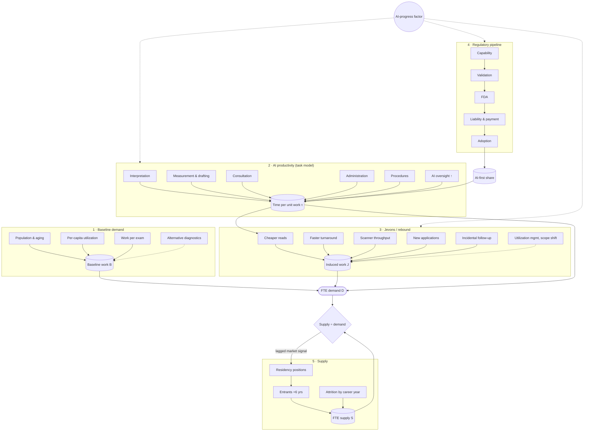
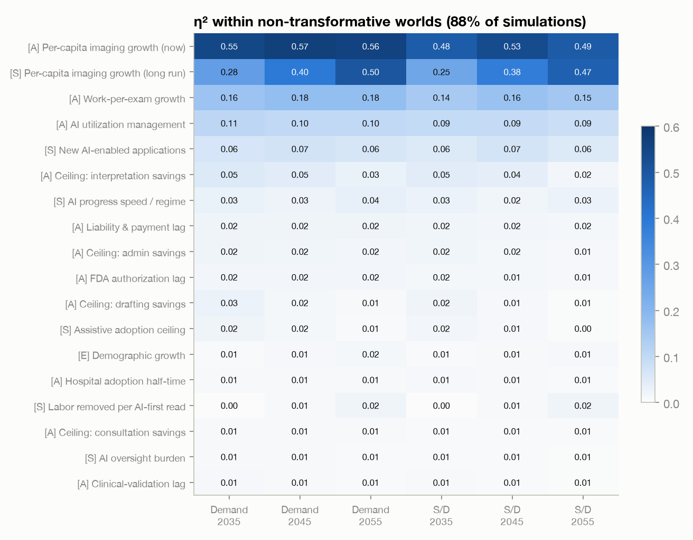

# Will AI Shrink the Radiology Job Market?
## A probabilistic forecast of the U.S. diagnostic-radiology workforce, 2026–2066, written for a first-year medical student

*Version 1.0 · October 2026 · Interactive version: <https://ethanuser.github.io/radiology/> · Code and data: this repository*

> **How to read this document.** Every number below is generated by the Monte Carlo model in [`model/`](model/) and inserted
> automatically by [`tools/build_docs.py`](tools/build_docs.py); if the model is re-run with different assumptions, the report
> changes with it. The model, code and text were drafted with an AI assistant (Claude, Anthropic) from the public sources cited,
> and should be read critically. This is a forecasting exercise, not career, financial or medical advice.

---

## Summary

**Question.** A first-year medical student (M1) in 2026 who chooses diagnostic radiology would match in 2030, finish
residency around 2035 (2036 with a fellowship) and practise until the mid-2060s. What will the market for their labor look
like, and how much does AI change it?

**Approach.** We built a probabilistic model with five separately specified components (baseline imaging demand, task-level
AI productivity, the regulatory/adoption pipeline for autonomous AI, Jevons/rebound effects, and a cohort model of radiologist
supply with an endogenous residency response). Its 65 uncertain inputs are drawn from explicit
probability distributions, correlated through three latent factors (AI progress, regulatory friction, appetite for imaging),
and propagated through 20,000 simulated futures. Each input is graded as **empirical** (E), **anchored** (A: an
empirical anchor plus judgment) or **subjective** (S).

**Headline results** (median, with 10th–90th percentile range; indices are relative to 2026):

| Metric | 2030 | 2035 | 2045 | 2055 | 2066 |
|---|---|---|---|---|---|
| **FTE demand** (2026 = 1): median (P10–P90) | 1.04 (0.96–1.11) | 1.05 (0.80–1.19) | 1.10 (0.65–1.39) | 1.14 (0.63–1.57) | 1.19 (0.66–1.79) |
|   FTE demand: P25–P75 | 1.01–1.08 | 0.96–1.12 | 0.95–1.24 | 0.93–1.35 | 0.93–1.48 |
| **FTE supply** (2026 = 1): median (P10–P90) | 1.03 (1.02–1.04) | 1.08 (1.06–1.10) | 1.20 (1.13–1.25) | 1.27 (1.05–1.42) | 1.33 (0.92–1.62) |
|   FTE supply: P25–P75 | 1.03–1.04 | 1.07–1.09 | 1.16–1.23 | 1.18–1.35 | 1.16–1.49 |
| **Supply ÷ demand** (2026 ≈ 0.93): median (P10–P90) | 0.91 (0.85–1.00) | 0.96 (0.83–1.25) | 1.01 (0.80–1.61) | 1.05 (0.77–1.53) | 1.06 (0.74–1.39) |
|   Supply ÷ demand: P25–P75 | 0.88–0.95 | 0.89–1.04 | 0.89–1.17 | 0.90–1.23 | 0.88–1.22 |
| **AI productivity** (work per radiologist-hour, 2026 = 1) | 1.06 (1.02–1.20) | 1.21 (1.09–1.83) | 1.39 (1.22–2.96) | 1.48 (1.29–3.67) | 1.56 (1.34–3.78) |
|   AI productivity: P25–P75 | 1.03–1.09 | 1.14–1.30 | 1.30–1.51 | 1.37–1.66 | 1.43–1.75 |
| **AI-first / autonomous share** of interpretive work | <1% (<1%–4%) | 3% (<1%–14%) | 15% (4%–56%) | 29% (11%–89%) | 48% (20%–95%) |
|   AI-first share: P25–P75 | <1%–2% | 1%–6% | 8%–25% | 19%–50% | 30%–60% |
| P(demand < 2026 level) | 21% | 35% | 32% | 32% | 31% |
| P(demand < 80% of 2026) | <1% | 10% | 13% | 15% | 16% |
| P(demand < 50% of 2026) | 0% | <1% | 5% | 6% | 5% |
| P(supply > demand) | 10% | 36% | 52% | 59% | 59% |
| **P(meaningful oversupply: S/D > 1.10)** | 3% | 17% | 34% | 42% | 42% |
| P(severe oversupply: S/D > 1.25) | <1% | 10% | 18% | 23% | 21% |
| P(shortage worse than 10%: S/D < 0.90) | 40% | 29% | 26% | 26% | 27% |

**Key findings**

1. **At the end of residency (2035), the most likely market is still tight.** The median supply/demand ratio is
   0.96; the probability of a shortage (ratio < 1) is 64%, and the
   probability of *meaningful oversupply* (more than 10% excess radiologist FTEs) is 17%. Most of
   that risk sits in a "transformative AI" branch to which we assign a 12% prior; outside it, the 2035 oversupply probability is
   6%.
2. **Over a career the distribution widens sharply.** Median FTE demand rises only modestly (+10% by
   2045, +14% by 2055) because AI productivity absorbs most of the growth in imaging. From 2035
   onward, roughly one future in three has demand *below* today's level, and the probability of meaningful oversupply climbs to
   34% in 2045 and 42% in 2055.
3. **Severe collapse is a tail, not a base case.** Demand falls below half of today's level with probability
   5% by 2045 and 5% by 2066. Those worlds are almost all
   in the transformative-AI branch.
4. **AI productivity is real but slow to be realized.** Median time saved per unit of imaging work is
   17% in 2035 and 32% in 2055. AI-first or autonomous
   reading reaches a median 15% of interpretive work in 2045, because the chain from technical
   capability to clinical validation, FDA authorization, liability/payment acceptance and hospital adoption takes one to two
   decades per tier of complexity.
5. **A true Jevons paradox is unlikely.** AI-induced demand (cheaper and faster reads, new applications, follow-up of
   AI-detected findings, scanner throughput, and new radiologist tasks) offsets a median 49% of the
   labor AI saves by 2045, but exceeds it in only 3% of simulated worlds. The interpretation fee is a
   small share of what an imaging exam costs, so cheaper reads alone generate little extra demand.
6. **What drives the forecast:** the AI-progress regime and future per-capita imaging utilization dominate. Regulatory delay,
   new applications and scanner throughput are second-order, and residency adjustment matters only on a 20+ year horizon. About
   half of the forecast spread comes from parameters we grade as subjective.
7. **For incumbents, AI risk mainly shows up as slower hiring, flatter pay and a changed job, not unemployment.** Annual
   attrition (≈2.7% of the workforce) can absorb a gradual decline. Demand falls faster than
   attrition over a five-year window after 2035 in 9%
   of worlds, and in only 0.1% outside the
   transformative branch.

---

## 1. Question, scope and definitions

**Population.** U.S. diagnostic radiologists. The supply model is calibrated to the Harvey L. Neiman Health Policy Institute
count of 37,482 radiologists enrolled to serve Medicare patients in 2023 <sup>1</sup>, a broader definition than the
AAMC's 28,618 "radiology and diagnostic radiology" physicians <sup>2</sup>. Because all outputs are indices relative to 2026, the
definitional difference matters mainly through the ratio of annual entrants to the existing stock.

**The M1 timeline.**

| Year | Milestone for a 2026 M1 | What the model reports |
|---|---|---|
| 2026 | M1 | baseline (index = 1) |
| 2030 | Residency match | 2030 column |
| 2031–2035 | PGY-1 + 4 years DR residency | — |
| 2035–2036 | Fellowship, first attending job | **2035 column** |
| 2045 / 2055 / 2066 | 10 / 20 / 30 years in practice | 2045, 2055, 2066 columns |

**Definitions.**

* **FTE demand $D(t)$**: radiologist full-time equivalents needed to perform the imaging work demanded in year $t$, given the
  AI tools in use, as an index with $D(2026)=1$. "Demand" includes work that is currently backlogged or outsourced.
* **FTE supply $S(t)$**: practising radiologists × FTE per head, as an index with $S(2026)=1$.
* **Supply/demand ratio $R(t)$** in absolute FTEs. Today's market is short: we put $R(2026)$ at about 0.93 (range 0.85–0.99).
  **Meaningful oversupply** means $R>1.10$: 10% more radiologist capacity than the work requires, roughly the scale of the
  mid-1990s and early-2010s gluts <sup>3</sup>. **Severe oversupply** means $R>1.25$.
* **AI productivity $P(t)$**: imaging work completed per radiologist-hour relative to 2026. Time saved is $1-1/P$.
* **AI-first/autonomous share**: the share of interpretive work where AI is the primary reader and the radiologist only audits,
  signs off or handles escalations.

---

## 2. Forecasting approach: outside view first

We follow the practices that distinguish accurate forecasters in tournaments: decompose the question, start from base rates
(the "outside view"), state explicit probabilities with wide intervals, and name the observations that should move the
forecast <sup>4-7</sup>. Four reference classes anchor our priors.

1. **Confident predictions that AI would displace radiologists have so far failed.** In 2016 Geoffrey Hinton argued that
   "people should stop training radiologists now" <sup>8</sup>. A decade later diagnostic-radiology residency positions are at
   a record 1,241 with a 97.6% fill rate <sup>9</sup>. Average radiology compensation rose 6.6% in the latest annual survey
   <sup>10</sup>. The FDA lists more than 1,600 AI-enabled devices, about three-quarters of them in radiology
   <sup>11</sup>, yet insurance-claims data show clinical use concentrated in a handful of products <sup>12</sup>. Langlotz's
   long-standing framing is that AI changes the work rather than replacing the worker <sup>13,14</sup>.
2. **The radiology labor market has boom–bust cycles driven by supply and utilization shocks rather than technology alone.**
   After the mid-1990s downturn, radiology trainee numbers fell to a nadir of 3,080 in 1997 and then rose 84% by 2011
   <sup>15</sup>. Positions kept expanding despite a softening job market, and the market was oversupplied by the mid-2010s
   <sup>3</sup>. In the 2015 Match only 86% of advanced DR positions filled, 55 of 166 programs went unfilled, and U.S.
   graduates took 67% of matched positions <sup>16</sup>. Medical students respond to market signals within a few years
   <sup>17</sup>.
3. **Clinical technology diffuses only after payment and liability are resolved, and then it can diffuse fast.** Mammography
   computer-aided detection (FDA 1998, Medicare payment 2002) was used for most U.S. screening mammograms within a few years,
   despite no measurable accuracy benefit <sup>18</sup>. Hospital EHR adoption passed 50% about four years after the 2009
   HITECH subsidies <sup>19</sup>. Autonomous diabetic-retinopathy AI took three years to go from FDA authorization
   (2018) to a payable CPT code <sup>20</sup>.
4. **Automation economics.** In the task framework of Acemoglu and Restrepo, automation *displaces* labor from automated
   tasks, raises demand through a *productivity* effect, and can *reinstate* labor through new tasks
   <sup>21,22</sup>. Whether employment rises or falls depends on the price elasticity of
   demand for the output. In historical industries it was high early and fell as demand saturated <sup>23</sup>. Most of today's
   U.S. employment is in job specialties created after 1940 <sup>24</sup>. The idea that efficiency gains can increase total
   resource use goes back to Jevons <sup>25</sup>.

**AI-progress inputs.** METR estimates that the length of software tasks frontier models can complete doubled roughly every
seven months from 2019 to 2024 <sup>26</sup>, and faster since 2023 in its 2026 update <sup>27</sup>. The AI 2027 scenario
sketches a world in which AI R&D automation arrives within a few years <sup>28</sup>. Superforecasters in a long-run tournament
were far more sceptical than domain experts about extreme AI outcomes <sup>29</sup>. We use these sources **only** to weight
four AI-progress regimes and to scale capability arrival dates (Section 3.6). None of them is a forecast about medicine.

---

## 3. Model structure



### 3.1 Baseline imaging demand (AI frozen at its 2026 level)

$$B(t)=\prod_{s=2027}^{t}\bigl(1+r_{\text{dem}}(s)+r_{\text{util}}(s)+r_{\text{cmplx}}(s)\bigr)\cdot\frac{1-a(t)}{1-a(2026)}$$

* **Demographics, $r_{\text{dem}}$.** Christensen et al project that population growth and aging alone raise imaging use
  16.9%–26.9% from 2023 to 2055, depending on modality <sup>30</sup>. That projection used Census 2023 population
  forecasts. CBO's 2026 outlook has markedly lower immigration and population growth (349 million in 2026 to 364 million in
  2056) <sup>31</sup>, so we centre the demographic growth of radiologist work at 0.52%/yr (E). After 2045 it declines as
  population growth approaches zero.
* **Per-capita utilization, $r_{\text{util}}$.** In U.S. health systems, CT use per person grew 3.7%/yr (adults) to 5.2%/yr (older
  adults) in 2013–2016 and MRI 1.3%–2.2%/yr, while nuclear medicine declined <sup>32</sup>. Roughly 93 million CTs were
  performed in 2023 <sup>33</sup>. Extrapolating recent trends moves Christensen's 2055 range to between −5.6% and +45.2%
  <sup>30</sup>. We start the work-weighted per-capita trend at 1.0%/yr (σ 0.8) and let it converge, with an uncertain
  half-life, to a long-run 0.3%/yr (σ 0.6). Both terms load on the "appetite for imaging" factor.
* **Work per exam, $r_{\text{cmplx}}$.** Images per cross-sectional study rose about tenfold at Mayo Clinic between 1999 and 2010
  <sup>34</sup>. Radiologist work per exam grows far more slowly than image counts; we use 0.4%/yr decaying with a 20-year
  half-life.
* **Alternative diagnostics, $a(t)$.** Blood-based tests, AI-ECG and similar tools displace up to 15% of imaging by 2066 (mode 4%).
* **Today's gap.** HRSA projections summarized by the Neiman Institute put radiology at about 90% workforce adequacy in 2038
  <sup>35</sup>. Rising pay and record residency expansion point the same way. We draw $R(2026)$ from a triangular distribution
  on 0.85–0.99 with mode 0.93.

### 3.2 AI productivity: a task-based model

Following Langlotz's task-based analysis <sup>36</sup> and the Acemoglu–Restrepo framework, a radiologist's 2026 working time
is split into five tasks, drawn from a Dirichlet distribution centred on interpretation 42%, measurement and report drafting 18%,
clinical synthesis and consultation 13%, administration (protocoling, QA) 15% and procedures 12%. Langlotz's literature synthesis
allocates 66.7% of time to performing and interpreting studies, 5.5% to protocoling, 11.8% to communication and 6.8% to other work
(plus 9.1% personal time). A time-motion study found 36.4% pure image interpretation <sup>37</sup>.

For each task $k$, assistive AI saves a fraction

$$\sigma_k(t)=m_k\cdot \text{cap}_k(t)\cdot \text{adopt}(t)$$

where $m_k$ is the eventual ceiling, $\text{cap}_k(t)$ a logistic capability curve whose midpoint is scaled by the AI-progress
multiplier $M$, and $\text{adopt}(t)$ the effective clinical adoption. The ceilings are anchored on the best evidence:
generative draft reports gave a 15.5% documentation-efficiency gain on about 24,000 radiographs without loss of accuracy
<sup>38</sup>. AI-supported mammography screening cut screen-reading workload 44% while increasing cancer detection
<sup>39-41</sup>. A meta-analysis of real-world deployments found no significant time savings
overall <sup>42</sup>, and radiologists given AI predictions did not improve on average <sup>43</sup>.

AI-first/autonomous reading (Section 3.3) removes a fraction $f_{\text{sub}}$ of interpretation and drafting time for the share
$\alpha(t)$ of studies read AI-first. Oversight work rises with AI use (governance, auditing, validation), which Langlotz notes his
model omits. Time per unit of work, relative to a world with no AI, is therefore

$$\tau(t)=s_I\bigl[(1-\alpha)(1-\sigma_I)+\alpha(1-f_{\text{sub}})\bigr]+s_D\bigl[(1-\alpha)(1-\sigma_D)+\alpha(1-f_{\text{sub}})\bigr]+\sum_{k\in\{C,A,P\}}s_k(1-\sigma_k)+o(t)$$

and AI productivity is $P(t)=\tau(2026)/\tau(t)$.

### 3.3 Regulation and adoption: from capability to labor substitution

Interpretive work is split into four autonomy tiers: (1) normal or negative radiographs and screening exams (≈10%); (2) all
radiographs, screening mammography and standardized follow-ups (≈20%); (3) complex diagnostic CT/MR/US/NM (≈47%); and (4) the
hardest residual work. For each tier, a technical-capability date is followed in sequence by:

$$T^{\text{ready}}_j = T^{\text{cap}}_j + L^{\text{validation}}_j + L^{\text{FDA}}_j + L^{\text{liability/payment}}_j,\qquad
\alpha(t)=\sum_j w_j\,a^{\max}_j\,\text{logistic}\!\left(\tfrac{t-T^{\text{ready}}_j-h}{\text{width}}\right)$$

* *Capability.* An autonomous normal-chest-radiograph product received EU CE Class IIb marking in 2022 <sup>44</sup>, so
  tier 1 is treated as technically capable now. Tiers 2–4 are subjective and scaled by $M$.
* *Validation.* The MASAI randomized trial took about four years from first randomization to its main publications
  <sup>39,40</sup>. Median 2.5 years for tier 1, longer for complex tiers.
* *FDA.* No autonomous radiology read is FDA-authorized as of 2026. The IDx-DR De Novo authorization (2018) is the main
  autonomous precedent <sup>11,20</sup>.
* *Liability and payment.* Medicare professional-component billing presumes physician interpretation. Mock jurors judge
  radiologists more harshly when they miss something AI flagged <sup>45</sup>. A new Category I CPT code for AI coronary
  plaque analysis shows that payment for AI analysis is possible <sup>46</sup>.
* *Adoption.* Half of eventual uptake takes a median 5.5 years after a tier becomes "ready" (CAD and EHR precedents of about
  four to six years <sup>18,19</sup>).

All lags load on a common regulatory-friction factor, so a strict regulator tends to be strict for every tier.

### 3.4 Jevons and rebound effects

AI-induced work $J(t)$ is the sum of exam-generating channels, limited by scanner and technologist capacity, minus two
countervailing channels:

| Channel | Specification | Evidence |
|---|---|---|
| Cheaper interpretation (price) | $(1-\Delta p)^{\varepsilon}-1$, with $\Delta p=\pi[\phi(1-\tau)+(1-\phi)\,0.5\,\tfrac{h}{1+h}]$; professional share $\phi$≈20%, pass-through $\pi$≈40%, elasticity $\varepsilon$≈−0.2 | <sup>47-50</sup> |
| Faster turnaround & availability | access × time saved: non-price rationing released | <sup>51</sup> |
| Scanner throughput / latent demand | latent demand (2–12%) released as AI-accelerated acquisition (median +30% throughput) frees capacity | <sup>52,53</sup> |
| New applications & screening | lognormal, median 18% of baseline work by 2066 × radiologist intensity 0.4–1.0 | <sup>46,54-56</sup> |
| Incidental findings & follow-up | up to 8% (mode 3%) at full AI-detection deployment | <sup>40,41</sup> |
| New radiologist tasks (reinstatement) | up to 12% of 2026 FTE (mode 4%) | <sup>22,24</sup> |
| AI-enabled utilization management (−) | up to 8% (mode 3%) | <sup>36,57</sup> |
| Scope shift to non-radiologists (−) | up to 10% (mode 3%) | — (subjective) |

Exam-generating channels pass through a smooth minimum with available capacity: $G=G_{\text{pot}}\,(1+(G_{\text{pot}}/K)^4)^{-1/4}$,
where $K$ is AI-driven throughput plus long-run investment in scanners and technologists. CT and MRI technologist vacancy rates
were 19.4% and 17.4% in 2025 <sup>53</sup>. FTE demand is then

$$D(t)=B(t)\,\frac{1+J(t)}{1+J(2026)}\,\frac{\tau(t)}{\tau(2026)}+B(t)\bigl[N(t)-N(2026)\bigr]$$

where $N$ is new non-reading radiologist work. **Jevons accounting**: labor saved $L=B(1-\tau/\tau_0)$; induced demand
$I=D-B\,\tau/\tau_0$; offset ratio $I/L$. A *true Jevons paradox* means $I>L$, which is equivalent to $D(t)>B(t)$: radiologist
demand with AI exceeds demand had AI stayed at its 2026 level. The identity $D=B-L+I$ holds exactly and is unit-tested.

### 3.5 Radiologist supply

A cohort model tracks practising radiologists by years in practice (0–54). Exit hazard rises from 0.4%/yr early in a career to
retirement levels after about 33 years, scaled by an uncertain multiplier covering pre- to post-COVID attrition (1.9%–3.0%/yr
<sup>1,35</sup>). New attendings in year $t$ equal $\kappa$ × filled DR positions from the year $t-6$ Match.
$\kappa=$1.20 is calibrated so that flat residency positions reproduce Christensen
et al's projection of 25.7% growth from 2023 to 2055 <sup>1</sup>.

Residency positions start at 1,241 (2026 Match <sup>9</sup>), follow an uncertain trend (1%/yr, σ 0.8, capped at 1.8× by GME
funding) and respond to the lagged market signal $x=\ln(D/S)$:

$$\text{positions}^{*}=\text{trend}\cdot e^{\gamma x},\qquad \text{fill}=0.976\,e^{\kappa_f\min(x,0)}-\text{fear}\cdot\text{visibility}_{AI}$$

Programs close 35% of the gap to the target each year. Fill rates fall when the market is oversupplied (as in 2014–2015) and,
modestly, when AI progress is visible. The DR applicant pool has already fallen 14% over three years <sup>9</sup>.

### 3.6 Uncertainty, correlation and AI-progress regimes

Inputs are drawn through a structured Gaussian copula. Each parameter's latent normal is a weighted sum of three factors
(AI progress $z_{AI}$, regulatory friction $z_{reg}$, appetite for imaging $z_{dem}$) plus idiosyncratic noise, which preserves
every marginal distribution exactly. The intended correlations hold by construction and are tested:

* faster AI means earlier capability, *and* higher task ceilings, *and* more new applications, *and* more scanner throughput;
* a stricter regulatory environment means longer validation, FDA and payment lags *and* lower eventual adoption;
* more appetite for imaging means faster per-capita growth *and* less utilization management.

The AI factor selects one of four regimes and a timeline multiplier $M$ that multiplies the years until each capability arrives.
The weights are subjective:

| Regime | Weight | $M$ | Interpretation |
|---|---|---|---|
| Stall | 15% | 1.6–3.0 | progress plateaus; radiology AI arrives 1.6–3× later than trend |
| Trend | 55% | lognormal, median 1 | current pace of radiology AI continues |
| Fast | 18% | 0.40–0.65 | general-purpose AI accelerates radiology timelines by roughly 2× |
| Transformative | 12% | 0.25–0.45 | AI can eventually do nearly all radiologist cognitive work; task ceilings and adoption ceilings are lifted, institutional lags shrink by 40%, robotics still lags |

Readers who disagree with these weights can re-weight the regime-conditional results in Section 6.5 or use the interactive
explorer on the website.

---

## 4. Parameters and evidence

The model has 65 sampled parameters plus the task-share Dirichlet: 4 graded E,
30 graded A and 31 graded S. The empirical backbone is concentrated in **fixed
calibration targets** rather than sampled parameters: the 2023 workforce (37,482), career length, attrition, the
flat-residency supply projection <sup>1</sup>, 2026 positions and fill rate <sup>9</sup> and the demographic projection
<sup>30</sup>. The full table, with distributions, percentiles, sources and factor loadings, is in
[Appendix A](#appendix-a-full-parameter-table) and in machine-readable form in
[`outputs/parameters.md`](outputs/parameters.md).

What is *not* well supported by data: the speed of general AI progress, the eventual ceilings on AI time savings for
non-interpretive tasks, the size of AI-enabled new applications, and the regulatory and liability lags for autonomous reading.
These are exactly the parameters the sensitivity analysis flags as most important (Section 7). That is the main reason this
forecast's intervals are wide, and why it should not be read more precisely than its quantiles.

---

## 5. Calibration and validation

| Check | Model | Reference |
|---|---|---|
| Supply growth 2023→2055 with flat residency positions | +25.7% | +25.7% <sup>1</sup> |
| Mean career length | 34.6 years | 34.2 (women) – 35.7 (men) years |
| Aggregate attrition, 2023 | 2.7%/yr | 1.9% pre-COVID, ≈3% post-COVID |
| Demographic growth of imaging work, 2026→2055 | 15.7% (P10–P90 12%–20%) | +16.9% to +26.9% for 2023→2055 with Census 2023 population <sup>30</sup>; lower population growth in CBO 2026 <sup>31</sup> |
| Realized AI time savings by 2031 | median 7.6% (P90 23%) | Langlotz: 33% (14%–49%) "upper end" potential within 5 years if all applications are adopted <sup>36</sup> |
| Baseline (no new AI) radiologist work, 2026→2055 | +41% median | — |

Our near-term AI effect is deliberately below Langlotz's estimate. His figure assumes the foreseeable applications are adopted,
and he describes it as the upper end of a range. Our model adds the diffusion and regulatory lags documented in Section 2. The
"assistive-AI time savings" sensitivity in Section 7 shows how much the forecast moves if those lags are shorter.

The unit tests ([`tests/test_model.py`](tests/test_model.py)) check index normalization, the supply and demographic calibrations,
the exact Jevons accounting identity $D=B-L+I$, that task-composition shares sum to one, that the copula preserves every
marginal, the intended signs of the induced correlations, and the regime weights.

---

## 6. Results

### 6.1 Demand and supply


Median FTE demand rises +5% by 2035, +10% by 2045 and
+19% by 2066, much less than the baseline imaging workload, which rises
+29% by 2045 without further AI (Figure 9). The demand distribution is wide and
left-skewed. By 2045 the 10th percentile is 0.65 and the 90th is 1.39.
Supply is far more predictable over the M1's first decade because everyone who will practise in 2035 has already matched or
is in medical school: the median supply index is 1.08 in 2035 (≈41,829
radiologists) and 1.20 in 2045.

### 6.2 The supply/demand balance


In the median world the current shortage narrows through the 2030s and the market is roughly balanced by the mid-2040s
(median ratio 1.01). The probability of meaningful oversupply rises from
3% in 2030 to 17% in 2035, 34% in
2045 and 42% in 2055. Persistent shortage remains about as likely: a ratio below 0.90 has
probability 26% in 2045. The probability that the M1 experiences at least one year of meaningful
oversupply at some point in 2035–2066 is 51%.

### 6.3 AI productivity and autonomy


Median dates (10th–90th percentile) for each stage of the pipeline:

| Tier | Capable | Validated | FDA-authorized | Paid & liability-accepted | 50% of eventual adoption |
|---|---|---|---|---|---|
| Tier 1 — normal/negative radiographs & screening | 2025 (2024–2026) | 2027 (2026–2030) | 2029 (2027–2032) | 2032 (2029–2037) | 2038 (2032–2045) |
| Tier 2 — all radiographs, screening mammography, standardized follow-up | 2030 (2027–2037) | 2033 (2029–2041) | 2035 (2030–2044) | 2040 (2033–2051) | 2046 (2037–2058) |
| Tier 3 — complex diagnostic CT/MR/US/NM | 2038 (2030–2055) | 2042 (2033–2060) | 2045 (2035–2064) | 2052 (2039–2074) | 2057 (2043–2081) |
| Tier 4 — hardest residual work | 2048 (2035–2080) | 2053 (2038–2085) | 2058 (2041–2091) | 2066 (2045–2103) | 2072 (2049–2110) |

Tier 1 (normal radiographs and negative screens) is plausibly paid for and liability-accepted in the early 2030s, but tier 3
(complex cross-sectional work, where most radiologist time goes) typically becomes payable only in the 2050s. Because tiers 1–2
make up only about 30% of interpretive work, early autonomy moves FTE demand less than headlines would suggest. The upper tail
of AI productivity (P90 2.96× in 2045) comes almost entirely from the transformative-AI branch.

### 6.4 Jevons accounting: does AI-induced demand offset AI productivity?


| | 2030 | 2035 | 2045 | 2055 | 2066 |
|---|---|---|---|---|---|
| Labor saved by AI productivity (mean, share of 2026 FTE) | 0.079 | 0.238 | 0.418 | 0.530 | 0.638 |
| ↳ induced: Cheaper interpretation (price) | +0.004 | +0.008 | +0.011 | +0.013 | +0.015 |
| ↳ induced: Faster turnaround & availability | +0.008 | +0.019 | +0.028 | +0.034 | +0.040 |
| ↳ induced: Scanner throughput / latent demand | +0.015 | +0.028 | +0.039 | +0.043 | +0.047 |
| ↳ induced: New applications & screening | +0.022 | +0.045 | +0.076 | +0.093 | +0.108 |
| ↳ induced: Incidental findings & follow-up | +0.005 | +0.014 | +0.022 | +0.025 | +0.027 |
| ↳ induced: New radiologist tasks | +0.004 | +0.018 | +0.056 | +0.072 | +0.081 |
| ↳ induced: Utilization management (AI) | −0.010 | −0.020 | −0.023 | −0.024 | −0.025 |
| ↳ induced: Scope shift to non-radiologists | −0.004 | −0.009 | −0.024 | −0.034 | −0.040 |
| **Net AI-induced demand (mean)** | 0.044 | 0.103 | 0.186 | 0.223 | 0.253 |
| Offset ratio, induced ÷ saved: median (P10–P90) | 0.53 (0.13–1.19) | 0.45 (0.18–0.80) | 0.49 (0.20–0.81) | 0.46 (0.19–0.76) | 0.42 (0.19–0.70) |
| Ratio of means | 0.56 | 0.43 | 0.44 | 0.42 | 0.40 |
| **P(true Jevons paradox: induced > saved)** | 15.8% | 3.4% | 3.2% | 2.0% | 1.0% |

* **Induced demand is substantial but rarely larger than the productivity effect.** It offsets a median
  45% (2035) to 42% (2066) of the labor AI saves. A true Jevons paradox
  occurs in 3.4% of worlds in 2035 and 2.0% in 2055. Early on (2030)
  Jevons is more common (16%), because capacity and throughput gains can arrive before large
  reading-time savings.
* **Cheaper interpretation is the weakest channel.** The radiologist's professional fee is roughly 10%–30% of the all-in price of
  an exam <sup>47</sup>, only part of any saving is passed through, and imaging demand is price-inelastic (around −0.2
  <sup>48,49</sup>). Halving interpretation cost therefore raises exam volume by only about 1%–2%.
* **The large channels are new applications, new radiologist tasks, throughput/latent demand and faster turnaround.** These are
  the "reinstatement" and "new frontier" mechanisms <sup>22,24</sup>. They are also the most subjective
  inputs. Capacity limits (technologist shortages) remove on average 11% of potential induced
  exams in 2045.
* In Bessen's terms <sup>23</sup>, radiologist demand behaves like a mature, fairly inelastic market. Jevons-type employment
  growth would need a large expansion in what imaging is used *for*, not just cheaper reads.

### 6.5 AI-progress regimes


| AI regime | Weight | Timeline multiplier M | Median demand 2035 / 2045 / 2055 | AI productivity 2045 | AI-first share 2045 | P(oversupply) 2035 / 2045 / 2055 |
|---|---|---|---|---|---|---|
| Stall | 15% | 1.6–3.0 | 1.09 / 1.17 / 1.25 | 1.22× | 7% | 3% / 18% / 26% |
| Trend | 55% | ≈0.65–1.6 (median 1) | 1.06 / 1.14 / 1.19 | 1.37× | 13% | 6% / 24% / 33% |
| Fast | 18% | 0.40–0.65 | 1.04 / 1.09 / 1.11 | 1.49× | 23% | 11% / 33% / 44% |
| Transformative | 12% | 0.25–0.45 + ceilings lifted | 0.69 / 0.52 / 0.50 | 3.53× | 74% | 95% / 100% / 99% |

The stall, trend and fast regimes give fairly similar *median* demand paths, because faster AI also brings more induced
demand and the regulatory pipeline dampens capability differences. The transformative branch is qualitatively different: demand
roughly halves by the mid-2040s and oversupply becomes near-certain. Excluding that branch, the 2045 oversupply probability is
25% and the probability that 2045 demand is below 80% of today's is
2%.

### 6.6 How the job changes


| Task | 2026 | 2035 | 2045 | 2055 | 2066 |
|---|---|---|---|---|---|
| Interpretation / reporting | 42% | 40% | 35% | 31% | 29% |
| Measurement & report drafting | 18% | 12% | 10% | 9% | 9% |
| Clinical synthesis & consultation | 13% | 14% | 14% | 15% | 15% |
| Administrative (protocoling, QA) | 15% | 13% | 13% | 14% | 14% |
| Physical / procedural | 12% | 15% | 16% | 17% | 17% |
| AI oversight (new task) | <1% | 4% | 6% | 8% | 8% |
| Other new radiologist tasks | 0% | 2% | 6% | 7% | 7% |

The share of time spent on primary interpretation and drafting falls, while consultation, procedures, AI oversight and other
new tasks rise. In most worlds the change in what a radiologist *does* is larger and more certain than the change in how many
radiologists are needed.

### 6.7 Baseline demand without further AI


Without further AI, radiologist workload would grow a median +16% by 2035 and
+41% by 2055 (P10–P90: +10% to +83%).
That growth is the main reason the median outlook is benign: AI in the median world mostly absorbs growth that would otherwise
deepen the shortage.

---

## 7. Sensitivity analysis

### 7.1 Which assumptions move the forecast? (one group at a time)

Each assumption group is pinned at its 10th and then its 90th percentile while every other input keeps its full distribution
(8,000 simulations per run, common random numbers). Bold rows are the six assumptions the question asked about.


| Assumption group (10th → 90th percentile) | Median demand 2035 | Median demand 2045 | Median demand 2055 | P(oversupply) 2035 | P(oversupply) 2045 | P(oversupply) 2055 |
|---|---|---|---|---|---|---|
| AI capability speed | 1.08 → 0.70 | 1.15 → 0.52 | 1.23 → 0.48 | 3% → 94% | 21% → 100% | 29% → 100% |
| **Future imaging utilization** | 0.94 → 1.18 | 0.90 → 1.40 | 0.85 → 1.62 | 33% → 10% | 88% → 11% | 96% → 11% |
| Assistive-AI time savings | 1.11 → 0.98 | 1.19 → 1.00 | 1.24 → 1.03 | 11% → 28% | 23% → 49% | 33% → 52% |
| **New imaging applications** | 1.02 → 1.10 | 1.06 → 1.17 | 1.09 → 1.22 | 20% → 13% | 40% → 25% | 47% → 34% |
| **Scanner throughput & capacity** | 1.01 → 1.08 | 1.05 → 1.13 | 1.09 → 1.17 | 22% → 15% | 41% → 30% | 47% → 39% |
| **Regulatory delay** | 1.03 → 1.06 | 1.07 → 1.15 | 1.11 → 1.20 | 19% → 14% | 38% → 27% | 45% → 35% |
| **AI-first / autonomous adoption** | 1.06 → 1.04 | 1.13 → 1.06 | 1.21 → 1.07 | 15% → 18% | 28% → 39% | 33% → 52% |
| Demographics | 1.04 → 1.06 | 1.08 → 1.13 | 1.10 → 1.19 | 18% → 15% | 37% → 29% | 46% → 36% |
| Price elasticity & pass-through | 1.03 → 1.07 | 1.08 → 1.13 | 1.12 → 1.18 | 18% → 14% | 36% → 29% | 44% → 38% |
| **Residency adjustment** | 1.05 → 1.05 | 1.10 → 1.10 | 1.14 → 1.14 | 16% → 17% | 33% → 33% | 42% → 38% |
| Residency slot growth | 1.05 → 1.05 | 1.10 → 1.10 | 1.14 → 1.14 | 16% → 17% | 29% → 37% | 30% → 53% |
| Attrition | 1.05 → 1.05 | 1.10 → 1.10 | 1.14 → 1.14 | 18% → 16% | 35% → 31% | 43% → 39% |
| Today's shortage (2026 S/D) | 1.05 → 1.05 | 1.10 → 1.10 | 1.14 → 1.14 | 12% → 21% | 27% → 39% | 37% → 44% |
| *All assumptions at their sampled distributions (reference)* | 1.05 | 1.10 | 1.14 | 17% | 33% | 41% |

**Reading the table.**

* **Future imaging utilization** is the most important of the named assumptions. Moving it from its 10th to its 90th percentile
  changes the 2045 oversupply probability from 88% to
  11%.
* **AI capability speed** is the largest single driver, but much of its swing reflects whether a world falls in the
  transformative branch: its 90th percentile lies inside that branch.
* **AI-first/autonomous adoption** and **regulatory delay** matter mainly after 2040, because even fast pipelines take years.
* **New imaging applications** and **scanner throughput** shift median demand by about ±5%–8%. They matter, but they are not the
  difference between a good and a bad career.
* **Residency adjustment** has almost no effect before 2045 and only a modest effect by 2055. Because new entrants are about
  3% of the workforce a year and training takes six years, the pipeline cannot correct an imbalance quickly. **Residency slot
  growth** matters more for 2055 than the *responsiveness* of slots.

### 7.2 Variance-based sensitivity

The correlation ratio $\eta^2=\operatorname{Var}(E[Y\mid X])/\operatorname{Var}(Y)$ estimates first-order variance shares. With
correlated inputs it includes effects transmitted through correlated parameters, so values do not sum to one.


| Rank | Parameter | Evidence | η² demand 2035 | η² demand 2045 | η² demand 2055 | η² S/D 2045 | Spearman ρ (demand 2045) |
|---|---|---|---|---|---|---|---|
| 1 | AI progress speed (timeline multiplier M, incl. regime) (`ai_u`) | S | 0.53 | 0.56 | 0.50 | 0.53 | +0.41 |
| 2 | Per-capita (age/sex-adjusted) utilization growth, 2026 (`util_g0`) | A | 0.17 | 0.18 | 0.23 | 0.19 | +0.60 |
| 3 | Long-run per-capita utilization growth (asymptote) (`util_ginf`) | S | 0.09 | 0.12 | 0.20 | 0.13 | +0.49 |
| 4 | Max time saved on interpretation by assistive AI (radiologist still reads) (`m_interp`) | A | 0.09 | 0.09 | 0.08 | 0.09 | -0.29 |
| 5 | Max time saved on administrative work (protocoling, QA, scheduling) (`m_admin`) | A | 0.08 | 0.08 | 0.07 | 0.07 | -0.24 |
| 6 | Max time saved on clinical synthesis/consultation/communication (`m_consult`) | A | 0.07 | 0.07 | 0.07 | 0.07 | -0.22 |
| 7 | Max time saved on measurement & report drafting (`m_draft`) | A | 0.07 | 0.06 | 0.06 | 0.06 | -0.22 |
| 8 | Growth in radiologist work per exam (complexity, images/study), 2026 (`cmplx_g0`) | A | 0.06 | 0.06 | 0.08 | 0.06 | +0.34 |
| 9 | AI-driven acquisition throughput gain at maturity (faster scans, auto-positioning) (`thru_H`) | A | 0.05 | 0.06 | 0.06 | 0.06 | -0.15 |
| 10 | Liability + reimbursement + scope-of-practice acceptance lag; tier-2 median (`lpay`) | A | 0.06 | 0.06 | 0.05 | 0.05 | +0.21 |

Excluding the transformative branch (88% of worlds), per-capita utilization dominates:

| Rank | Parameter | Evidence | η² demand 2035 | η² demand 2045 | η² demand 2055 | η² S/D 2045 | Spearman ρ (demand 2045) |
|---|---|---|---|---|---|---|---|
| 1 | Per-capita (age/sex-adjusted) utilization growth, 2026 (`util_g0`) | A | 0.55 | 0.57 | 0.56 | 0.53 | +0.75 |
| 2 | Long-run per-capita utilization growth (asymptote) (`util_ginf`) | S | 0.28 | 0.40 | 0.50 | 0.38 | +0.62 |
| 3 | Growth in radiologist work per exam (complexity, images/study), 2026 (`cmplx_g0`) | A | 0.16 | 0.18 | 0.18 | 0.16 | +0.41 |
| 4 | AI-enabled utilization management (order decision support, payer AI prior auth) (`um_max`) | A | 0.11 | 0.10 | 0.10 | 0.09 | -0.31 |
| 5 | New AI-enabled imaging applications by 2066 (share of baseline work, before capacity limits) (`new_max`) | S | 0.06 | 0.07 | 0.06 | 0.07 | +0.26 |
| 6 | Max time saved on interpretation by assistive AI (radiologist still reads) (`m_interp`) | A | 0.05 | 0.05 | 0.03 | 0.04 | -0.21 |
| 7 | AI progress speed (timeline multiplier M, incl. regime) (`ai_u`) | S | 0.03 | 0.03 | 0.04 | 0.02 | +0.15 |
| 8 | Liability + reimbursement + scope-of-practice acceptance lag; tier-2 median (`lpay`) | A | 0.02 | 0.02 | 0.02 | 0.02 | +0.14 |



### 7.3 How much of the uncertainty is subjective?


Pinning all 31 subjective parameters at their medians narrows the 80% interval for 2045 demand by
50% and for the 2045 supply/demand ratio by 62%.
Pinning the 30 anchored parameters narrows the demand interval by 10%, and
the 4 empirical parameters by less than 1%. **Better data on things we can already measure would barely
sharpen this forecast. What would sharpen it is information about the future of AI, regulation and imaging use**, which is why
Section 8 is framed around signposts.

---

## 8. Interpretation for an M1 considering radiology in 2026

**Likely job market at the end of residency (2035–2036).** Probably good. Supply growth to 2035 is almost locked in
(≈+8%), and median demand grows slightly faster than supply in the early years before AI
productivity catches up. The median supply/demand ratio in 2035 is 0.96, with a
64% chance of a continuing shortage and a 17% chance of
meaningful oversupply (6% if transformative AI does not arrive). The most likely
"bad" outcome at graduation is a softer market (fewer signing bonuses, more competition for desirable locations), not a lack
of jobs.

**10 years in (2045).** Roughly a coin flip between continued shortage and surplus (median ratio
1.01). There is a 34% chance of meaningful oversupply and a
32% chance that radiologist demand is below today's level. AI-first reading covers a
median 15% of interpretive work.

**20 years in (2055).** The distribution is wide: median demand +14%, but
15% probability of demand below 80% of today and 42%
probability of meaningful oversupply. This is the horizon where the AI-progress regime, autonomous-reading adoption and
long-run imaging utilization dominate.

**30 years in (2066).** Similar odds to 2055 (42% oversupply,
5% chance demand is below half of today's), with the residency pipeline having had time to
partly adjust.

**Which margin does AI risk hit?** In order of likelihood:

1. **Task composition** (near-certain). Drafting, measurement and protocoling shrink, while consultation, procedures and AI
   oversight grow (Section 6.6).
2. **Workload intensity.** In shortage worlds, productivity gains are absorbed as higher throughput per radiologist rather than
   shorter days.
3. **Hiring.** In surplus worlds, the first adjustment is fewer openings for new graduates and residency cuts, as in the
   mid-1990s and mid-2010s.
4. **Compensation.** Pay growth that is currently driven by shortage would flatten or reverse once the ratio exceeds 1. Pay
   is not modeled explicitly.
5. **Unemployment of practising radiologists** (least likely). Attrition of ≈2.7%/yr can absorb
   gradual declines. Demand falls faster than attrition in some five-year window during the M1's career in
   9% of worlds, nearly all of them transformative-AI
   worlds.

**What would make the forecast significantly more optimistic or pessimistic.** Conditional probabilities from the simulation:

| If we observe… | Share of simulated worlds | P(oversupply) 2035 | P(oversupply) 2045 | P(oversupply) 2055 | Median demand 2045 |
|---|---|---|---|---|---|
| All simulated worlds | 100% | 17% | 34% | 42% | 1.10 |
| AI saves >15% of radiologist time by 2031 | 17% | 75% | 83% | 84% | 0.59 |
| AI saves <5% of radiologist time by 2031 | 28% | 2% | 18% | 27% | 1.17 |
| >5% of interpretive work is AI-first/autonomous by 2033 | 20% | 57% | 71% | 73% | 0.71 |
| Autonomous reading of radiographs/screening is paid for before 2035 | 21% | 54% | 68% | 71% | 0.77 |
| Autonomous radiograph/screening reads not paid for until after 2045 | 25% | 3% | 17% | 27% | 1.18 |
| Per-capita imaging growth in the top third (≥~1.3%/yr) | 33% | 10% | 14% | 18% | 1.27 |
| Per-capita imaging growth in the bottom third (≤~0.7%/yr) | 33% | 27% | 61% | 70% | 0.97 |
| New AI-enabled imaging applications in the top third | 33% | 25% | 36% | 42% | 1.12 |
| New AI-enabled imaging applications in the bottom third | 33% | 11% | 35% | 44% | 1.08 |
| Transformative-AI branch | 12% | 95% | 100% | 99% | 0.52 |
| Excluding the transformative-AI branch | 88% | 6% | 25% | 34% | 1.13 |

Concrete things to watch, in rough order of informativeness:

* **Pessimistic signals.** Prospective, multi-site evidence of large real-world time savings (≥15%) from generative
  reporting by about 2030. FDA authorization of autonomous reads for any U.S. radiology exam class. CMS or major payers paying
  for AI-only reads, or malpractice safe-harbor legislation. Medicare per-capita imaging volumes flattening or falling
  (utilization management, Medicare's 2033 trust-fund depletion <sup>57</sup>). DR residency positions passing about 1,400
  per year. Frontier AI models solving multi-hour clinical-reasoning tasks reliably (METR-style horizons in the multi-day range)
  <sup>27</sup>.
* **Optimistic signals.** Real-world AI time savings staying in the single digits. Autonomous-reading products stalling at
  FDA or liability. Continued 3%+ annual growth in CT and MRI volumes. Lung-screening uptake (18% in 2022 <sup>54</sup>) and
  opportunistic screening <sup>55</sup> scaling with radiologist involvement. AI creating paid, radiologist-led services such as
  quantitative imaging, theranostics and AI governance.

**Practical implications.** Not advice, but direct consequences of the model: (i) the decision to enter radiology looks
reasonable on a 10-year horizon, and its risks are back-loaded; (ii) skills that sit in the slower-to-automate tasks
(procedures and IR, consultation and multidisciplinary work, breast intervention, AI governance and informatics) are a hedge;
(iii) geographic and practice-type flexibility matters more in surplus worlds; (iv) update yearly on the signposts above
rather than on headlines.

---

## 9. Limitations

* **National aggregate.** The model has no geography, subspecialty mix, practice type or teleradiology/offshoring dynamics. The
  shortage is known to be local and uneven <sup>35</sup>.
* **No wage or hours equilibrium.** Prices, compensation and hours worked do not adjust to clear the market. The ratio $R$ is a
  pressure indicator, not a realized unemployment rate. Demand does not respond to radiologist wages.
* **No feedback from shortage to AI adoption.** In reality a deep shortage would speed adoption of labor-saving AI. This
  probably makes the median path slightly too optimistic for future radiologists.
* **The regimes are coarse.** The transformative branch is a simple stylization (lifted ceilings, shorter lags) of a world that
  would be far stranger than any parameter change can capture.
* **Subjective parameters dominate the spread** (Section 7.3). The intervals are honest about that, but the medians of
  subjective parameters are still one analyst's judgment.
* **Data definitions differ** (Medicare-enrolled radiologists vs AAMC specialty counts; exams vs RVUs). We use indices to limit
  the damage.
* **Sources from 2025–2026 are recent.** Several key sources are preprints or trade-press summaries (the Langlotz task model,
  Match 2026 and compensation surveys) and may be revised.

---

## 10. Reproducibility

```bash
python -m venv .venv && source .venv/bin/activate
pip install -r requirements.txt
python run_model.py          # 20,000 simulations + sensitivity (~15 s); writes outputs/, figures/, docs/data/
python -m pytest             # calibration, accounting and copula tests
python tools/build_docs.py   # regenerates REPORT.md and docs/report.html from the outputs
```

Key files: [`model/params.py`](model/params.py) (every distribution, grade and source), [`model/simulate.py`](model/simulate.py)
(the model), [`model/analysis.py`](model/analysis.py) (tables, Jevons accounting, sensitivity),
[`model/references.py`](model/references.py) (bibliography), [`outputs/`](outputs/) (CSV/JSON results).


## References

1. Christensen EW, Parikh JR, Drake AR, Rubin EM, Rula EY. Projected US radiologist supply, 2025 to 2055. *J Am Coll Radiol*. 2025;22(2):161-169. doi:10.1016/j.jacr.2024.10.019 [Link](https://doi.org/10.1016/j.jacr.2024.10.019)
2. Association of American Medical Colleges. *Physician Specialty Data Report: Active Physicians by Specialty, 2024*. AAMC; 2024. Accessed October 7, 2026. https://www.aamc.org/data-reports/workforce
3. Sharafinski ME Jr, Nussbaum D, Jha S. Supply/demand in radiology: a historical perspective and comparison to other labor markets. *Acad Radiol*. 2016;23(2):245-251. doi:10.1016/j.acra.2015.10.009 [Link](https://doi.org/10.1016/j.acra.2015.10.009)
4. Tetlock PE, Gardner D. *Superforecasting: The Art and Science of Prediction*. Crown; 2015. [Link](https://en.wikipedia.org/wiki/Superforecasting)
5. Mellers B, Ungar L, Baron J, et al. Psychological strategies for winning a geopolitical forecasting tournament. *Psychol Sci*. 2014;25(5):1106-1115. doi:10.1177/0956797614524255 [Link](https://doi.org/10.1177/0956797614524255)
6. Kahneman D, Lovallo D. Timid choices and bold forecasts: a cognitive perspective on risk taking. *Manage Sci*. 1993;39(1):17-31. doi:10.1287/mnsc.39.1.17 [Link](https://doi.org/10.1287/mnsc.39.1.17)
7. Metaculus. Track record. Accessed October 7, 2026. https://www.metaculus.com/questions/track-record/
8. Hinton G. Remarks at: Machine Learning and the Market for Intelligence conference; 2016; Creative Destruction Lab, University of Toronto, Toronto, Ontario, Canada.
9. National Resident Matching Program. *Results and Data: 2026 Main Residency Match*. National Resident Matching Program; 2026. Summarized in: Match Day 2026: radiology programs offer more positions than ever, but applicant pool declines. *Radiology Business*. March 20, 2026. Accessed October 7, 2026. [Link](https://radiologybusiness.com/topics/healthcare-management/healthcare-staffing/match-day-2026-radiology-programs-offer-more-positions-ever-applicant-pool-declines)
10. Doximity. *2026 Physician Compensation Report*. Doximity; August 25, 2026. Summarized in: Radiology among top specialties for pay, compensation growth. *AuntMinnie*. 2026. Accessed October 7, 2026. [Link](https://www.auntminnie.com/practice-management/news/15822383/radiology-among-top-specialties-for-pay-compensation-growth)
11. US Food and Drug Administration. Artificial intelligence-enabled medical devices. Updated September 2026. Accessed October 7, 2026. https://www.fda.gov/medical-devices/digital-health-center-excellence/artificial-intelligence-enabled-medical-devices
12. Wu K, Wu E, Theodorou B, et al. Characterizing the clinical adoption of medical AI devices through U.S. insurance claims. *NEJM AI*. 2024;1(1). doi:10.1056/AIoa2300030 [Link](https://doi.org/10.1056/AIoa2300030)
13. Langlotz CP. Will artificial intelligence replace radiologists? *Radiol Artif Intell*. 2019;1(3):e190058. doi:10.1148/ryai.2019190058 [Link](https://doi.org/10.1148/ryai.2019190058)
14. Mousa D. AI isn’t replacing radiologists. *Works in Progress*. 2025. Accessed October 7, 2026. [Link](https://worksinprogress.co/)
15. Rosenkrantz AB, Hughes DR, Duszak R Jr. The U.S. radiologist workforce: an analysis of temporal and geographic variation by using large national datasets. *Radiology*. 2016;279(1):175-184. doi:10.1148/radiol.2015150921 [Link](https://doi.org/10.1148/radiol.2015150921)
16. Shi J. May the Match be ever in your favor. *Diagnostic Imaging*. May 7, 2015. Accessed October 7, 2026. [Link](https://www.diagnosticimaging.com/view/may-match-be-ever-your-favor)
17. Nicholson S. Physician specialty choice under uncertainty. *J Labor Econ*. 2002;20(4):816-847. doi:10.1086/342039 [Link](https://doi.org/10.1086/342039)
18. Lehman CD, Wellman RD, Buist DSM, Kerlikowske K, Tosteson ANA, Miglioretti DL; Breast Cancer Surveillance Consortium. Diagnostic accuracy of digital screening mammography with and without computer-aided detection. *JAMA Intern Med*. 2015;175(11):1828-1837. doi:10.1001/jamainternmed.2015.5231 [Link](https://doi.org/10.1001/jamainternmed.2015.5231)
19. Adler-Milstein J, Jha AK. HITECH Act drove large gains in hospital electronic health record adoption. *Health Aff (Millwood)*. 2017;36(8):1416-1422. doi:10.1377/hlthaff.2016.1651 [Link](https://doi.org/10.1377/hlthaff.2016.1651)
20. Abràmoff MD, Lavin PT, Birch M, Shah N, Folk JC. Pivotal trial of an autonomous AI-based diagnostic system for detection of diabetic retinopathy in primary care offices. *NPJ Digit Med*. 2018;1:39. doi:10.1038/s41746-018-0040-6 [Link](https://doi.org/10.1038/s41746-018-0040-6)
21. Acemoglu D, Restrepo P. The race between man and machine: implications of technology for growth, factor shares, and employment. *Am Econ Rev*. 2018;108(6):1488-1542. doi:10.1257/aer.20160696 [Link](https://doi.org/10.1257/aer.20160696)
22. Acemoglu D, Restrepo P. Automation and new tasks: how technology displaces and reinstates labor. *J Econ Perspect*. 2019;33(2):3-30. doi:10.1257/jep.33.2.3 [Link](https://doi.org/10.1257/jep.33.2.3)
23. Bessen J. Automation and jobs: when technology boosts employment. *Econ Policy*. 2019;34(100):589-626. doi:10.1093/epolic/eiaa001 [Link](https://doi.org/10.1093/epolic/eiaa001)
24. Autor D, Chin C, Salomons A, Seegmiller B. New frontiers: the origins and content of new work, 1940-2018. *Q J Econ*. 2024;139(3):1399-1465. doi:10.1093/qje/qjae008 [Link](https://doi.org/10.1093/qje/qjae008)
25. Jevons WS. *The Coal Question: An Inquiry Concerning the Progress of the Nation, and the Probable Exhaustion of Our Coal-Mines*. Macmillan and Co; 1865. [Link](https://oll.libertyfund.org/titles/jevons-the-coal-question)
26. Kwa T, West B, Becker J, et al. Measuring AI ability to complete long tasks. *arXiv*. Preprint posted online March 18, 2025. doi:10.48550/arXiv.2503.14499 [Link](https://doi.org/10.48550/arXiv.2503.14499)
27. METR. Time Horizon 1.1. METR; January 2026. Accessed October 7, 2026. https://metr.org/notes/2026-01-22-time-horizon-limitations/
28. Kokotajlo D, Alexander S, Larsen T, Lifland E, Dean R. AI 2027. AI Futures Project. Published April 3, 2025. Accessed October 7, 2026. https://ai-2027.com
29. Karger E, Rosenberg J, Jacobs Z, et al. *Forecasting Existential Risk: Evidence From a Long-Run Forecasting Tournament*. Forecasting Research Institute Working Paper No. 1; 2023. [Link](https://forecastingresearch.org/xpt)
30. Christensen EW, Drake AR, Parikh JR, Rubin EM, Rula EY. Projected US imaging utilization, 2025 to 2055. *J Am Coll Radiol*. 2025;22(2):151-158. doi:10.1016/j.jacr.2024.10.017 [Link](https://doi.org/10.1016/j.jacr.2024.10.017)
31. Congressional Budget Office. *The Demographic Outlook: 2026 to 2056*. Publication 61879. Congressional Budget Office; January 2026. [Link](https://www.cbo.gov/publication/61879)
32. Smith-Bindman R, Kwan ML, Marlow EC, et al. Trends in use of medical imaging in US health care systems and in Ontario, Canada, 2000-2016. *JAMA*. 2019;322(9):843-856. doi:10.1001/jama.2019.11456 [Link](https://doi.org/10.1001/jama.2019.11456)
33. Smith-Bindman R, Chu PW, Azman Firdaus H, et al. Projected lifetime cancer risks from current computed tomography imaging. *JAMA Intern Med*. 2025;185(6):710-719. doi:10.1001/jamainternmed.2025.0505 [Link](https://doi.org/10.1001/jamainternmed.2025.0505)
34. McDonald RJ, Schwartz KM, Eckel LJ, et al. The effects of changes in utilization and technological advancements of cross-sectional imaging on radiologist workload. *Acad Radiol*. 2015;22(9):1191-1198. doi:10.1016/j.acra.2015.05.007 [Link](https://doi.org/10.1016/j.acra.2015.05.007)
35. Rula EY. The radiologist shortage: a workforce update from HPI. *ACR Bulletin*. February 5, 2026. Accessed October 7, 2026. https://www.acr.org/Clinical-Resources/Publications-and-Research/ACR-Bulletin/2026/radiologist-shortage-work-force-update
36. Langlotz CP. The effect of AI on the radiologist workforce: a task-based analysis. *medRxiv*. Preprint posted online December 22, 2025. doi:10.64898/2025.12.20.25342714 [Link](https://doi.org/10.64898/2025.12.20.25342714)
37. Dhanoa D, Dhesi TS, Burton KR, Nicolaou S, Liang T. The evolving role of the radiologist: the Vancouver workload utilization evaluation study. *J Am Coll Radiol*. 2013;10(10):764-769. doi:10.1016/j.jacr.2013.04.001 [Link](https://doi.org/10.1016/j.jacr.2013.04.001)
38. Huang J, Wittbrodt MT, Teague CN, et al. Efficiency and quality of generative AI-assisted radiograph reporting. *JAMA Netw Open*. 2025;8(6):e2513921. doi:10.1001/jamanetworkopen.2025.13921 [Link](https://doi.org/10.1001/jamanetworkopen.2025.13921)
39. Lång K, Josefsson V, Larsson AM, et al. Artificial intelligence-supported screen reading versus standard double reading in the Mammography Screening with Artificial Intelligence trial (MASAI): a clinical safety analysis of a randomised, controlled, non-inferiority, single-blinded, screening accuracy study. *Lancet Oncol*. 2023;24(8):936-944. doi:10.1016/S1470-2045(23)00298-X [Link](https://doi.org/10.1016/S1470-2045(23)00298-X)
40. Hernström V, Josefsson V, Sartor H, et al. Screening performance and characteristics of breast cancer detected in the Mammography Screening with Artificial Intelligence trial (MASAI): a randomised, controlled, parallel-group, non-inferiority, single-blinded, screening accuracy study. *Lancet Digit Health*. 2025;7(3):e175-e183. doi:10.1016/S2589-7500(24)00267-X [Link](https://doi.org/10.1016/S2589-7500(24)00267-X)
41. Eisemann N, Bunk S, Mukama T, et al. Nationwide real-world implementation of AI for cancer detection in population-based mammography screening. *Nat Med*. 2025;31(3):917-924. doi:10.1038/s41591-024-03408-6 [Link](https://doi.org/10.1038/s41591-024-03408-6)
42. Wenderott K, Krups J, Zaruchas F, Weigl M. Effects of artificial intelligence implementation on efficiency in medical imaging—a systematic literature review and meta-analysis. *NPJ Digit Med*. 2024;7(1):265. doi:10.1038/s41746-024-01248-9 [Link](https://doi.org/10.1038/s41746-024-01248-9)
43. Agarwal N, Moehring A, Rajpurkar P, Salz T. Combining human expertise with artificial intelligence: experimental evidence from radiology. NBER Working Paper 31422. National Bureau of Economic Research; 2023. doi:10.3386/w31422 [Link](https://doi.org/10.3386/w31422)
44. AI enters the radiology department: ChestLink, an AI x-ray tool approved by European officials. *The Batch*. DeepLearning.AI; 2022. Accessed October 7, 2026. [Link](https://www.deeplearning.ai/the-batch/ai-enters-the-radiology-department)
45. Bernstein MH, Sheppard B, Bruno MA, Lay PS, Baird GL. Randomized study of the impact of AI on perceived legal liability for radiologists. *NEJM AI*. 2025;2(6). doi:10.1056/AIoa2400785 [Link](https://doi.org/10.1056/AIoa2400785)
46. Medicare Physician Fee Schedule includes CPT code, $1,000 payment amount for imaging AI software. *Radiology Business*. 2025. Accessed October 7, 2026. [Link](https://radiologybusiness.com/topics/artificial-intelligence/medicare-physician-fee-schedule-includes-cpt-code-1000-payment-amount-imaging-ai-software)
47. Radiology alignment: common structures and the value of radiologists’ services. *Radiology Business*. Accessed October 7, 2026. [Link](https://radiologybusiness.com/sponsored/1067/vmg/topics/healthcare-management/business-intelligence/radiology-alignment-common-structures-and-value-radiologists-services)
48. Manning WG, Newhouse JP, Duan N, Keeler EB, Leibowitz A, Marquis MS. Health insurance and the demand for medical care: evidence from a randomized experiment. *Am Econ Rev*. 1987;77(3):251-277. [Link](https://www.jstor.org/stable/1804094)
49. Aron-Dine A, Einav L, Finkelstein A. The RAND Health Insurance Experiment, three decades later. *J Econ Perspect*. 2013;27(1):197-222. doi:10.1257/jep.27.1.197 [Link](https://doi.org/10.1257/jep.27.1.197)
50. Brot-Goldberg ZC, Chandra A, Handel BR, Kolstad JT. What does a deductible do? The impact of cost-sharing on health care prices, quantities, and spending dynamics. *Q J Econ*. 2017;132(3):1261-1318. doi:10.1093/qje/qjx013 [Link](https://doi.org/10.1093/qje/qjx013)
51. Larson DB, Johnson LW, Schnell BM, Salisbury SR, Forman HP. National trends in CT use in the emergency department: 1995-2007. *Radiology*. 2011;258(1):164-173. doi:10.1148/radiol.10100640 [Link](https://doi.org/10.1148/radiol.10100640)
52. Johnson PM, Lin DJ, Zbontar J, et al. Deep learning reconstruction enables prospectively accelerated clinical knee MRI. *Radiology*. 2023;307(2):e220425. doi:10.1148/radiol.220425 [Link](https://doi.org/10.1148/radiol.220425)
53. American Society of Radiologic Technologists. ASRT staffing and workplace survey shows vacancy rate increases near record highs. Published July 24, 2025. Accessed October 7, 2026. [Link](https://www.asrt.org/main/news-publications/news/article/2025/07/24/asrt-staffing-and-workplace-survey-shows-vacancy-rate-increases-near-record-highs-aligning-with-overall-health-care-profession-trends)
54. Bandi P, Star J, Ashad-Bishop K, Kratzer T, Smith R, Jemal A. Lung cancer screening in the US, 2022. *JAMA Intern Med*. 2024;184(8):882-891. doi:10.1001/jamainternmed.2024.1655 [Link](https://doi.org/10.1001/jamainternmed.2024.1655)
55. Lee MH, Garrett JW, Warner JD, Pickhardt PJ. Opportunistic screening with imaging: actionable insights from unused data. *Radiol Clin North Am*. 2026;64(3):605-621. doi:10.1016/j.rcl.2026.01.013 [Link](https://doi.org/10.1016/j.rcl.2026.01.013)
56. Baker LC. Acquisition of MRI equipment by doctors drives up imaging use and spending. *Health Aff (Millwood)*. 2010;29(12):2252-2259. doi:10.1377/hlthaff.2009.1099 [Link](https://doi.org/10.1377/hlthaff.2009.1099)
57. Boards of Trustees of the Federal Hospital Insurance and Federal Supplementary Medical Insurance Trust Funds. *2026 Annual Report*. Centers for Medicare & Medicaid Services; June 2026. [Link](https://www.cms.gov/oact/tr)
58. Rajpurkar P, Lungren MP. The current and future state of AI interpretation of medical images. *N Engl J Med*. 2023;388(21):1981-1990. doi:10.1056/NEJMra2301725 [Link](https://doi.org/10.1056/NEJMra2301725)

---

## Appendix A. Full parameter table

E = empirical, A = anchored, S = subjective. Factor loadings are on $z_{AI}$ (AI progress), $z_{reg}$ (regulatory friction) and
$z_{dem}$ (appetite for imaging).

| Group | Parameter | Distribution | P10 / P50 / P90 | Unit | Evidence | Sources & notes |
|---|---|---|---|---|---|---|
| demand | Demographic (population + aging) growth of radiologist work, 2026-2045 (`dem_rate`) | Normal(μ=0.52, σ=0.1), truncated [0.15, 0.9] | 0.392 / 0.52 / 0.648 | %/yr | **E** | <sup>30</sup>, <sup>31</sup> Christensen et al project +16.9% to +26.9% exams by modality 2023-2055 from population growth and aging alone (≈0.49-0.75%/yr) using Census 2023 projections. CBO's 2026 outlook has slower population growth (349M→364M, 2026-2056), so the centre is shaded down ≈0.1 pt. |
| demand | Demographic growth in 2066 relative to 2026-2045 rate (`dem_late`) | Uniform(0.4, 0.9) | 0.45 / 0.65 / 0.85 | ratio | **A** | <sup>31</sup> CBO projects population growth slowing to zero by 2056; aging continues to add imaging per capita. |
| demand | Per-capita (age/sex-adjusted) utilization growth, 2026 (`util_g0`) | Normal(μ=1, σ=0.8), truncated [-1.5, 3.5] | -0.022 / 1 / 2.02 | %/yr | **A** | <sup>32</sup>, <sup>30</sup>, <sup>33</sup> US CT use grew 3.7%/yr (adults, 2013-16) and MRI 1.3-2.2%/yr (2005-16); nuclear medicine declined. Christensen's recent-trend scenario spans -5.6% to +45.2% by 2055 across modalities. Work-weighted centre ≈1%/yr. *Factor loadings: z_dem: +0.7.* |
| demand | Long-run per-capita utilization growth (asymptote) (`util_ginf`) | Normal(μ=0.3, σ=0.6), truncated [-1.5, 2.5] | -0.465 / 0.301 / 1.07 | %/yr | **S** | <sup>32</sup> Growth in CT/MRI per capita has decelerated each decade since 2000; we assume further deceleration but allow either sign. *Factor loadings: z_dem: +0.7.* |
| demand | Half-life of convergence from current to long-run utilization growth (`util_half`) | Uniform(6, 20) | 7.4 / 13 / 18.6 | years | **S** |   |
| demand | Growth in radiologist work per exam (complexity, images/study), 2026 (`cmplx_g0`) | Normal(μ=0.4, σ=0.3), truncated [-0.2, 1.2] | 0.0476 / 0.407 / 0.782 | %/yr | **A** | <sup>34</sup> Images per cross-sectional study rose ~10x at Mayo 1999-2010 while exams doubled. Work per exam (RVU-weighted) grows far more slowly than image counts; we decay this term with a 20-year half-life. *Factor loadings: z_dem: +0.3.* |
| demand | Imaging displaced by alternative diagnostics by 2066 (blood tests, AI-ECG, genomics) (`alt_max`) | Triangular(0, mode 0.04, 0.15) | 0.0245 / 0.0592 / 0.109 | share | **S** |   |
| demand | Midpoint year of alternative-diagnostic substitution (`alt_mid`) | Uniform(2035, 2055) | 2.04e+03 / 2.04e+03 / 2.05e+03 | year | **S** |   |
| demand | Supply ÷ demand for radiologist FTEs in 2026 (current shortage) (`ratio0`) | Triangular(0.85, mode 0.93, 0.99) | 0.883 / 0.925 / 0.961 | ratio | **A** | <sup>35</sup>, <sup>10</sup>, <sup>9</sup> HRSA (via Neiman HPI) puts radiology at ≈90% adequacy in 2038; compensation rose 6.6% in a year and DR positions keep expanding — consistent with a moderate (not extreme) current shortage. |
| ai_capability | AI progress speed (quantile → timeline multiplier M) (`ai_u`) | Regime mixture: 15% stall (M 1.6-3.0), 55% trend (lognormal, median 1, σ_log 0.25), 18% fast (M 0.40-0.65), 12% transformative (M 0.25-0.45, task ceilings lifted) | 2.07 / 0.917 / 0.417 | multiplier | **S** | <sup>26</sup>, <sup>27</sup>, <sup>28</sup>, <sup>29</sup> Loose guidance only. M multiplies the number of years from 2026 until each capability arrives. *Factor loadings: z_ai: +1.0.* |
| ai_capability | Midpoint year: reliable draft reports & automated measurements (M=1) (`cap_draft_T0`) | Normal(μ=2028, σ=1.5) | 2.03e+03 / 2.03e+03 / 2.03e+03 | year | **A** | <sup>38</sup>, <sup>36</sup> Generative draft reporting already gave +15.5% documentation efficiency on radiographs in a 24k-study prospective cohort. |
| ai_capability | Midpoint year: protocoling, scheduling, QA and admin automation (M=1) (`cap_admin_T0`) | Normal(μ=2030.5, σ=2) | 2.03e+03 / 2.03e+03 / 2.03e+03 | year | **A** | <sup>36</sup>  |
| ai_capability | Midpoint year: AI assistance that materially speeds interpretation (M=1) (`cap_interp_T0`) | Normal(μ=2033, σ=3) | 2.03e+03 / 2.03e+03 / 2.04e+03 | year | **A** | <sup>42</sup>, <sup>43</sup>, <sup>58</sup> Real-world meta-analysis finds no significant time savings yet; radiologists under-use AI predictions. |
| ai_capability | Midpoint year: AI support for clinical synthesis/communication (M=1) (`cap_consult_T0`) | Normal(μ=2034, σ=3) | 2.03e+03 / 2.03e+03 / 2.04e+03 | year | **S** | <sup>36</sup>  |
| ai_capability | Midpoint year: meaningful automation of procedural/physical work (M=1) (`cap_proc_T0`) | Normal(μ=2050, σ=8) | 2.04e+03 / 2.05e+03 / 2.06e+03 | year | **S** |   |
| ai_capability | Capability S-curve width (logistic scale; 10→90% ≈ 4.4×) (`cap_width`) | Uniform(2, 4) | 2.2 / 3 / 3.8 | years | **S** |   |
| ai_tasks | Max time saved on interpretation by assistive AI (radiologist still reads) (`m_interp`) | Beta(6, 14) [mean 0.30] | 0.175 / 0.293 / 0.434 | share | **A** | <sup>36</sup>, <sup>41</sup>, <sup>43</sup>  *Factor loadings: z_ai: +0.4.* |
| ai_tasks | Max time saved on measurement & report drafting (`m_draft`) | Beta(12, 8) [mean 0.60] | 0.459 / 0.603 / 0.737 | share | **A** | <sup>38</sup>, <sup>36</sup> Northwestern's draft-report tool saved 15.5% of total radiograph reporting time (up to 40% for some readers); if drafting/measurement is ~30% of reading time, that is already ~50% of this sub-task. *Factor loadings: z_ai: +0.4.* |
| ai_tasks | Max time saved on clinical synthesis/consultation/communication (`m_consult`) | Beta(5, 15) [mean 0.25] | 0.134 / 0.242 / 0.378 | share | **A** | <sup>36</sup> Langlotz: record summarization −30% tech/provider communication; non-routine communication −30%; patient explanation −30%. *Factor loadings: z_ai: +0.4.* |
| ai_tasks | Max time saved on administrative work (protocoling, QA, scheduling) (`m_admin`) | Beta(8, 12) [mean 0.40] | 0.263 / 0.397 / 0.541 | share | **A** | <sup>36</sup> Langlotz: automated protocoling −60% (30-70%). *Factor loadings: z_ai: +0.4.* |
| ai_tasks | Max time saved on physical/procedural work (`m_proc`) | Beta(1.5, 17) [mean 0.08] | 0.0168 / 0.0663 / 0.166 | share | **S** |   *Factor loadings: z_ai: +0.4.* |
| ai_tasks | Midpoint year of effective clinical adoption of assistive AI (`adopt_mid`) | Normal(μ=2029.5, σ=2), truncated [2027, 2040] | 2.03e+03 / 2.03e+03 / 2.03e+03 | year | **A** | <sup>12</sup>, <sup>11</sup>, <sup>38</sup>, <sup>18</sup> ≈1,100 radiology AI devices cleared by 2025 but claims-based use was concentrated in a handful of products. Precedent: mammography CAD (FDA 1998, CMS payment 2002) reached most US screening exams within ~6 years. *Factor loadings: z_reg: +0.4, z_ai: -0.3.* |
| ai_tasks | Assistive adoption S-curve width (`adopt_width`) | Uniform(1.5, 3.5) | 1.7 / 2.5 / 3.3 | years | **S** |   |
| ai_tasks | Saturation share of work done with assistive AI (`adopt_max`) | Beta(18, 2) [mean 0.90] | 0.81 / 0.913 / 0.972 | share | **S** |   |
| ai_tasks | New oversight work created by AI (governance, auditing, validation), share of time (`ovh_max`) | Uniform(0.02, 0.08) | 0.026 / 0.05 / 0.074 | share | **S** | <sup>36</sup>, <sup>22</sup> Langlotz explicitly does not model AI monitoring/oversight time; this is the reinstatement term inside the reading room. |
| autonomy | Tier 1 share of interpretive work: normal/negative radiographs & screening exams (`w1`) | Triangular(0.06, mode 0.1, 0.15) | 0.079 / 0.103 / 0.129 | share | **A** | <sup>44</sup>, <sup>39</sup>  |
| autonomy | Tier 2 share: all radiographs, screening mammography, standardized follow-ups (`w2`) | Triangular(0.12, mode 0.2, 0.28) | 0.156 / 0.2 / 0.244 | share | **A** | <sup>36</sup> Langlotz delegation assumptions: mammography 50%, radiography 40%, other modalities 3%. |
| autonomy | Tier 3 share: complex diagnostic CT/MR/US/NM (`w3`) | Triangular(0.35, mode 0.47, 0.57) | 0.401 / 0.465 / 0.523 | share | **S** |   *Factor loadings: z_ai: +0.2.* |
| autonomy | Tier 1 technical capability year (not AI-speed scaled) (`tcap1_T0`) | Normal(μ=2025, σ=1) | 2.02e+03 / 2.02e+03 / 2.03e+03 | year | **A** | <sup>44</sup> An autonomous normal-chest-radiograph product received EU CE Class IIb marking in 2022. |
| autonomy | Tier 2 technical capability year (M=1) (`tcap2_T0`) | Normal(μ=2031, σ=3) | 2.03e+03 / 2.03e+03 / 2.03e+03 | year | **S** |   |
| autonomy | Tier 3 technical capability year (M=1) (`tcap3_T0`) | Normal(μ=2040, σ=5) | 2.03e+03 / 2.04e+03 / 2.05e+03 | year | **S** |   |
| autonomy | Tier 4 (residual hardest work) capability year (M=1) (`tcap4_T0`) | Normal(μ=2052, σ=8) | 2.04e+03 / 2.05e+03 / 2.06e+03 | year | **S** |   |
| regulation | Clinical-validation lag (prospective, multi-site) after capability; tier-1 median (`lval`) | Lognormal(median=2.5, σ_log=0.4) | 1.5 / 2.5 / 4.17 | years | **A** | <sup>39</sup>, <sup>40</sup> MASAI ran 2021-2025 from randomisation to primary readout. Tiers 2-4 multiply by 1.2/1.5/1.8. *Factor loadings: z_reg: +0.3, z_ai: -0.3.* |
| regulation | FDA authorization lag for autonomous claims; tier-2 median (`lfda`) | Lognormal(median=2, σ_log=0.5) | 1.05 / 2 / 3.8 | years | **A** | <sup>11</sup>, <sup>20</sup> No autonomous radiology read is FDA-authorized as of 2026; the IDx-DR De Novo (2018) is the main autonomous precedent. Tier multipliers 0.75/1.0/1.5/2.0. *Factor loadings: z_reg: +0.7, z_ai: -0.3.* |
| regulation | Liability + reimbursement + scope-of-practice acceptance lag; tier-2 median (`lpay`) | Lognormal(median=4, σ_log=0.6) | 1.85 / 4 / 8.63 | years | **A** | <sup>20</sup>, <sup>45</sup>, <sup>12</sup> Autonomous retinal AI: FDA 2018 → Category I CPT 92229 in 2021. Mock jurors penalize radiologists who disagree with AI. Medicare professional-component billing presumes physician interpretation. Tier multipliers 0.75/1.0/1.4/1.8. *Factor loadings: z_reg: +0.7, z_ai: -0.3.* |
| regulation | Hospital adoption: years from 'ready' to half of eventual uptake (`ahalf`) | Lognormal(median=5.5, σ_log=0.35) | 3.51 / 5.5 / 8.61 | years | **A** | <sup>19</sup>, <sup>18</sup>, <sup>12</sup> Hospital EHR adoption passed 50% about four years after the 2009 HITECH subsidies; reimbursed mammography CAD diffused within ≈4-6 years. *Factor loadings: z_reg: +0.4, z_ai: -0.2.* |
| regulation | Autonomy adoption S-curve width (`awidth`) | Uniform(1.5, 3.5) | 1.7 / 2.5 / 3.3 | years | **S** |   |
| regulation | Eventual uptake of tier-1 autonomy (share of eligible work) (`amax1`) | Beta(17, 3) [mean 0.85] | 0.743 / 0.862 / 0.941 | share | **S** |   *Factor loadings: z_reg: -0.4, z_ai: +0.3.* |
| regulation | Eventual uptake of tier-2 autonomy (`amax2`) | Beta(14, 6) [mean 0.70] | 0.566 / 0.707 / 0.825 | share | **S** |   *Factor loadings: z_reg: -0.4, z_ai: +0.3.* |
| regulation | Eventual uptake of tier-3 autonomy (`amax3`) | Beta(11, 9) [mean 0.55] | 0.408 / 0.552 / 0.69 | share | **S** |   *Factor loadings: z_reg: -0.4, z_ai: +0.3.* |
| regulation | Eventual uptake of tier-4 autonomy (`amax4`) | Beta(8, 12) [mean 0.40] | 0.263 / 0.397 / 0.541 | share | **S** |   *Factor loadings: z_reg: -0.4, z_ai: +0.3.* |
| regulation | Share of interpretation+drafting time actually removed per AI-first/autonomous study (`f_sub`) | Uniform(0.6, 0.95) | 0.635 / 0.775 / 0.915 | share | **S** | <sup>43</sup> Residual human time: sampling QA, sign-off, escalations, liability review. *Factor loadings: z_ai: +0.3.* |
| jevons | Professional (interpretation) share of the all-in price of an imaging exam (`pc_share`) | Triangular(0.1, mode 0.2, 0.3) | 0.145 / 0.2 / 0.255 | share | **E** | <sup>47</sup> ≈20% for MRI, ≈25% for radiography of Medicare global fees; lower where hospital facility fees apply. |
| jevons | Share of cost savings passed through to prices paid (`pass_through`) | Beta(4, 6) [mean 0.40] | 0.21 / 0.393 / 0.599 | share | **S** |  Fee schedules are administered and revalued slowly; commercial prices are sticky. |
| jevons | Price elasticity of imaging demand (`elasticity`) | Triangular(-0.6, mode -0.2, -0.05) | -0.452 / -0.268 / -0.141 | elasticity | **E** | <sup>48</sup>, <sup>49</sup>, <sup>50</sup> RAND HIE ≈ −0.2 for medical care; deductible shocks cut imaging alongside other services. |
| jevons | Turnaround/availability rebound: extra work per unit of radiologist time freed (`access`) | Triangular(0, mode 0.1, 0.3) | 0.0548 / 0.127 / 0.223 | ratio | **A** | <sup>51</sup> Non-price rationing: when reads become fast and available 24/7, clinicians order more (ED CT visits rose from 2.8% to 13.9%, 1995-2007). Applied to the share of radiologist time saved. |
| jevons | New AI-enabled imaging applications by 2066 (share of baseline work, before capacity limits) (`new_max`) | Lognormal(median=0.18, σ_log=0.7) | 0.0734 / 0.18 / 0.441 | share | **S** | <sup>54</sup>, <sup>55</sup>, <sup>46</sup>, <sup>40</sup> Opportunistic CT screening, higher lung-screening uptake (18% in 2022), coronary plaque AI (new Category I code), AI-triaged screening programmes, quantitative follow-up imaging. *Factor loadings: z_ai: +0.5, z_dem: +0.3.* |
| jevons | Midpoint year of new-application uptake (M=1) (`new_T0`) | Normal(μ=2038, σ=4) | 2.03e+03 / 2.04e+03 / 2.04e+03 | year | **S** |   |
| jevons | New-application S-curve width (`new_width`) | Uniform(3, 6) | 3.3 / 4.5 / 5.7 | years | **S** |   |
| jevons | Radiologist labour intensity of new-application work vs a typical exam (`lambda_new`) | Uniform(0.4, 1) | 0.46 / 0.7 / 0.94 | ratio | **S** |   |
| jevons | Extra follow-up work from AI-detected (incidental) findings at full deployment (`iota`) | Triangular(0, mode 0.03, 0.08) | 0.0155 / 0.0353 / 0.06 | share | **A** | <sup>40</sup>, <sup>41</sup> AI-supported screening raised cancer detection 17.6-29% with flat recall; more findings mean more follow-up. |
| jevons | Latent demand currently rationed by scanner/technologist capacity (`latent`) | Triangular(0.02, mode 0.06, 0.12) | 0.04 / 0.0652 / 0.0955 | share | **A** | <sup>53</sup> CT technologist vacancy 19.4% and MRI 17.4% in 2025. |
| jevons | AI-driven acquisition throughput gain at maturity (faster scans, auto-positioning) (`thru_H`) | Lognormal(median=0.3, σ_log=0.45) | 0.169 / 0.3 / 0.534 | share | **A** | <sup>52</sup> Deep-learning reconstruction cut knee MRI time ≈44% prospectively; CT is already fast and table time dominates. *Factor loadings: z_ai: +0.5.* |
| jevons | Midpoint year of throughput gains (M=1) (`thru_T0`) | Normal(μ=2032, σ=3) | 2.03e+03 / 2.03e+03 / 2.04e+03 | year | **A** | <sup>52</sup>  |
| jevons | Long-run extra scanner/technologist capacity built in response to demand (by 2066) (`cap_invest`) | Uniform(0, 0.25) | 0.025 / 0.125 / 0.225 | share | **S** | <sup>56</sup>  |
| jevons | AI-enabled utilization management (order decision support, payer AI prior auth) (`um_max`) | Triangular(0, mode 0.03, 0.08) | 0.0155 / 0.0353 / 0.06 | share | **A** | <sup>36</sup>, <sup>57</sup> Langlotz: order-entry decision support −3% (0-6%) of advanced imaging; Medicare HI trust fund depletion projected 2033. *Factor loadings: z_dem: -0.4.* |
| jevons | Reads shifting to non-radiologists with AI support by 2066 (`scope_max`) | Triangular(0, mode 0.03, 0.1) | 0.0173 / 0.0408 / 0.0735 | share | **S** |   |
| jevons | New radiologist tasks created alongside AI (reinstatement), share of 2026 FTE (`nt_max`) | Triangular(0, mode 0.04, 0.12) | 0.0219 / 0.0507 / 0.089 | share | **S** | <sup>22</sup>, <sup>24</sup> e.g. AI governance roles, theranostics, quantitative-imaging consults, multidisciplinary precision-medicine work. *Factor loadings: z_ai: +0.3.* |
| supply | Attrition hazard multiplier (post-COVID ≈ high end) (`attr_mult`) | Uniform(0.85, 1.2) | 0.885 / 1.02 / 1.17 | multiplier | **E** | <sup>1</sup>, <sup>35</sup> Attrition rose from ≈1.9%/yr pre-COVID to ≈3%/yr post-COVID; persistence would cost ≈3,100 radiologists by 2055. |
| supply | Trend growth in DR residency positions (before market response) (`slot_g`) | Normal(μ=1, σ=0.8), truncated [-1.0, 3.0] | -0.00299 / 1 / 2 | %/yr | **A** | <sup>1</sup>, <sup>9</sup> DR positions rose from 1,132 (2022) to 1,241 (2026), ≈2.3%/yr; GME caps limit sustained growth. |
| supply | Residency-position response to market signal (elasticity to ln D/S) (`resid_gamma`) | Uniform(0.3, 1.5) | 0.42 / 0.9 / 1.38 | elasticity | **A** | <sup>3</sup>, <sup>15</sup>, <sup>17</sup> After the mid-1990s downturn, radiology trainee numbers fell to a 1997 nadir (3,080) and then rose 84% by 2011; medical-student interest tracks the job market. |
| supply | Fill-rate response to oversupply (applicant flight) (`fill_kappa`) | Uniform(0.3, 1.5) | 0.42 / 0.9 / 1.38 | elasticity | **A** | <sup>3</sup>, <sup>16</sup> 2015 Match, during the last oversupply: 86% of advanced DR positions filled, 55 of 166 programs went unfilled, and U.S. graduates took 67% of matched positions. |
| supply | Information/perception lag before the pipeline reacts (`resid_lag`) | Uniform(1, 3) | 1.2 / 2 / 2.8 | years | **A** | <sup>3</sup>  |
| supply | Applicant deterrence from visible AI progress (max fill-rate loss) (`fear`) | Uniform(0, 0.08) | 0.008 / 0.04 / 0.072 | share | **A** | <sup>9</sup> DR PGY-1 applicants fell 14% over 2023-2026 even as positions hit records and still filled 97.6%. |
| supply | Drift in FTE per radiologist (part-time, generational preferences) (`fte_drift`) | Normal(μ=-0.1, σ=0.15) | -0.292 / -0.1 / 0.0922 | %/yr | **S** |   |

Task-share Dirichlet (concentration 80): interpretation 0.42, drafting/measurement 0.18, consultation 0.13, administration
0.15, procedures 0.12 <sup>36,37</sup>.
