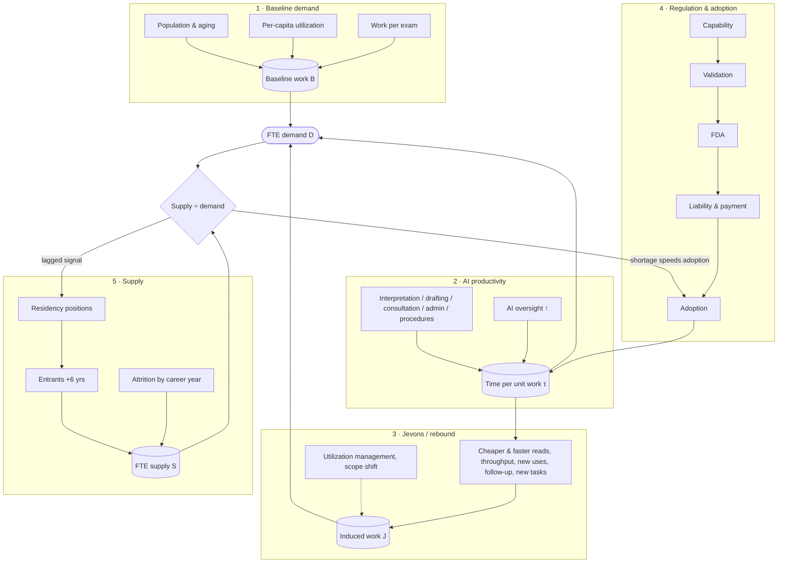

# Will AI Shrink the Radiology Job Market?
## A probabilistic forecast of the U.S. diagnostic-radiology workforce, 2026–2066

*For anyone considering, training in, or early in a career in diagnostic radiology · Version 1.4 · October 2026 ·
Interactive version: <https://ethanuser.github.io/radiology/> · Code and data: this repository*

> **How to read this document.** Every number is produced by the Monte Carlo model in [`model/`](model/) and inserted by
> [`tools/build_docs.py`](tools/build_docs.py); re-running the model regenerates the report. Superscript section marks
> (for example <sup>§4.3</sup>) link each claim to the method or evidence behind it, and numbered superscripts link to references.
> Each reference has ↩ links back to every place it is cited, and your browser's Back button returns you to where you were.
> The model and text were drafted with an AI assistant (Claude, Anthropic) from the cited sources and should be read
> critically. This is a forecast, not career, financial or medical advice. The probabilities are conditional on the model's
> assumptions: read them as structured, model-based judgment (a scenario analysis with explicit weights), not as a calibrated
> statistical forecast. §8.4 shows how much they move under alternative assumptions and model structures.

---

## Summary

**Question.** Diagnostic radiology is the specialty most often named as a likely casualty of AI. For someone choosing the
specialty now, or already training in it, what will the market for radiologists' labor look like when they enter practice
and over the following decades? How much does AI change it?

**Approach.** We built a probabilistic model with five separately specified components: baseline imaging demand, task-level
AI productivity, the regulatory and adoption pipeline for autonomous AI, Jevons/rebound effects, and a cohort model of
radiologist supply with an endogenous residency response.{{m('model')}} Its {{n_params}} uncertain inputs are drawn
from explicit probability distributions, correlated through three latent factors (AI progress, regulatory friction, appetite
for imaging), and propagated through {{f"{n_drawn:,}"}} simulated futures, of which the {{f"{n_sims:,}"}} not already contradicted by
events are kept (§10).{{m('uncertainty')}} Each input is graded
**empirical** (E), **anchored** (A: an empirical anchor plus judgment) or **subjective** (S).{{m('params')}}

**Headline results** (median with 10th–90th percentile range; indices relative to 2026):

{{headline_table()}}

**Key findings**

1. **Over the next decade the market most likely stays balanced or short.** Radiologists who will practice in 2035 have mostly already
   matched or started medical school, and imaging demand keeps growing with an aging population. The median
   supply/demand ratio in 2035 is {{num(sm[2035]['ratio_p50'])}} (below 1 means a shortage). The probability of meaningful
   oversupply (more than 10% excess radiologist capacity) is {{pct(sm[2035]['p_oversupply'])}} in 2035, and most of it sits in
   a "transformative AI" branch with a 12% prior; outside that branch it is
   {{pct(x['non_tai']['2035']['p_over'])}}.{{m('balance')}}{{m('regimes')}}
2. **Risk grows with time in practice.** Median FTE demand rises only modestly ({{chg(sm[2045]['demand_p50'])}} by 2045,
   {{chg(sm[2055]['demand_p50'])}} by 2055) because AI productivity absorbs most of the growth in imaging. The probability of
   meaningful oversupply rises to {{pct(sm[2045]['p_oversupply'])}} in 2045 and {{pct(sm[2055]['p_oversupply'])}} in 2055
   (any surplus, $R>1$: {{pct(sm[2045]['p_supply_exceeds_demand'])}} in 2045),
   and from 2035 on, {{pct(min([sm[2035]['p_demand_below_today'], sm[2045]['p_demand_below_today'], sm[2055]['p_demand_below_today'], sm[2066]['p_demand_below_today']]))}}–{{pct(max([sm[2035]['p_demand_below_today'], sm[2045]['p_demand_below_today'], sm[2055]['p_demand_below_today'], sm[2066]['p_demand_below_today']]))}}
   of futures have demand below today's level. With no further AI, oversupply would be
   {{pct(rb['structures']['no_ai']['2045']['p_over'])}} likely in 2045 and {{pct(rb['structures']['no_ai']['2055']['p_over'])}} in 2055
   (supply slowly overtaking slow-growing demand); with assistive AI but no AI-first reading,
   {{pct(rb['structures']['assistive_only']['2045']['p_over'])}} and {{pct(rb['structures']['assistive_only']['2055']['p_over'])}}. This
   later risk is not only a transformative-AI story: excluding that branch, oversupply is still
   {{pct(x['non_tai']['2045']['p_over'])}} likely in 2045 and {{pct(x['non_tai']['2055']['p_over'])}} in 2055.{{m('ds')}}
3. **A collapse is a tail, not a base case.** Demand falls below half of today's level with probability
   {{pct(sm[2045]['p_demand_below_50'])}} in 2045 and {{pct(sm[2066]['p_demand_below_50'])}} in 2066, almost entirely in
   transformative-AI worlds.{{m('regimes')}}
4. **AI productivity is real but slow to be realized.** Median time saved per unit of imaging work is
   {{pct(x['time_saved']['2035']['p50'])}} in 2035 and {{pct(x['time_saved']['2055']['p50'])}} in 2055. AI-first or autonomous
   reading reaches a median {{pct(sm[2045]['autonomous_p50'])}} of interpretive work by 2045. For each tier of exam
   difficulty, the chain from technical capability to clinical validation, FDA authorization, liability and payment
   acceptance, and hospital adoption takes one to two decades by assumption (the lag priors in §4.3, anchored on past
   diffusion); it is an input, not a finding.{{m('aiprod')}}{{m('pipeline')}}
5. **A true Jevons paradox is unlikely under the main assumptions, but this depends on the demand channels assumed.**
   AI-induced demand (cheaper and faster reads, new applications, follow-up of AI-detected findings, scanner throughput, new
   radiologist tasks) offsets a median {{pct(jv[2045]['offset_p50'])}} of the labor AI saves by 2045 and exceeds it in only
   {{pct(jv[2045]['p_jevons'])}} of simulated futures. If AI creates three times as many new imaging uses (and twice the new
   radiologist tasks) as assumed, that rises to
   {{pct(rb['structures']['open_demand']['2045']['p_jevons'])}}.{{m('jevres')}}{{m('robust')}}
6. **What drives the forecast:** the AI-progress regime and future per-capita imaging use, then the size of assistive-AI
   time savings. Regulatory delay, new applications and scanner throughput are second-order. Growth in residency positions
   becomes a top driver by 2055. Most of the spread (roughly two-thirds to three-quarters) comes from inputs graded
   subjective.{{m('sensitivity')}}
7. **For practicing radiologists, AI risk would most likely show up as slower hiring of new graduates, flatter pay and a
   changed job, not unemployment.** The model forecasts only the supply/demand balance; the split between hiring, pay and hours
   is an interpretation from past gluts, not a model output. Attrition (measured 2.0–2.5% a year in 2019–2022; the model's exit rate is a little higher) absorbs gradual declines,
   but new graduates keep entering: a severe surplus ($R>1.25$) lasts five or more years in
   {{pct(x['displacement']['p_sustained_severe_surplus'])}} of futures ({{pct(x['displacement']['p_sustained_severe_surplus_non_tai'])}} outside the
   transformative branch).
   Demand falls faster than attrition over some five-year window after 2035 in
   {{pct(x['displacement']['p_any_decline_faster_than_attrition_2035_2066'])}} of futures, and in
   {{pct(x['displacement']['p_any_decline_faster_than_attrition_non_tai'], 1)}} outside the transformative branch.{{m('margins')}}
8. **The backtest is a weak sanity check.** Run from 2016 with only the information then available, a simplified version of
   the approach gave a {{pct(bt['radiology']['p_shortage'])}} chance of the radiologist shortage seen in 2025, but that result
   comes from the supply-versus-demand fundamentals rather than the AI layer, and ranges from
   {{pct(min(bt['radiology']['sensitivity'].values()))}} to {{pct(max(bt['radiology']['sensitivity'].values()))}} under other
   reasonable protocol choices. For the three other occupations, the BLS-plus-trend combination alone was more accurate
   than the full method on average: the AI layer helped for translators, tied for software and hurt badly for
   transcription.{{m('backtest')}}
9. **The direction is robust; the exact numbers are not.** Under {{len(rb['priors']) - 1}} alternative prior sets (two of them combinations) and {{len([k for k, v in rb['structures'].items() if k != 'base' and not v['counterfactual']])}} alternative model
   structures (including reads with no radiologist, automation that does not follow a difficulty ladder, and no shortage
   today), the 2045
   oversupply probability ranges from {{pct(rb['band']['2045']['single_lo'])}} to {{pct(rb['band']['2045']['single_hi'])}} (main
   model {{pct(sm[2045]['p_oversupply'])}}); changing the AI and imaging priors together widens this to
   {{pct(rb['band']['2045']['lo'])}}–{{pct(rb['band']['2045']['hi'])}}. Every variant agrees that risk is lower in 2035 than later and rises over a
   career.{{m('robust')}}

**By career stage** (details in §9{{m('careers')}}):

{{stage_table()}}

\*Assumes a 1-year fellowship; subtract one year without it.

---

{{anchor('question')}}
## 1. Question, scope and definitions

**Population.** U.S. diagnostic radiologists. Supply is calibrated to the Harvey L. Neiman Health Policy Institute count of
37,482 radiologists enrolled to serve Medicare patients in 2023 [@christensen_supply], a broader definition than the AAMC's
28,618 "radiology and diagnostic radiology" physicians [@aamc_2024]. All outputs are indices relative to 2026, so the
definitional difference matters mainly through the ratio of entrants to the existing stock.

**Career timelines.** The stage table above shows when people at each stage in 2026 would typically start independent
practice: a pre-med around 2038, a first-year medical student around 2035–2036, a current R1 around 2031. The forecast
reports calendar years. Read across to your own start year.

**Definitions.**

* **FTE demand $D(t)$**: radiologist full-time equivalents needed to perform the imaging work demanded in year $t$, given the
  AI in use, as an index with $D(2026)=1$. It includes work that is currently backlogged or outsourced.
* **FTE supply $S(t)$**: practicing radiologists × FTE per head, as an index with $S(2026)=1$.
* **Supply/demand ratio $R(t)$**, in absolute FTEs. Today's market is short: $R(2026)$ ≈ 0.93 (range 0.85–0.99).{{m('baseline')}}
  **Meaningful oversupply** is $R>1.10$. This threshold is a convention for a clearly noticeable surplus: the mid-1990s and
  mid-2010s gluts [@sharafinski_2016; @shi_2015] were never measured on this scale, so we also report $P(R>1)$.
  **Severe oversupply** is $R>1.25$.
* **AI productivity $P(t)$**: imaging work completed per radiologist-hour relative to 2026. Time saved is $1-1/P$.
* **AI-first/autonomous share**: share of interpretive work where AI is the primary reader and the radiologist audits,
  signs off or handles escalations.

---

{{anchor('approach')}}
## 2. Forecasting approach: outside view first

We follow practices that distinguish accurate forecasters in tournaments: decompose the question, start from base rates
(the "outside view"), state explicit probabilities with wide intervals, and name the observations that should move the
forecast [@tetlock_2015; @mellers_2014; @kahneman_1993; @metaculus]. Four reference classes anchor the priors.

1. **Confident predictions that AI would displace radiologists have so far failed.** In 2016 Geoffrey Hinton said that
   people "should stop training radiologists now" [@hinton_2016]. A decade later, diagnostic-radiology programs offered a
   record 1,241 positions with a 97.6% fill rate [@nrmp_2026], and average radiology compensation rose 6.6% in the latest
   annual survey [@doximity_2026]. The FDA lists more than 1,600 AI-enabled devices, about three-quarters in radiology
   [@fda_ai_2026], but claims data show clinical use concentrated in a handful of products [@wu_2024]. Langlotz's framing
   since 2019 has been that AI changes the work rather than replacing the worker [@langlotz_2019; @mousa_2025].
2. **The radiology labor market cycles with supply and utilization shocks.** After the mid-1990s downturn, radiology trainee
   numbers fell to a nadir of 3,080 in 1997 and then rose 84% by 2011 [@rosenkrantz_2016]. Positions kept expanding despite
   a softening job market, and the market was oversupplied by the mid-2010s [@sharafinski_2016]. In the 2015 Match only 86%
   of advanced DR positions filled and U.S. graduates took 67% of matched positions [@shi_2015]. Students respond to market
   signals within a few years [@nicholson_2002; @reeder_2022].
3. **Clinical technology diffuses only after payment and liability are resolved, and then it can diffuse quickly.**
   Mammography computer-aided detection (FDA 1998, Medicare payment 2002) was used for most U.S. screening mammograms within a
   few years, despite no measurable accuracy benefit [@lehman_2015]. Hospital EHR adoption passed 50% about four years after
   the 2009 HITECH subsidies [@adler_milstein_2017]. Autonomous diabetic-retinopathy AI took three years from FDA
   authorization (2018) to a payable CPT code [@abramoff_2018].
4. **Automation economics.** In the task framework, automation displaces labor from automated tasks, raises demand through
   productivity, and can reinstate labor through new tasks [@acemoglu_restrepo_2018; @acemoglu_restrepo_2019]. Whether
   employment rises depends on demand elasticity, which was high early in industrialization and fell as demand saturated
   [@bessen_2019]. Most of today's U.S. employment is in job specialties created after 1940 [@autor_2024]. Whether automation
   raises or lowers wages depends on whether it removes the expert or the inexpert parts of a job [@autor_thompson_2025].
   The idea that efficiency can increase total use goes back to Jevons [@jevons_1865].

**AI-progress inputs.** METR's measured task horizons for frontier models doubled about every seven months from 2019 to 2024
[@metr_2025], and faster after 2023 [@metr_2026]. AI 2027 sketches very rapid progress [@ai2027]. A survey of 2,778 AI
researchers put even odds on machines outperforming humans at every task by 2047, but on full automation of occupations only
by 2116 [@grace_2025]. Expert and superforecaster panels assign far lower probabilities to near-term transformative AI than
industry leaders do [@leap_2025; @karger_2023]. We use these sources only to weight four AI-progress regimes and to scale
when radiology capabilities arrive.{{m('uncertainty')}} None of them is a forecast about medicine.

{{anchor('approaches')}}
### 2.1 Ways to forecast a job market, and why this one

There are several ways to answer "will there be jobs?", each with a track record.

| Approach | Strength | Weakness | Evidence on accuracy |
|---|---|---|---|
| Ask a domain expert or a famous thinker | Rich context, fast | Overconfident; experts rarely beat informed generalists on long-range questions | In 20 years of tracked political and economic forecasts, specialists did no better than generalists, and "hedgehogs" with one big idea did worst [@tetlock_2005]. Hinton's 2016 call on radiology [@hinton_2016] |
| Aggregate many forecasters (superforecasters, prediction markets) | Best record on 1–2 year questions | Few long-horizon or niche questions; thin markets | Teams of trained forecasters beat individuals and intelligence analysts [@mellers_2014; @tetlock_2015]; markets aggregate dispersed information well [@arrow_2008; @metaculus]. In a 2022 tournament, superforecasters and domain experts had nearly identical overall accuracy, and both underestimated AI benchmark progress, superforecasters more so (9.7% vs 24.6% average probability on what happened); the median of all forecasts beat individuals [@fri_xpt_2025] |
| Extend the trend / reference-class base rates | Simple, hard to beat over short horizons | Misses turning points | The "outside view" corrects planning optimism [@kahneman_1993]; simple statistical methods were competitive in the M4 competition [@makridakis_2020] |
| Official projections (BLS) | Careful, occupation-level, public | Assume slow technology change | BLS projected +14% for medical transcriptionists over 2006–16; employment fell 41% [@bls_ooh_2008_mt; @bls_ooh_2018_mt] |
| Task-exposure indices | Rank which jobs are exposed | No timing, regulation or demand response | Frey & Osborne ranked transcription as highly automatable and software as not [@frey_osborne_2013]; LLM exposure estimates [@eloundou_2024] |
| Scenarios | Make tails concrete | No probabilities | AI 2027 [@ai2027] |
| Structured probabilistic model (this report) | Decomposes the question into parts with evidence; keeps every assumption explicit; outputs probabilities that can be updated | Only as good as its subjective inputs; can create false precision | Combining forecasts usually beats choosing one [@clemen_1989; @makridakis_2020]; backtest in §6.2{{m('backtest')}} |

We use the structured model as the main tool, but borrow from the others: base rates set the priors (§2), official
projections and trends enter the backtest baseline, AI forecasts weight the regimes, and the signposts in §9.3 are designed
for updating, as superforecasters do. No method has a good record at 20–40-year horizons, so the long-range probabilities
in this report should be read as structured judgment, not measurement.

---

{{anchor('evidence')}}
## 3. Recent evidence (2024–2026)

For a general overview of what AI can and cannot yet do compared with radiologists, see the review by Rajpurkar and
Lungren in the *New England Journal of Medicine* [@rajpurkar_2023] and Mousa's accessible essay on why AI has not replaced
radiologists [@mousa_2025]. This section summarizes the empirical work most relevant to the model's least certain components. Full texts of RSNA and
open-access journals were reviewed. For some Elsevier journals (including JACR), figures come from abstracts because
full-text access was blocked for automated reading.

**3.1 How much time does AI save radiologists today?**

| Study | Setting and design | Measured effect on radiologist time |
|---|---|---|
| Huang et al, 2025 [@huang_2025] | 23,960 radiographs, live deployment, 12 hospitals | 15.5% faster documentation; no loss of accuracy |
| Hong et al, 2025 [@hong_2025] | 758 chest radiographs, 5 readers, reader study | Reading time 34.2 s → 19.8 s (−42%) |
| Li et al, 2026 [@li_2026] | LLM impressions, 42 hospitals, blinded comparison | −0.46 min per report; impressions non-inferior in 69% |
| Liu et al, 2026 [@liu_2026] | 185,044 chest CT reports, 2 hospitals, retrospective | No sustained efficiency gain at one of two sites |
| Tanno et al, 2025 [@tanno_2025] | AI chest-radiograph reports vs radiologists | AI report preferred or equivalent in 77.7% (94% of normal cases); clinically significant errors in 22.8% of AI-only vs 14.0% of human-only reports |
| Wenderott et al, 2024 [@wenderott_2024] | Meta-analysis of real-world AI deployments | 67% of studies reported time reductions; pooled effects not significant |
| Yu et al, 2024 [@yu_2024] | 140 radiologists, 15 chest-radiograph tasks | Effects of AI assistance highly heterogeneous; erroneous AI output hurt performance |
| Lauritzen et al, 2024 [@lauritzen_2024] | Danish screening program before vs after AI | 33.5% fewer screening reads; higher cancer detection, lower recall |
| MASAI, 2023–2026 [@lang_2023; @hernstrom_2025; @gommers_2026] | 105,934 women, randomised | 44% lower screen-reading workload; 29% more cancers detected; interval cancers non-inferior (rate ratio 0.88) |

The screening savings come from replacing the second reader in European double reading, a substitution effect that does
not transfer to single-read U.S. practice; we use them only to size tier 1, not to set assistive ceilings. The evidence
supports large savings on drafting and in screening programs, modest and heterogeneous savings on
interpretation, and little measured effect at system scale so far.{{m('ai')}}

**3.2 How much work could be read autonomously?** A commercial tool could autonomously report 28% of normal posteroanterior
chest radiographs (7.8% of all) with 99.1% sensitivity for abnormal films [@plesner_2023]. With a tuned threshold, about 47%
of unremarkable films (roughly 17.5% of all chest radiographs) could be excluded at 99% sensitivity [@plesner_2024]. An
autonomous normal-chest-radiograph product has held EU CE Class IIb marking since 2022 [@oxipit_2022]. In the U.S., no
autonomous radiology read is FDA-authorized as of October 2026 [@fda_ai_2026]. Generative chest-radiograph drafting tools
received FDA Breakthrough designations in 2026, and a cleared breast-ultrasound tool generates reports under radiologist
control [@aidoc_2026; @deephealth_2026]. FDA's AI lifecycle guidance remains a draft [@fda_draft_2025]. Of FDA-authorized AI
devices, 43% had no published clinical validation and about 4% had randomized evidence [@chouffani_2024]. Liability rules
are unsettled [@mello_2024], and mock jurors judge radiologists more harshly when they miss something AI flagged
[@bernstein_2025].{{m('pipeline')}}

**3.3 Adoption.** In 2020, 33.5% of surveyed U.S. radiologists used any AI [@allen_2021]. By 2025, 75% of UK radiology
departments used AI clinically, but the Royal College of Radiologists found no overall reduction in workload. The UK
consultant shortfall was 32% [@rcr_2026]. In China, AI use was associated with *higher* burnout odds among radiologists with
high workloads [@liu_burnout_2024].

**3.4 Workforce and demand.** Average exams read per radiologist-day were flat from 2018 to 2024 (+0.6%), but the busiest
quartile read 30.6% more [@zamani_2026]. Practice turnover rose from 5.3% to 8.5% between 2013 and 2022 and followed a
U-shaped relationship with workload [@parikh_2026]. Emergency-department CT per 100 Medicare beneficiaries nearly doubled
from 2013 to 2023 even as ED visits fell [@rosenkrantz_2025]. A review of 2024 imaging research found that 49% of articles
with direct patient-care impact would increase radiologist workload and fewer than 1% would decrease it. AI studies had about 14 times higher
odds of adding work (odds ratio 14.3, 95% CI 4.2–48.2; with a baseline near 49%, roughly twice
as likely) [@kwee_2025].{{m('baseline')}}{{m('jevons')}}

**3.5 Labor-market evidence from other occupations.** In payroll data, workers aged 22–25 in the most AI-exposed occupations
saw a 16% relative employment decline after 2022, while experienced workers did not. Firms adjusted headcount rather than
pay [@canaries_2025]. Danish administrative data show near-zero effects of chatbots on earnings and hours, partly because AI
created new oversight tasks [@humlum_2025]. Field experiments find meaningful productivity gains concentrated among less
experienced workers [@brynjolfsson_2025]. Macro estimates of AI's productivity effect over a decade are modest
[@acemoglu_2025], and measured exposure is broad across occupations [@eloundou_2024]. These findings shape the model's
assumption that the first adjustment margin is new-graduate hiring rather than layoffs of incumbents.{{m('margins')}}

---

{{anchor('model')}}
## 4. Model structure



{{anchor('baseline')}}
### 4.1 Baseline imaging demand (AI frozen at its 2026 level)

$$B(t)=\prod_{s=2027}^{t}\bigl(1+r_{\text{dem}}(s)+r_{\text{util}}(s)+r_{\text{cmplx}}(s)\bigr)\cdot\frac{1-a(t)}{1-a(2026)}$$

* **Demographics, $r_{\text{dem}}$.** Population growth and aging alone raise imaging 16.9%–26.9% from 2023 to 2055,
  depending on modality [@christensen_util], under Census 2023 population forecasts. CBO's 2026 outlook has markedly lower
  population growth (349 million in 2026 to 364 million in 2056) [@cbo_2026], so we center demographic growth of radiologist
  work at 0.52%/yr (A), declining after 2045.
* **Per-capita utilization, $r_{\text{util}}$.** Age-specific CT use grew 3.7–5.2%/yr in 2013–2016 and MRI 1.3–2.2%/yr, while
  nuclear medicine declined [@smith_bindman_2019]. About 93 million CTs were performed in 2023 [@smith_bindman_2025]. ED CT per
  Medicare beneficiary nearly doubled from 2013 to 2023 [@rosenkrantz_2025]. National 2018–22 claims data imply total utilization in
  2055 that is 16.9% to 26.9% above 2023 by modality from population growth and aging alone, and between 5.6% lower and 45.2%
  higher if each modality's recent per-person trend continues to 2030 (radiography and nuclear medicine falling, CT and MRI
  rising) [@christensen_util]. The Neiman Institute's 2026 update projects +17% (MRI) to +25% (CT) by 2055 and calls the
  shortage "fairly static" [@rula_2026]. We start the per-person trend at 0.6%/yr (σ 0.7) and let it converge to 0.2%/yr (σ 0.5) with an uncertain half-life. Demographics times per-person use then
  grows a median {{pct(val['dem_util_growth_2026_2055'][1])}} from 2026 to 2055 (80%:
  {{pct(val['dem_util_growth_2026_2055'][0])}} to {{pct(val['dem_util_growth_2026_2055'][2])}}). Each end of Christensen's
  trend range is a single modality (CT up, nuclear medicine down), so a work-weighted claims-based figure is lower than CT's;
  our center sits above the claims-based trends, because 2018–22 includes the COVID dip and we let growth continue past 2030,
  and below CT's own trend. This is a deliberate judgment, and the most consequential non-AI one (§8.1); the "imaging restraint"
  prior set in §8.4 is close to the claims-based trends. The input is graded subjective. Version 1.2 centered this trend at 1.2%/yr.
* **Work per exam, $r_{\text{cmplx}}$.** Images per cross-sectional study rose about tenfold at Mayo Clinic from 1999 to 2010
  [@mcdonald_2015]. Work per exam grows far more slowly than image counts: 0.4%/yr, decaying with a 20-year half-life.
* **Alternative diagnostics, $a(t)$.** Blood-based tests, AI-ECG and similar tools displace up to 15% of imaging (mode 4%).
* **Today's gap (subjective).** No measured national figure exists. HRSA *projects* radiology at about 90% workforce
  adequacy in 2038, and the Neiman Institute describes the shortage as "fairly static" [@rula_2026]. Pay is rising and positions
  are expanding, but per-radiologist volumes are flat on average and the strain is uneven [@zamani_2026; @parikh_2026].
  $R(2026)$ is triangular on 0.85–0.99 (mode 0.93), graded subjective.

{{anchor('ai')}}
### 4.2 AI productivity: a task-based model

Following Langlotz's task-based analysis [@langlotz_2025] and the Acemoglu–Restrepo framework, radiologists' 2026 working time
is drawn from a Dirichlet distribution centered on interpretation 42%, measurement and drafting 18%, clinical synthesis and
consultation 13%, administration 15% and procedures 12%. Langlotz allocates 66.7% of time to performing and interpreting
studies, 5.5% to protocoling and 11.8% to communication. A time-motion study found 36.4% pure interpretation [@dhanoa_2013].
For each task $k$, assistive AI saves

$$\sigma_k(t)=m_k\cdot \text{cap}_k(t)\cdot \text{adopt}(t)$$

where $m_k$ is the eventual ceiling (anchored on §3.1), $\text{cap}_k$ a logistic capability curve scaled by the
AI-progress multiplier $M$, and $\text{adopt}$ the effective clinical adoption, whose clock runs faster while demand exceeds
supply (new in v1.1). For the AI-first share $\alpha(t)$, a fraction $f_{\text{sub}}$ of interpretation and drafting time is
removed. Oversight work $o(t)$ grows with AI use [@humlum_2025]. Time per unit of work relative to a no-AI world is

$$\tau(t)=s_I\bigl[(1-\alpha)(1-\sigma_I)+\alpha(1-f_{\text{sub}})\bigr]+s_D\bigl[(1-\alpha)(1-\sigma_D)+\alpha(1-f_{\text{sub}})\bigr]+\sum_{k\in\{C,A,P\}}s_k(1-\sigma_k)+o(t)$$

and AI productivity is $P(t)=\tau(2026)/\tau(t)$.

{{anchor('pipeline')}}
### 4.3 Regulation and adoption: from capability to labor substitution

Interpretive work is split into four autonomy tiers. Tier 1 is normal or negative radiographs and screening exams, ≈7% of
interpretive work after recalibration to the Danish evidence in §3.2. Tier 2 is all radiographs, screening mammography and
standardized follow-ups (≈17%). Tier 3 is complex diagnostic CT/MR/US/NM (≈47%). Tier 4 is the hardest residual work.
These tiers are this report's own construct, not a standard classification. The closest published framework, "levels of
autonomous radiology" [@ghuwalewala_2022], grades *how much* of a read AI performs (from assistance to fully autonomous
reporting); our tiers instead group *which exams* could plausibly become autonomous first, ordered by current evidence (normal
chest radiographs and screening exams first, §3.2). The ordering is an assumption, tested by the "tiers in any order" structure
in §8.4. AI-first reading of screening mammograms also needs a change to the Mammography Quality Standards Act rules on interpreting
physicians, not just an FDA device authorization, so the archived FDA prediction (§10.1) refers to chest radiographs only. Each
tier passes, in sequence:

$$T^{\text{ready}}_j = T^{\text{cap}}_j + L^{\text{validation}}_j + L^{\text{FDA}}_j + L^{\text{liability/payment}}_j,\qquad
\alpha(t)=\sum_j w_j\,a^{\max}_j\,\text{logistic}\!\left(\tfrac{\tilde t_j(t)-h}{\text{width}}\right)$$

where $\tilde t_j$ is time since readiness on the shortage-accelerated adoption clock. Validation lags are anchored on
MASAI, which took about five years from randomization (April 2021) to its interval-cancer endpoint (January 2026)
[@gommers_2026], and on the scarcity of prospective validation [@chouffani_2024]. FDA lags are anchored on the absence of any
U.S. autonomous radiology authorization so far and on the IDx-DR precedent [@fda_ai_2026; @abramoff_2018]. Liability and
payment lags are anchored on CPT 92229 for autonomous retinal AI, CPT 75577 for AI coronary plaque analysis
[@cms_pfs_2026], and liability research [@mello_2024; @bernstein_2025]. Adoption half-times follow the CAD and EHR precedents
[@lehman_2015; @adler_milstein_2017]. All lags load on a common regulatory-friction factor.

{{anchor('jevons')}}
### 4.4 Jevons and rebound effects

| Channel | Specification | Evidence |
|---|---|---|
| Cheaper interpretation (price) | $(1-\Delta p)^{\varepsilon}-1$; professional share ≈20%, pass-through ≈40%, elasticity ≈−0.2 | [@pc_share; @manning_1987; @aron_dine_2013; @brot_goldberg_2017] |
| Faster turnaround & availability | access × time saved | [@larson_2011] |
| Scanner throughput / latent demand | latent demand (2–12%) released as AI-accelerated acquisition frees capacity | [@johnson_2023; @asrt_2025] |
| New applications & screening | lognormal, median 18% of baseline work by 2066 × radiologist intensity 0.4–1.0 | [@kwee_2025; @bandi_2024; @lee_2026; @cms_pfs_2026] |
| Incidental findings & follow-up | up to 8% at full AI-detection deployment | [@hernstrom_2025; @eisemann_2025] |
| New radiologist tasks (reinstatement) | up to 12% of 2026 FTE | [@acemoglu_restrepo_2019; @autor_2024] |
| AI utilization management (−) | up to 8% | [@langlotz_2025; @trustees_2026] |
| Scope shift to non-radiologists (−) | up to 10% | subjective |

Exam-generating channels pass through a smooth minimum with capacity: $G=G_{\text{pot}}(1+(G_{\text{pot}}/K)^4)^{-1/4}$. FTE
demand is

$$D(t)=B(t)\,\frac{1+J(t)}{1+J(2026)}\,\frac{\tau(t)}{\tau(2026)}+B(t)\bigl[N(t)-N(2026)\bigr]$$

Labor saved is $L=B(1-\tau/\tau_0)$, induced demand is $I=D-B\,\tau/\tau_0$, and the offset ratio is $I/L$. A *true Jevons
paradox* is $I>L$, equivalently $D>B$. The identity $D=B-L+I$ is unit-tested.

{{anchor('supply')}}
### 4.5 Radiologist supply

A cohort model tracks practicing radiologists by years in practice. Exit hazard rises to retirement levels after about 33
years and is scaled by a multiplier, U(0.95, 1.25). With flat positions, multipliers of 1.0 and 1.2 reproduce the published
supply projections under blended 2014–23 attrition (+25.7% by 2055) and post-COVID attrition (+20.9%); the range is centered
between them, nearer the post-COVID case. Measured attrition rose from 1.1% (2014) to 2.0% (2019) and 2.5% (2022)
[@christensen_supply; @rula_2026]; the cohort model's aggregate rate is not directly comparable, because the
entrants-per-position factor $\kappa$ absorbs definitional differences.
Practice turnover has also roughly doubled [@parikh_2026]. Entrants in year $t$ equal $\kappa$ × filled DR positions from
the year $t-6$ Match, where $\kappa=${{num(val['kappa_entrants_per_filled_position'])}} is calibrated so that flat residency
positions reproduce Christensen et al's +25.7% (2023–2055) [@christensen_supply]. Positions start at 1,241 [@nrmp_2026],
follow a trend (1.5%/yr, σ 0.8, capped at 1.8× by GME funding; positions grew about 1.9%/yr in 2010–2025 [@malhotra_2026]), and
respond to a market signal $x=\ln(D/S)$ averaged over three years and observed with a 1–3-year lag, clipped to [−0.7, 0.4]:

$$\text{positions}^{*}=\text{trend}\cdot e^{\gamma' x},\quad \gamma'=\gamma \text{ if } x<0 \text{ (surplus) else } 0.3\gamma,\qquad \tilde p=\text{positions}_t(1+g),\quad \text{positions}_{t+1}=\tilde p+0.35(\text{positions}^{*}-\tilde p)$$

$$\text{fill}=0.976\,e^{\kappa_f\min(x,0)}-\text{fear}\cdot\text{visibility}_{AI}$$

Programs cut positions faster in a surplus than they add them in a shortage (GME caps). The trend accrues only while the market
is not in surplus, so programs stop expanding during a glut; each year positions grow with that trend and then close 35% of the remaining gap to the market-adjusted target.

{{anchor('uncertainty')}}
### 4.6 Uncertainty, correlation, regimes and the shortage feedback

Inputs are drawn through a structured Gaussian copula with three factors: AI progress, regulatory friction and appetite for
imaging. This preserves every marginal while inducing the intended correlations, which are tested: faster AI means earlier
capability *and* higher task ceilings *and* more new applications *and* more throughput. The AI factor selects a regime with
these subjective weights:

| Regime | Weight | Timeline multiplier $M$ | Interpretation |
|---|---|---|---|
| Stall | 15% | 1.6–3.0 | radiology AI arrives 1.6–3× later than trend |
| Trend | 55% | lognormal, median 1 | current pace continues |
| Fast | 18% | 0.40–0.65 | roughly 2× faster |
| Transformative | 12% | 0.25–0.45 + lifted ceilings | AI eventually does nearly all radiologist cognitive work; institutional lags for tiers 2–4 shrink 40%; robotics still lags |

**Shortage feedback (new in v1.1).** Version 1.0 assumed adoption speed was independent of the shortage. Now the model solves
in two passes. Pass 1 computes the shortage path $\ln(D/S)$. Pass 2 runs the assistive and autonomous adoption clocks faster
by $1+\kappa_a\max(0,\ln(D/S))$ with $\kappa_a\sim U(0,4)$ (subjective), so a 7% shortage speeds adoption by up to 28%. This is one
fixed-point iteration of the coupled system.

---

{{anchor('params')}}
## 5. Parameters and evidence

The model has {{n_params}} sampled parameters plus the task-share Dirichlet: {{ev_n('Empirical')}} graded E,
{{ev_n('Anchored')}} graded A and {{ev_n('Subjective')}} graded S. The empirical backbone sits mostly in **fixed calibration
targets**: the 2023 workforce, career length, attrition, the flat-residency supply projection, 2026 positions and fill rate,
and the demographic projection. The full table is in [Appendix A](#appendix-a). What is *not* well supported by data: the
speed of general AI progress, the ceilings on AI time savings for non-interpretive tasks, the size of AI-enabled new
applications, and regulatory and liability lags for autonomous reading. These are the parameters the sensitivity analysis
flags.{{m('sensitivity')}}

---

{{anchor('validation')}}
## 6. Calibration and validation

### 6.1 Calibration checks

| Check | Model | Reference |
|---|---|---|
| Supply growth 2023→2055, flat residency (calibration target, matched by construction) | {{chg(val['supply_flat_2055_vs_2023'], 1)}} | +25.7% [@christensen_supply] |
| Supply growth 2023→2055, flat residency, attrition multiplier 1.2 (calibration end-point, not independent) | {{chg(val['supply_flat_2055_high_attrition'], 1)}} | +20.9% with post-COVID attrition [@rula_2026] |
| Matched to the Neiman update: demographics-only demand, post-COVID attrition, flat positions, no AI: supply ÷ demand (consistency check) | median {{num(val['neiman_matched_ratio_p50']['2035'])}} (2035), {{num(val['neiman_matched_ratio_p50']['2045'])}} (2045), {{num(val['neiman_matched_ratio_p50']['2055'])}} (2055) | shortage "fairly static" if no action is taken [@rula_2026] |
| Same, but with this model's per-person and complexity growth and blended attrition | median {{num(val['noai_flat_ratio_p50']['2035'])}} (2035), {{num(val['noai_flat_ratio_p50']['2045'])}} (2045), {{num(val['noai_flat_ratio_p50']['2055'])}} (2055) | shortage "fairly static" if no action is taken [@rula_2026] |
| Mean career length | {{num(val['mean_career_years'], 1)}} years | 34.2–35.7 years |
| Aggregate attrition, 2023 | {{pct(val['attrition_2023'], 1)}}/yr at multiplier 1.0 (sampled median ≈3.0%; entrants per position, 1.20, inflate entries and exits alike) | 1.1% (2014) rising to 2.5% (2022) [@rula_2026] |
| Demographic growth of imaging work, 2026→2055 | {{pct(val['demographic_growth_2026_2055_p50'], 1)}} | +16.9% to +26.9% for 2023→2055 with higher Census population [@christensen_util] |
| Realized AI time savings by 2031 | median {{pct(val['realized_time_saved_2031_p50'], 1)}} (P90 {{pct(val['realized_time_saved_2031_p90'])}}) | Langlotz: 33% (14%–49%), an "upper end" potential if all applications are adopted [@langlotz_2025] |
| Demographics × per-person imaging use, 2026→2055 | median {{pct(val['dem_util_growth_2026_2055'][1])}} (80%: {{pct(val['dem_util_growth_2026_2055'][0])}} to {{pct(val['dem_util_growth_2026_2055'][2])}}) | 2023→2055 across modalities: +16.9% to +26.9% (demographics only), −5.6% to +45.2% (recent trends to 2030) [@christensen_util]; +17% to +25% [@rula_2026] |
| Baseline radiologist work 2026→2055, no further AI | {{chg(1 + val['baseline_no_ai_2055_p50'])}} median | Exam projections above plus work per exam (complexity); no direct benchmark |

Matched to the Neiman update's assumptions, the model gives a roughly static shortage, as they do. With this model's own
per-person and complexity growth, the no-AI shortage instead deepens slowly; the gap is entirely those demand assumptions.

**A rough back-cast of the starting point.** Practicing radiologists grew about 12% from 2010 to 2022 (about 1%/yr) while
residency positions grew about 1.9%/yr [@malhotra_2026]. If radiologist work grew 1.5–2.5%/yr over 2016–2026 (demographics,
per-person use and complexity), a market near balance in 2016 (0.98–1.05) would sit at roughly 0.85–0.99 today, consistent
with the prior but unable to tell 0.85 from 1.0. Practice-level data showing exams up about 31% in 2018–2024 with flat exams
per radiologist-day [@zamani_2026] come from a sample of growing practices and may reflect consolidation rather than national
growth. A proper reconstruction remains the top priority (§10).

The near-term AI effect is below Langlotz's potential because the model adds documented diffusion, validation and payment
lags. It sits within the range of measured real-world effects in §3.1. Unit tests check the calibrations, the exact Jevons
identity, copula marginals and correlation signs, regime weights, the shortage feedback, the alternative structures, and that
every reference has a link (links were checked by hand, not by the tests).

{{anchor('backtest')}}
### 6.2 Backtest: forecasting 2025 from 2016

Calibration checks show that the model reproduces published projections; they do not show that the *method* forecasts well.
To test that, we set the clock back to 2016 and forecast employment in 2025 using only information available then. 2016 is a
natural start: it is the year of Hinton's "stop training radiologists" remark and of large-scale neural machine translation.

**Protocol** (fixed before computing outcomes; code in `model/backtest.py`). The three occupations share one protocol;
radiology differs (hand-set AI exposure, its own supply side and an 8-year regulatory lag), and the per-occupation capability
dates were judged in 2026, so hindsight may enter. The
backtest replays a simplified version of the method, with the same structure and AI-regime mixture but a generic
task-exposure model, rather than the full radiology model:

* *Baseline (non-AI) growth* is an equal-weight combination of the BLS 2016–26 projection and the prior decade's trend. Their
  disagreement sets the baseline uncertainty [@clemen_1989].
* *AI layer*, with the same structure as the main model: a share of work exposed to automation (mapped from Frey & Osborne's
  2013 automation probabilities [@frey_osborne_2013], the standard estimate in 2016), a capability S-curve timed by the
  **same AI-regime mixture** as the main model, an adoption lag, and a demand rebound set by the occupation's demand elasticity
  (high for software, middle for translation, low for transcription).
* *Radiology* also gets a supply side (the 2016–25 training pipeline was largely fixed) and a 2016 starting balance near
  or slightly above 1 after the mid-2010s glut [@sharafinski_2016; @shi_2015]. The question scored is whether 2025 shows a
  shortage.
* Employment data come from the BLS *Occupational Outlook Handbook* (2008, 2018 and 2026 editions) [@bls_ooh_2010_sw;
  @bls_ooh_2018_sw; @bls_ooh_2026_sw; @bls_ooh_2008_tr; @bls_ooh_2018_tr; @bls_ooh_2026_tr; @bls_ooh_2008_mt;
  @bls_ooh_2018_mt; @bls_ooh_2026_mt].


{{backtest_md()}}

**Results.** All three occupations fell inside the method's 80% intervals (coverage {{pct(bt['coverage80'])}}). The mean
absolute log error was {{num(bt['mae_log']['model'])}} for the full method, {{num(bt['mae_log']['bls'])}} for BLS,
{{num(bt['mae_log']['trend'])}} for trend extrapolation, and **{{num(bt['mae_log']['combo'])}} for the BLS-plus-trend combination
alone**. On average forecast combination did the work. Per occupation, the AI layer helped for translators (log error
{{num(abs(bt['occupations'][1]['err_model']))}} vs {{num(abs(bt['occupations'][1]['err_combo']))}}), tied for software developers,
and hurt badly for medical transcription, where it over-predicted the
decline in medical transcription (median {{num(bt['occupations'][2]['q']['p50'])}} vs {{num(bt['occupations'][2]['actual'])}};
combination alone {{num(bt['occupations'][2]['combo'])}}), plausibly because speech recognition moved much of the work to editing
drafts rather than eliminating it [@bls_ooh_2018_mt], a rebound the "low elasticity" class understated. Translation growth was
over-predicted by every method that used the strong prior trend.

For radiology the method gave a {{pct(bt['radiology']['p_shortage'])}} chance of a 2025 shortage, which is what the market
signals in §3 indicate. That result is driven by assumed demand growth (2%/yr) outpacing a nearly fixed supply (1%/yr) from
a 2016 starting point near balance; neither input is sourced to a 2016 document, and radiology's AI exposure (0.35) was
set by hand rather than from the Frey & Osborne mapping used for the other occupations. At the main model's own starting
demand growth (about 1.5%/yr) the hindcast is close to a coin flip. The AI layer moves it modestly (median
effect on 2025 demand {{pct(1 - bt['radiology']['ai_effect_p50'], 1)}}, because the regulatory lag delays most labor substitution
beyond 2025). Changed one
at a time, the result is {{pct(bt['radiology']['sensitivity']['no_ai_layer'])}} without the AI layer,
{{pct(bt['radiology']['sensitivity']['demand_1_5pct'])}} with demand growth of 1.5%/yr,
{{pct(bt['radiology']['sensitivity']['lag_3yr'])}} with a 3-year adoption lag, and
{{pct(bt['radiology']['sensitivity']['start_ratio_1_10'])}} if 2016 began in a 10% surplus. The Brier score on this single
event is {{num(bt['brier']['model'])}} (0.25 for a coin flip), which says little on its own; and the outcome it is scored against,
a shortage, rests on the indirect market signals behind the subjective 2026 starting point.

**Limits.** Four cases cannot establish forecasting skill or calibration at a 40-year horizon. The 2016 inputs were selected in
2026, and the capability timing for each occupation (for example, neural translation reaching production quality around 2022)
and the radiology regulatory lag are judgments that may carry hindsight even though they were fixed before scoring. Wide
intervals make coverage easy. This is therefore not out-of-sample evidence that the long-range method is accurate or well
calibrated. What the backtest does support is narrower: combining forecasts helps, and in radiology the supply pipeline and
demand growth, not AI, determined the 2016–2025 outcome. Several start dates, a larger reference class and forecasts recorded
before outcomes are known would make a stronger test; §10.1 begins the last of these.

---

{{anchor('results')}}
## 7. Results

{{anchor('ds')}}
### 7.1 Demand and supply


Median FTE demand rises {{chg(sm[2035]['demand_p50'])}} by 2035, {{chg(sm[2045]['demand_p50'])}} by 2045 and
{{chg(sm[2066]['demand_p50'])}} by 2066. Baseline workload rises {{chg(x['baseline']['2045']['p50'])}} by 2045 without further
AI.{{m('baseres')}} Supply is predictable for a decade: relative to 2026 supply, the median index is {{num(sm[2035]['supply_p50'])}} in 2035
(≈{{f"{x['supply']['head_2035_p50']:,.0f}"}} radiologists) and {{num(sm[2045]['supply_p50'])}} in 2045.{{m('supply')}}

{{anchor('balance')}}
### 7.2 The supply/demand balance


In the median world the shortage narrows through the 2030s and the market is roughly balanced in the 2040s (median ratio
{{num(sm[2045]['ratio_p50'])}} in 2045). The probability of meaningful oversupply rises from
{{pct(sm[2030]['p_oversupply'])}} (2030) to {{pct(sm[2035]['p_oversupply'])}} (2035), {{pct(sm[2045]['p_oversupply'])}} (2045)
and {{pct(sm[2055]['p_oversupply'])}} (2055). A shortage worse than 10% remains possible but less likely in 2045
({{pct(sm[2045]['p_shortage_10'])}}).

{{anchor('aiprod')}}
### 7.3 AI productivity and autonomy


{{pipeline_md()}}

Tier 1 is typically payable in the early 2030s, but tier 3 (complex cross-sectional work, where most radiologist time goes)
only in the 2050s. The upper tail of productivity (P90 {{num(sm[2045]['productivity_p90'])}}× in 2045) comes from the
transformative branch.{{m('regimes')}}

{{anchor('jevres')}}
### 7.4 Jevons accounting: does AI-induced demand offset AI productivity?


{{jevons_md()}}

* Induced demand offsets a median {{pct(jv[2035]['offset_p50'])}} (2035), {{pct(jv[2045]['offset_p50'])}} (2045) and {{pct(jv[2066]['offset_p50'])}} (2066) of the
  labor AI saves. A true Jevons paradox occurs in {{pct(jv[2035]['p_jevons'], 1)}} of worlds in 2035 and
  {{pct(jv[2055]['p_jevons'], 1)}} in 2055. Early on (2030) it is more common ({{pct(jv[2030]['p_jevons'])}}) because throughput
  gains can arrive before reading-time savings.
* Cheaper interpretation is the weakest channel. The professional fee is about 10%–30% of an exam's all-in price
  [@pc_share], and demand is price-inelastic (≈−0.2) [@manning_1987; @aron_dine_2013], so halving interpretation cost adds
  roughly 1%–2% more exams.
* The large channels are new applications, new radiologist tasks, throughput/latent demand and faster turnaround: the
  "reinstatement" and "new work" mechanisms [@acemoglu_restrepo_2019; @autor_2024]. Recent literature suggests AI tends to
  *add* radiologist work [@kwee_2025]. Capacity limits remove on average {{pct(x['capacity_bind_2045_mean'])}} of potential
  induced exams in 2045.
* In Bessen's terms [@bessen_2019], radiologist demand behaves like a mature, fairly inelastic market.

{{anchor('regimes')}}
### 7.5 AI-progress regimes


{{regimes_md()}}

Excluding the transformative branch, the 2045 oversupply probability is {{pct(x['non_tai']['2045']['p_over'])}}, and the
probability that 2045 demand is below 80% of today's is {{pct(x['non_tai']['2045']['p_below80'])}}.

{{anchor('tasks')}}
### 7.6 How the job changes


{{composition_md()}}

{{anchor('baseres')}}
### 7.7 Baseline demand without further AI


Without further AI, workload would grow a median {{chg(x['baseline']['2035']['p50'])}} by 2035 and
{{chg(x['baseline']['2055']['p50'])}} by 2055 (P10–P90: {{chg(x['baseline']['2055']['p10'])}} to
{{chg(x['baseline']['2055']['p90'])}}). That growth is the main reason the median market stays near balance: AI in the median
world mostly absorbs growth that would otherwise deepen the shortage. It is also the most consequential non-AI input (§8.1).

---

{{anchor('sensitivity')}}
## 8. Sensitivity analysis

{{anchor('tornado')}}
### 8.1 Which assumptions move the forecast?

Each assumption group is pinned at its 10th and then its 90th percentile while all other inputs keep their distributions
(8,000 simulations per run, common random numbers). All members of a group are pinned at the same percentile together, which is
more extreme than the group's combined 10th/90th percentile unless the members are perfectly correlated, and more so the
weaker their correlation. For future imaging utilization, this sets three inputs at their tails at once; the milder prior sets
in §8.4 are a better guide to its plausible effect. Bold rows are six commonly debated
assumptions.


{{tornado_md()}}

* **Future imaging utilization** is the most important named assumption. It moves the 2045 oversupply probability from
  {{pct(tor['Future imaging utilization']['pOver2045_low'])}} to {{pct(tor['Future imaging utilization']['pOver2045_high'])}}.
* **AI capability speed** is the largest single driver, mostly through whether a world falls in the transformative branch.
* **AI-first adoption** and **regulatory delay** matter mainly after 2040.
* **New applications** and **scanner throughput** shift median demand by roughly ±5%–8%.
* **Residency adjustment** barely matters before 2045. New entrants are about {{pct(x['surplus_arith']['entry_rate_2035'], 1)}} of the workforce a year and training takes
  six years, so the pipeline corrects slowly.

{{anchor('eta')}}
### 8.2 Variance-based sensitivity

The correlation ratio $\eta^2=\operatorname{Var}(E[Y\mid X])/\operatorname{Var}(Y)$ estimates first-order variance shares.
With correlated inputs it includes effects carried by correlated parameters.


{{eta_md()}}

Excluding the transformative branch, per-capita utilization dominates:

{{eta_md(eta_nt, 8)}}

{{anchor('evshare')}}
### 8.3 How much of the uncertainty is subjective?


Pinning all {{ev_n('Subjective')}} subjective parameters at their medians narrows the 80% interval for 2045 demand by
{{pct(ev_shrink('Subjective', 2045))}} and for the 2045 supply/demand ratio by {{pct(ev_shrink('Subjective', 2045, 'R'))}}.
Pinning the anchored parameters {{('narrows it by ' + pct(ev_shrink('Anchored', 2045))) if ev_shrink('Anchored', 2045) >= 0 else ('widens it by ' + pct(-ev_shrink('Anchored', 2045)))}}. No sampled input is graded purely empirical
(the empirical anchors enter as fixed calibration targets without propagated uncertainty), so most of the spread (about two-thirds to three-quarters) comes from purely subjective inputs and nearly all of it
involves judgment. The attribution is not additive.
Pinning the anchored inputs barely sharpens the demand range (and widens the 2045 supply ÷ demand interval by
{{pct(-ev_shrink('Anchored', 2045, 'R'))}}, a sign the attribution is not additive), although two measurable quantities,
today's per-person imaging growth and today's shortage, are large drivers of the oversupply probability and worth measuring
better. Note that this attribution measures the width of the demand interval, not the oversupply probability. What would
also sharpen it is information about AI, regulation and
future imaging use, which is why §9.3 is framed around signposts.

{{anchor('robust')}}
### 8.4 Beyond parameter uncertainty: alternative priors and model structures

A Monte Carlo simulation propagates uncertainty *within* a model. More simulations reduce numerical noise, but they cannot
correct errors shared by every simulated future, and possibilities the equations exclude contribute nothing. We therefore
separate three kinds of uncertainty:

1. **Numerical (Monte Carlo) error.** With {{f"{n_sims:,}"}} futures, the standard error of a probability near 30% is about
   {{pct(rb['priors']['main']['2045']['se'], 1)}}. Negligible.
2. **Parameter uncertainty.** The distributions in Appendix A; everything in §7 reflects it.
3. **Choice of priors and of model structure.** Tested here.

**Alternative prior sets.** The same simulated futures are importance-reweighted so that the most consequential subjective
inputs follow different, separately motivated priors (effective sample sizes stay above {{f"{rb['min_ess']:,.0f}"}}). *AI-skeptical:* regime
weights 30/55/12/3, in the spirit of forecasting panels that put far lower odds on rapid transformative AI than AI-lab
leaders [@leap_2025; @karger_2023]. *AI-bullish:* 5/35/30/30, closer to AI-lab leaders and the AI 2027 scenario [@ai2027;
@metr_2026]. *Imaging restraint:* per-capita imaging growth centered on 0.3%/yr (Medicare cost pressure, appropriateness
rules) [@trustees_2026]. *Imaging growth:* centered on 1.3%/yr, nearer recent CT growth [@smith_bindman_2025; @rosenkrantz_2025].
*Residency growth slows:* positions grow only about 0.5%/yr as GME caps bind. *Residency growth continues:* positions grow
1.9%/yr, the 2010–2025 pace [@malhotra_2026] (both exact reweights, since that
input has no factor loadings). Two *corner* sets change both AI and imaging priors at once (AI-skeptical with imaging growth; AI-bullish with imaging restraint), because
single changes understate how far the answer can move when assumptions err in the same direction.

**Alternative model structures.** The main model fixes several things by construction, so {{len([k for k, v in rb['structures'].items() if k != 'base' and not v['counterfactual']])}} alternatives are
re-simulated from the same draws:

* *No radiologist on AI-first reads:* in every tier, AI-first reads need no radiologist time at all (no audit or sign-off),
  rather than about a fifth of the usual time (2% in the transformative branch).
* *Tiers automated in any order:* capability dates are assigned to tiers at random in each future and regulatory lags are
  equal across tiers, so AI may master some complex CT tasks before simpler radiographs.
* *3× unforeseen new demand:* three times the new AI-enabled applications and twice the new radiologist tasks, standing in
  for channels such as image-derived biomarkers that are hard to forecast from current utilization.
* *Stronger payer pushback:* twice the AI-enabled utilization management and scope shift to other clinicians.
* *New uses not capped by scanners:* new AI-enabled uses (such as opportunistic screening of existing CTs) bypass the scanner and
  technologist capacity cap.
* *Normal-X-ray AI capable since 2022:* tier-1 capability centered on 2022, matching the EU approval, instead of 2025. Only
  {{pct(rb['structures']['tier1_2022']['kept_share'])}} of these futures survive the condition that no autonomous read is FDA-authorized
  yet, and because regulatory lags load on the AI-speed factor (−0.3), the non-event also counts as evidence against fast AI.
* *No shortage today:* supply ÷ demand in 2026 drawn from 0.95–1.03 instead of 0.85–0.99, since the main prior rules out a
  balanced market today.
* *Transformative boost waits for regulation:* in the main model, the transformative regime raises assistive time-saving
  ceilings (interpretation up to 70%, drafting up to 90%) without passing the validation, FDA and payment pipeline that gates
  AI-first reading. That boost drives much of the transformative branch's near-certain oversupply in 2035. In this variant the
  extra savings count as de facto autonomy and phase in only as the tier-3 pipeline clears and hospitals adopt; the 2035
  headline falls from
  {{pct(sm[2035]['p_oversupply'])}} to {{pct(rb['structures']['tai_gated']['2035']['p_over'])}}.

**Counterfactuals: how much of the risk comes from AI?** Two further runs are not alternatives but decompositions: *no further
AI in radiology* (radiology AI frozen at its 2026 level; alternative diagnostics such as AI-ECG still displace some imaging, so
this is not a world without AI anywhere) and *assistive AI only* (no AI-first reading). Without further AI, meaningful oversupply has
probability {{pct(rb['structures']['no_ai']['2035']['p_over'], 1)}} in 2035, {{pct(rb['structures']['no_ai']['2045']['p_over'])}} in
2045 and {{pct(rb['structures']['no_ai']['2055']['p_over'])}} in 2055. In this world today's shortage mostly deepens (a meaningful
shortage in {{pct(rb['structures']['no_ai']['2045']['p_short10'])}} of futures in 2045); oversupply arises only where per-person imaging
grows slowly. With assistive AI only it is {{pct(rb['structures']['assistive_only']['2035']['p_over'])}},
{{pct(rb['structures']['assistive_only']['2045']['p_over'])}} and {{pct(rb['structures']['assistive_only']['2055']['p_over'])}}.
So near-term risk comes almost entirely from AI time savings; by 2055 about
{{pct(rb['structures']['no_ai']['2055']['p_over'] / sm[2055]['p_oversupply'])}} of the risk would exist without further AI, and
AI-first reading adds most of the rest after 2045.


{{robust_md()}}

The qualitative conclusions survive every variant: oversupply risk is lower in 2035 than in 2045–2055,
and regulation and adoption lags matter. The quantitative ones do not: the 2045 oversupply probability spans
{{pct(rb['band']['2045']['single_lo'])}}–{{pct(rb['band']['2045']['single_hi'])}} across single changes and
{{pct(rb['band']['2045']['lo'])}}–{{pct(rb['band']['2045']['hi'])}} including the corners, driven mostly by the AI and imaging-growth
priors. The structural variants
move it less, except that the Jevons result is fragile: with three times the new demand, a true Jevons paradox occurs in
{{pct(rb['structures']['open_demand']['2045']['p_jevons'])}} of futures in 2045. These bands are sensitivity ranges, not
confidence intervals. They cover a chosen set of alternatives, not the full space of plausible structures (for example, a
transformative-AI future that also creates large imaging-derived services needing little scanner time); no variant was fitted
to data, and others (a wage-and-hours labor market, regional markets) remain untested.

**Method check on the reweighting.** Importance reweighting changes one input's marginal, but because inputs share latent
factors it also shifts the correlated inputs. As a cross-check, the two imaging-growth sets were re-simulated with only that
input's marginal changed and the copula unchanged: 2045 oversupply is {{pct(rb['resim_check']['imaging_restraint']['2045'])}}
(restraint) and {{pct(rb['resim_check']['imaging_growth']['2045'])}} (growth), against
{{pct(rb['priors']['imaging_restraint']['2045']['p_over'])}} and {{pct(rb['priors']['imaging_growth']['2045']['p_over'])}} reweighted. The
reweighted values are somewhat more extreme, as expected, but tell the same story. One structural feature deserves note: in the transformative branch, extra exams are capped by scanner and
technologist capacity while radiologist time per study falls by about 70% by 2045, so oversupply there is near-certain
and a Jevons outcome impossible by construction. The 2035 headline is therefore close to the transformative weight plus the
non-transformative risk ({{pct(x['non_tai']['2035']['p_over'])}}). Similarly, the collapse tail (demand below half of
today's) comes almost entirely from that 12% prior weight: outside the transformative branch, task ceilings keep 2045 demand
above 80% of today's in nearly every future. Finally, the capacity cap also limits new uses that need no extra scanner time
(such as opportunistic screening of existing CTs); exempting that channel raises P(Jevons, 2045) to
{{pct(rb['structures']['uncapped_new_uses']['2045']['p_jevons'])}} and lowers P(oversupply, 2045) to
{{pct(rb['structures']['uncapped_new_uses']['2045']['p_over'])}}.

---

{{anchor('careers')}}
## 9. What this means at different career stages

### 9.1 When you enter practice, and after

{{stage_table()}}

\*Assumes a 1-year fellowship. "Oversupply" means more than 10% excess radiologist capacity nationally (a convention; §1).

* **Trainees finishing in the next five years** (current residents and fellows) enter a market that is most likely still
  short. The probability of meaningful oversupply is {{pct(sm[2030]['p_oversupply'])}} in 2030.{{m('balance')}}
* **Medical students and pre-meds** enter in the mid-to-late 2030s. They most likely enter a balanced or short market. Risk
  rises in the 2040s–2050s, in ordinary futures as well as the transformative-AI branch; the extreme outcomes (demand
  halving, layoffs) are almost entirely transformative.{{m('regimes')}}
* **Everyone** should expect the job to change more than headcounts do: drafting, measurement and protocoling shrink, while
  consultation, procedures and AI oversight grow.{{m('tasks')}}

{{anchor('margins')}}
### 9.2 Which margin does AI risk hit?

In order of likelihood:

1. **Task composition** (near-certain). See §7.6.
2. **Workload intensity.** In shortage worlds, productivity gains become more studies per hour rather than shorter days,
   consistent with rising volumes for the busiest radiologists [@zamani_2026].
3. **Hiring of new graduates.** In surplus worlds, the first adjustment is fewer openings and residency cuts, as in the
   mid-1990s and mid-2010s [@rosenkrantz_2016; @shi_2015]. In other AI-exposed occupations, early-career employment fell first
   while experienced workers were unaffected [@canaries_2025].
4. **Compensation.** Shortage-driven pay growth would likely flatten or reverse once the ratio exceeds 1, although
   reimbursement changes could pass part of the productivity gain to hospitals or insurers instead. If AI automates mostly the
   routine parts of the job, the remaining work becomes more expert, which tends to support pay but reduce headcount
   [@autor_thompson_2025]. Pay is not modeled explicitly.
5. **Pressure on practicing radiologists.** Demand falls faster than attrition in some five-year window after 2035 in
   {{pct(x['displacement']['p_any_decline_faster_than_attrition_2035_2066'])}} of worlds, nearly all of them transformative. But
   because new graduates keep entering, a severe surplus ($R>1.25$) lasts five or more years in
   {{pct(x['displacement']['p_sustained_severe_surplus'])}} of worlds ({{pct(x['displacement']['p_sustained_severe_surplus_non_tai'])}}
   outside the transformative branch). Who bears it, through pay, hours or jobs, is not modeled. As illustrative arithmetic,
   a 15% surplus could be absorbed entirely by about {{pct(x['surplus_arith']['hours_cut'])}} fewer hours each, or by halving
   new-graduate entry for about {{num(x['surplus_arith']['years_half_entry'], 0)}} years (entrants are about
   {{pct(x['surplus_arith']['entry_rate_2035'], 1)}} of the workforce a year), or by lower pay, most likely in some uneven mix.

{{anchor('signposts')}}
### 9.3 What would make the forecast more optimistic or pessimistic

{{signposts_md()}}

†Futures with many new AI uses are mostly fast-AI futures, where AI also saves more time, so they show *more* oversupply despite the extra imaging; these are signals, not levers.

* **Pessimistic signals:** prospective multi-site evidence of ≥15% real-world time savings from generative reporting by about
  2030; FDA authorization of autonomous reads for any U.S. exam class [@fda_ai_2026]; payment for AI-only reads or liability
  safe harbors [@mello_2024]; per-capita imaging flattening as Medicare's trust fund nears depletion in 2033
  [@trustees_2026]; DR positions passing about 1,400 a year; frontier AI reliably completing multi-day clinical reasoning
  tasks [@metr_2026].
* **Optimistic signals:** real-world AI time savings staying in single digits [@wenderott_2024; @liu_2026]; autonomous
  products stalling at FDA, liability or payment; continued strong CT growth [@rosenkrantz_2025]; screening and opportunistic
  imaging scaling with radiologists in the loop [@bandi_2024; @lee_2026]; AI creating paid radiologist-led services.

---

{{anchor('limits')}}
## 10. Limitations

* **National aggregate.** The model has no geography, subspecialty mix, practice type or teleradiology. The shortage is local
  and uneven [@rula_2026; @zamani_2026].
* **No wage, hours or reimbursement equilibrium.** $R$ is a pressure indicator, not an unemployment rate. A 30% productivity
  gain could show up as fewer hires, shorter hours, lower pay, shorter backlogs or lower prices; the model does not choose
  among these, and statements about pay and hiring are interpretations.
* **The starting point is a judgment.** The 2026 ratio (median 0.93) is inferred from pay, vacancies, workload and workforce
  projections, not measured. The model has not been shown to reproduce 2015–2026 exam volumes, work RVUs and workforce counts;
  doing so would strengthen the baseline. A milder starting shortage (0.96) raises the 2045 oversupply probability from about
  {{pct(sm[2045]['p_oversupply'])}} to {{pct(tor["Today's shortage (2026 S/D)"]['pOver2045_high'])}}.
* **Tier-1 timing and conditioning.** Tier-1 capability is centered on 2025, later than the European evidence (CE marking 2022)
  implies; with capability in 2022, the model's own lags would have produced FDA authorization before late 2026 in most futures
  (only {{pct(rb['structures']['tier1_2022']['kept_share'])}} survive),
  which has not happened, suggesting the validation and FDA lags may be short and thin-tailed: the model cannot represent an
  authorization pathway that stays closed for many years, so the archived FDA and payment predictions (§10.1) partly test those
  tails. All results drop the {{pct(1 - n_sims / n_drawn, 1)}} of futures already contradicted by events (an FDA-authorized
  autonomous radiology read before October 2026), which lowers the effective transformative-AI weight to
  {{pct(rg['Transformative']['weight'])}}.
* **Structure is only partly tested.** §8.4 tests {{len([k for k, v in rb['structures'].items() if k != 'base' and not v['counterfactual']])}} alternative structures; others are untested.
* **The shortage feedback is a one-step approximation** of a coupled system, with a subjective strength.
* **The regimes are coarse.** The transformative branch is a stylization of a world far stranger than any parameter change
  can capture.
* **Subjective parameters dominate the spread** (§8.3).
* **Data definitions differ** (Medicare-enrolled radiologists vs AAMC counts; exams vs RVUs).
* **Limited validation.** The 2016→2025 backtest (§6.2) covers four cases over nine years with a simplified version of the
  method; the forecast runs 40 years. Several start dates, a larger reference class and prospectively recorded forecasts
  would be stronger.
* **Recent sources.** Several key sources are preprints, conference results or trade-press summaries. Some JACR figures come
  from abstracts.

**Priorities for further work**, in order: (1) test whether the demand and supply model reproduces 2015–2026 data (imaging
volumes, work RVUs, staffing, hours, vacancies and pay) independently of its calibration targets, which would test the
subjective 2026 starting point; (2) add simple pay, hours and hiring scenarios; (3) elicit the AI and imaging-growth priors from
outside forecasters with a prespecified procedure; (4) score the archived predictions below as they resolve.

<a name="sec-tracking"></a>
### 10.1 Prospective tracking

Each release archives near-term, checkable predictions in `outputs/predictions/` so the forecast can be scored later. The
tables below are rendered from the archive file for release {{_fj['extra']['predictions_release']}}, and a unit test fails if the
model changes without a new release. Drafts labelled v1.4 were revised before publication and are kept for transparency.
Like every result in this report, they are conditioned on what is already known
({{x['predictions_meta']['conditioned_on']}}), state how they will be resolved, and will be scored by {{x['predictions_meta']['scoring']}}. This release's are:

{{predictions_md()}}

{{anchor('repro')}}
## 11. Reproducibility

```bash
python -m venv .venv && source .venv/bin/activate
pip install -r requirements.txt
python run_model.py          # 20,000 simulations + sensitivity; writes outputs/, figures/, docs/data/
python -m pytest             # calibration, accounting, copula, feedback and reference tests
python tools/build_docs.py   # regenerates REPORT.md and docs/report.html
```

**Version history.** v1.0 (October 2026): initial model. v1.1 (October 2026): 2024–2026 evidence review (§3); tier-1/2
autonomy shares recalibrated to autonomous chest-radiograph and mammography evidence; per-capita utilization raised to
1.2%/yr; shortage-driven adoption feedback; AMA-standardized references with links and back-links; neutral career-stage
framing. v1.2 (October 2026): 2016→2025 backtest against BLS projections and trends for radiology, software developers,
translators and medical transcriptionists (§6.2); comparison of forecasting approaches (§2.1); supply shown in units of 2026
demand; axis titles on all figures; citation pop-overs with source passages on the website. v1.3 (October 2026): per-person
imaging growth recentered from 1.2% to 0.6%/yr after benchmarking against national claims-based projections (§4.1, §6.1);
alternative prior sets, corner combinations and alternative model structures (§8.4); three kinds of uncertainty separated;
backtest compared with forecast combination alone (§6.2); sustained-surplus metric; today's shortage regraded subjective;
oversupply threshold described as a convention. v1.4 (October 2026): counterfactuals without further radiology AI and with assistive AI only; no-shortage-today and
uncapped-new-uses structures; re-simulation check of the reweighting; attrition range centered nearer post-COVID levels;
imaging-growth center 0.6%/yr; tiers described as this report's construct; illustrative surplus arithmetic; archived
checkable predictions (§10.1). Also in v1.4: residency growth recentered to 1.5%/yr (2010–2025 pace ≈1.9%/yr); a variant that gates the
transformative assistive boost through the regulatory pipeline; predictions conditioned on known events with resolution
criteria; like-for-like shortage and oversupply comparisons; rough back-cast of the starting point.

<!-- REFERENCES -->

---

<a name="appendix-a"></a>
## Appendix A. Full parameter table

E = empirical, A = anchored, S = subjective. Loadings are on $z_{AI}$ (AI progress), $z_{reg}$ (regulatory friction) and
$z_{dem}$ (appetite for imaging).

{{params_md()}}

Task-share Dirichlet (concentration 80): interpretation 0.42, drafting/measurement 0.18, consultation 0.13, administration
0.15, procedures 0.12 [@langlotz_2025; @dhanoa_2013].
